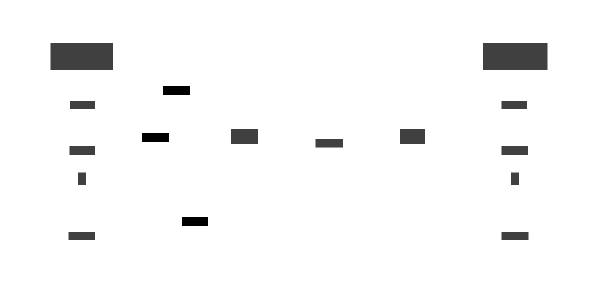

# My Ultimate Web Scraping Tech Stack

<!-- tl;dr starts -->

Web Scraping is mass collecting data on the Internet. It's always my favorite topic that every personal project of mine would involve web scraping to some extent.

<!-- tl;dr ends -->

<!-- TODO: rewrite this article, it needs to be more practical -->

## Rate Limit

Service providers have set up many wall of defences to protect their service and data from being misuse. One of them is **Rate Limit**.

The **Rate Limit** is the fixed number of requests you can send in a particular time window. Set up rate-limiting systems can protect servers from mass exploiting or DDoS attacks, prevent harming legitimate users or resolving to completely service shutdown.

### Rate-limiting methods

- IP-based: #1 choice of rate limiting.
- API-based: API providers generally require clients to use an API key.
- Geographic-based: clients' from a specific region and country can be limited.
- User Session: WAF (Web Application Firewall) such as Akamai set session cookies and restrict request rate.
- HTTP requests: Cloudflare supports rate limiting for specific HTTP headers and cookies, TLS fingerprints, ...

### Bypassing Rate Limit

- Using Proxy servers or VPN.
- Modify HTTP request headers.

### Bypass Cloud

There are ad-infinite tools utilizes different methods to fight the challenges setup by the data source.

## Proxy

Proxy is "interact with the Internet on my behalf".

### Use Cases

- Anonymous browsing: hide clients' IP, hide the fact that clients are using proxy, ...
- Bypass rate limiters to do web scraping.
- Cache content, filter requests

>

### Categorization criteria

#### Protocols

- HTTP:

* Accessing/retrieving information via many data transfers (web brosers, web services, APIs).

- SOCKS4/SOCKS5:

*

1. Forward/Reverse proxy

2. Anonymity

| 
Type
 | Client IP | Proxy indicator |
| -------------------------------------------------------------- | :-------: | :-------------: |
| High Anonymous                                                 |    No     |       No        |
| Anonymous                                                      |    No     |       Yes       |
| Distoring                                                      |  Partial  |       Yes       |
| Transparent                                                    |    Yes    |       Yes       |

### Categorization by providers

1. Public proxy

2. Private proxy

3. Residential proxy

4. Mobile proxy

- According to [IPRoyal's "Understanding Mobile Proxies: How They Work & How to Use Them "](https://iproyal.com/blog/understanding-mobile-proxies-how-they-work-how-to-use-them/), mobile proxies are real, physical portable devices (tables, smartphones, ...) with access to the Internet through mobile data (3G, 4G).

A mobile proxy network can rotate IP addresses and forwarding traffic through several mobile devices. The structure of a mobile proxy comprises actual 3G/4G connections that the data provider allocates to these devices, which makes it hard to detect masked IP addresses.

Mobile proxies are used as pools of residential proxies.

Each website request uses a different proxy IP address. User can use the same IP address for a few minutes.

### Security issue regarding free proxies

**Behavior**: For the case of HTTP-only proxies, they can perform man-in-the-middle attack (MITM):

- Inject custom HTML code into transmitted HTML files. The code can display malicious ads on users' browser, tricking them into clicking them and accidentally downloading malware.
- Inject JS code into transmitted JS files. An infected JS file can:
  - Steal login credentials and cookies of visited sites.
  - Steal banking account/credit card info.
  - Force users participating in DDoS attacks using residential IPs, by telling their browser to load a website a few hundred times/sec via `<iframe>/<script>` request.
  - Monitor everything users are doing on the web, including reading mouse positions.

**Statistics**: In 2015, Christian Haschek has conducted 2 major tests on free proxies. First, he tested **443 free proxies**, then he tested **25443 free proxies**. Both are evaluated based on these criterias:

- Is HTTPS allowed or HTTP-only?
- Is JS modified?
- Is HTML modified?
- Will it hide the client's IP?

=> Results:

Test 1:

| Criteria | Percentage        |
| -------- | ----------------- |
| Tested   | 443 (100%)        |
| Online   | 199 / 443 (44.9%) |
| No HTTPS | 157 / 199 (79%)   |
| Not mod  | 149 / 199 (75%)   |
| Mod HTML | 33 / 199 (16.6%)  |
| Mod JS   | 17 / 199 (8.5%)   |
| Hide IP  | 199 / 199 (100%)  |

=> **21%** out of 199 free online proxies are _somewhat_ safe.

Test 2:

| Criteria              | Percentage            |          |
| --------------------- | --------------------- | -------- |
| Tested                | 25443 (100%)          |          |
| Online                | 13307 / 25543 (52.1%) |          |
| No HTTPS              | 8294 / 13307 (62.35%) | => Worse |
| Mod HTML              | 2391 / 13307 (17.97%) |          |
| Mod JS                | 2747 / 13307 (20.64%) | => Worse |
| Mod total / Online    | 5136 / 13307 (38.6%)  |          |
| Mod total / HTTP-only | 5136 / 8294 (61.92%)  |          |

=> **37.65%** out of 13307 free online proxies are _somewhat_ safe.

**Why I said _somewhat_?**

At the time this article was written, things might have changed and there might be more attack vectors that I do not know of. Here are some that I know could attack inside HTTPS-allowed free proxies:

- If the sites are just _partial_ HTTPS supported, i.e. load unsafe resources (e.g. jQuery from a HTTP site), you're still can be screwed. Most browsers will tell you that by displaying a broken padlock icon.

- HTTPS proxies can still see client's IP address and their browsing activity so they could sell them to data brokers.

=> "Free proxy" is another example for the argument "if the product is free, you are the product".

> P/s: Big techs open-sourced some of their major projects for free pull requests.

### Free, non-required credit card proxy providers

**NOTE: Data from 2025-01-10**

|    Name     |              Proxy Type              | Geographical Coverage |    Free tier     |
| :---------: | :----------------------------------: | :-------------------: | :--------------: |
| Bright Data | Datacenter, Residential, Mobile, ISP |          195          | 7-day free trial |
|  Webshare   |         Residential, Static          |          195          | 10 free proxies  |

## VPN

## References

- [Christian Haschek's "Why are free proxies free"](https://blog.haschek.at/post/fd9bc/)
- [Christian Haschek's "Analyzing 443 free proxies"](https://blog.haschek.at/2015-analyzing-443-free-proxies/)
- [Christian Haschek's "Let's analyze over 20k proxies (it won't get much better)"](https://blog.haschek.at/2015-lets-analyze-twenty-thousand-proxies/)
- [Guru99's "12 Best FREE Residential Proxy Server (2025)"](https://www.guru99.com/best-free-proxy.html)
- [Zenrows's "Bypass Rate Limit While Web Scraping Like a Pro"](https://www.zenrows.com/blog/web-scraping-rate-limit#what-is)
