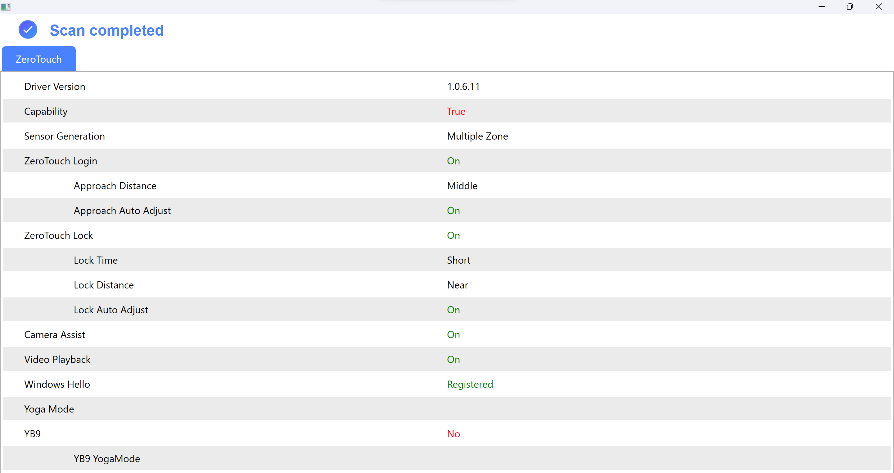

# Why I will never use Lenovo laptop again

<!-- tl;dr starts -->

2 days, 20 hours. That's the amount of time of a busy-bee as myself have to spend to tackle a very hard problem came from a Lenovo laptop. And the solution is far from perfect. It's all because of the incompetence in Lenovo's product quality control.

<!-- tl;dr ends -->

## TL;DR

Disable Sensor device in Windows's Device Manager and put a black tape on the camera. The solution is not perfect, the energy is still being wasted, but good enough to wrap things up.

Here are the remaining holes to dig:

- **UPDATE (2025-01-04)**: [I've asked wangyanyan again about the diagnostic tool](https://forums.lenovo.com/topic/findpost/1516/5254325/6513428). For now I will wait for his reply.
- Install Windows 11 and test if User Presence Detection is existed inside Presence setting.
- Find an older BIOS version.
- Test [this tool](https://meta.box.lenovo.com/v/link/view/223f0d2ad1084ac2a595b5e1b05010fb) from wangyanyan's reply on [another thread](https://forums.lenovo.com/topic/findpost/1516/5263346/6146508).

## Introduction

A Lenovo laptop usually built with 2 IR cameras. The left-most one has blinking red light to indicate it's running, it was used to constuct a map of your face, serving as an face authentication device. The other, right-most one can only be visible if you view it through your smartphone camera. This camera is constantly blinking.

It all starts from this [Reddit threat](https://www.reddit.com/r/Lenovo/comments/igvzoh/lenovo_needs_to_fix_this_infrared_light_issue_on/) that I know that the right-most IR camera is a [times-of-flight sensor](https://en.wikipedia.org/wiki/Time-of-flight_camera). In simple term, it's a camera that continuously emits infrared light on your face so the laptop knows whether you're in front of the computer or not.

## Why is this a concern to me?

Unbeknowned to me that infrared light can cause damage to eyes' health despite its invisibility to the human eyes.

Not to mention it's also an energy-dripping-faucet.

> I don't know how intensive of that IR blaster, but a Redditor stated that his eyes are sensitive to infrared light and he can sense infrared light on Lenovo laptop as well.

## My investigation

This feature of constantly blasting infrared light onto buyer's face is known by many names, gives me a hard time when looking for answer on the Internet:

- User Presence Detection
- Human Presence Detection (standard)
- Smart Settings/Smart Assist/Intelligent Security > Zero Touch Lock.
- [Elliptic Virtual Lock Sensor](https://support.lenovo.com/us/en/solutions/ht515870-how-to-disable-elliptic-virtual-lock-sensor-thinkpad)
- Mirametrix Glance.

It depends on the series and the version of Lenovo Vantage that different terms can be used. I've heard that Lenovo Vantage has different skins for different series for Legion, Yoga, ThinkPad, IdeaPad, ... On my Lenovo Yoga 14sARH 2021, it's called _Zero Touch_

I've dug quite a deep rabbit hole in finding ways to disable this feature:

### 1. [Latest Lenovo Vantage on Microsoft Store](https://support.lenovo.com/us/en/solutions/ht505081)

- [User Guide - User Presence Sensing - ThinkPad P1](https://download.lenovo.com/pccbbs/pubs/p1_gen6/html/html_en/explore_lock_on_leave.html):

  - Open Lenovo Vantage
  - Click Device ➙ Smart Assist
  - Toggle the Zero Touch Lock.

- [LenovoSupport Reddit account](https://www.reddit.com/r/Lenovo/comments/igvzoh/comment/ikd0xy9) stated that on [Lenovo IdeaPad S540 user guide, page 15](https://lnv.gy/3QsA9i8), ntelligent feature can be disabled by:
  - Open Lenovo Vantage.
  - Select Hardware Settings -> Smart Settings/Smart Assist.
  - Change the settings.

=> I've found the Zero Touch- settings but they're under a section called "Intelligent Security". Toggle them off but to no avail.

### 2. Old versions of Lenovo Vantage

It might be newer versionjs of Lenovo Vantage don't support old machines like mine, so I tried to disable that feature from inside an older version of Lenovo Vantage.

Microsoft Store doesn't show old versions of their apps. Luckily, there is an [online link generator for Microsoft Store](https://store.rg-adguard.net/) that crawls for old installer in Microsoft servers, hence proves its trustworthiness.

=> I've chosen the furthest version, October 2022 to test, and it's still not working. I've also reinstalled all drivers, including BIOS that are made specifically for my laptop.

> My assumption: the BIOS version is too new, it might mess with the Zero Touch settings.

Sometimes Lenovo staffs upload unpacked Lenovo Vantage versions to Lenovo support forum to help its members. Unfortunately, the links are all expired, so I've tried my luck at Web Archive. Using Web Archive search API to run these queries:

```
http://web.archive.org/cdx/search/cdx?url=download.lenovo.com/*&amp;fl=original,timestamp&amp;collapse=digest&amp;filter=original:.*lenovovantage.*\.zip&amp;limit=1000
http://web.archive.org/cdx/search/cdx?url=download.lenovo.com/*&amp;fl=original,timestamp&amp;collapse=digest&amp;filter=original:.*LenovoVantage.*\.zip&amp;limit=1000
```

I've excavated 2 versions:

- [LenovoVantage_4.27.32.0](https://web.archive.org/web/20210701000000*/https://download.lenovo.com/pccbbs/thinkvantage_en/metroapps/Vantage/LenovoVantage_4.27.32.0.zip)
- [LenovoVantage_20.1908.3.0](https://web.archive.org/web/20250000000000*/https://download.lenovo.com/pccbbs/thinkvantage_en/metroapps/Vantage/LenovoVantage_20.1908.3.0.zip)

=> They're too old, there are no Zero Touch settings.

### 3. BIOS settings

Many source stated that this feature can be disabled via BIOS > Security > Intelligent Security > User Presence Sensing.

=> There is no such things as Intelligent Security, or User Presence Sensing setting inside my BIOS, since I'm using a Yoga series laptop.

Sometimes the BIOS provider hides some of their settings. I don't know whether my BIOS was done the same, nor the combination to unlock if that was true. I also didn't think that the setting is hidden since it's illogical.

### 4. Registry Editor

There is a post on Lenovo's forum stated that Human Presence Detection can be configured using Registry Editor:

```
Computer\HKEY_LOCAL_MACHINE\SYSTEM\CurrentControlSet\Services\SmartSense\Parameters\HPD
```

=> I don't have the documentation so I just set everything inside to 0. Still not working though.

### 5. Device Manager / Services (partially worked)

According to this [Reddit thread](https://www.reddit.com/r/Lenovo/comments/1bxi4bc/cant_find_a_way_to_disable_human_presence/lgza4t9/), disables these devices/services should work:

- _Device Manager > Network Adapter > Wifi device > Human Presence Detection_ (MSI laptop, duh)
- _Device Manager > Software Components > Elliptic Virtual Lock Sensor_
- _Services > Elliptic Human Presence Detection Service_.

**=> Nothing can be found on my Device Manager/Services. But I do found a sensor device in Device Manager. After disabled it, my machine doesn't wake up by itself when I'm in front of the laptop. But the IR camera still was flashing.**

### 6. Energy Settings on Windows 11

Haven't tried. Doubt it would work though since the Zero Touch driver is for Windows 10.

### 7. Running Lenovo's staff diagnosting tool

[wangyanyan, a Lenovo staff on forum, give me ZeroTouchSMATool.zip](https://forums.lenovo.com/topic/findpost/1516/5254325/6108837) for me to run. Since he's a Lenovo staff so I wouldn't mind running unsigned applications on my machine.

=> A window that shows "You care settings, we care you" pop up and then closed immediately. No information are displayed so I can't provide any screenshot.

This should be the output:

