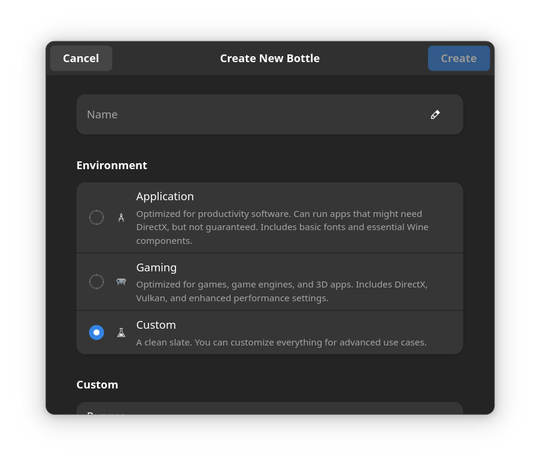
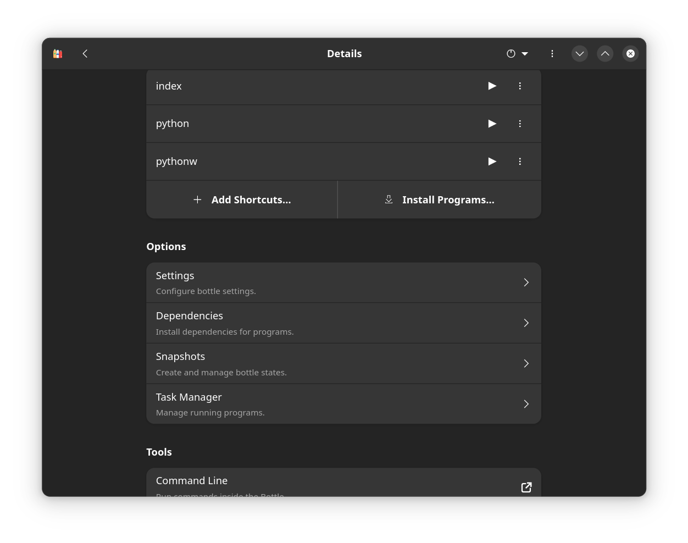
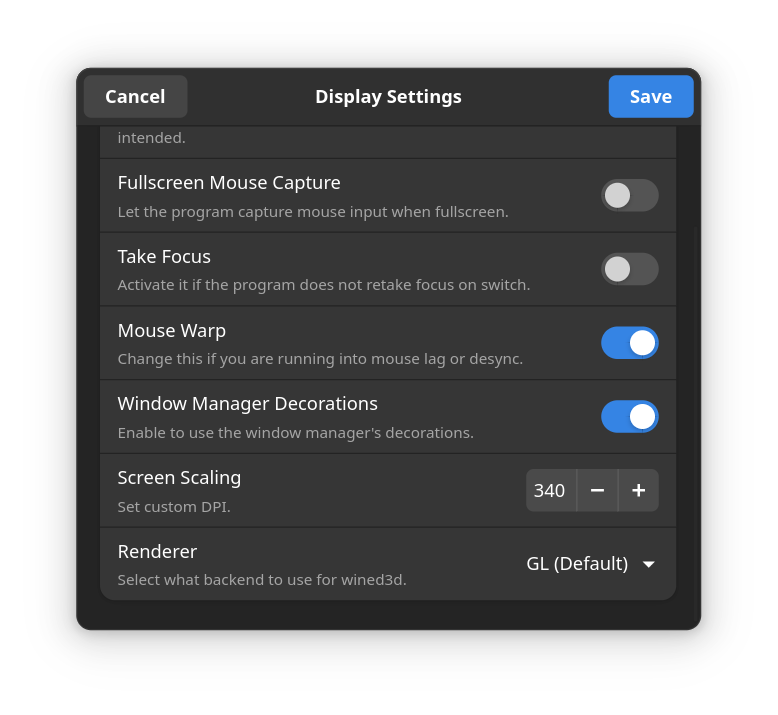
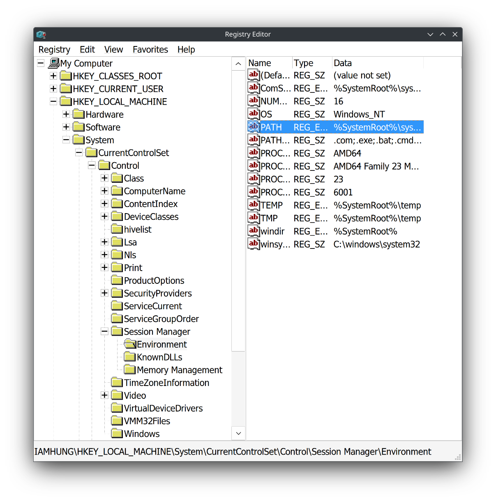

# Setup Guide

<!-- tl;dr starts -->

I would like to try out different FOSS on GitHub, especially web crawlers. But some tools only worked on Windows, plus my overthinking mind regarding the safety of these tools if they got installed inside my machine so it's better that I setup a dedicated WINE sandbox.

<!-- tl;dr ends -->

## TL;DR

- **Create New Bottle: Environment > Custom** to prevent bloating your system.
  
- You're not going to play games. Disable anything related to graphics inside **Details: Options > Settings**.
  
- Manually downloaded GUI installers into Bottle's directory since I haven't found a way to run PowerShell nor install applications using CMD.
- **Display > Advanced Display Settings > Screen Scaling: 340** (depending on your monitor resolution and scale ratio that you increase/decrease it). This is to ensure the GUI installer's font is not too small.
  
- **Bottle Details: Tools > Registry Editor**,
  

## Install Application

Normal user install applications via GUI installer, more advanced users use CLI, more specifically, PowerShell. But, Windows PowerShell is basically useless in Bottles after I've tried to run it using all of the known method

- Run `powershell` alone inside **CMD**.
- Run `powershell [COMMAND]` inside **CMD**.
- `Run Executable...` > `C:\windows\system32\WindowsPowerShell\v1.0\powershell.exe` (even after toggle enable _Run in Terminal_).

=> It's better to download GUI Windows installer manually from the host and manually move it inside the Bottle, then run it using `Run Executable...`.

> **NOTE:** I don't like portal (a.k.a file chooser), seems like a flaw in Flatpak security design. Bill Dietrich talks about this in [his GitHub Issue flatpak#3977](https://github.com/flatpak/flatpak/issues/3977).

## PATH Environment Variable

Usually after a CLI application installation (e.g. `python`, `pip`, ...), the `PATH` environemt variable will be updated for the user to run executable files from any working directories. However, this is not the case for Bottles.

From the host, use any search tools (Search feature in file managers, `plocate`, ...) to identify the directory contains the executables, then go modifying the Registry Editor:

```
HKEY_LOCAL_MACHINE\System\CurrentControlSet\Control\Session Manager\Environment
```

Add your new directory paths to `PATH` env var, remember each entry is separated by a semicolon.

> **Note:** There are built-in environment variables that specify different path levels:
>
> - `%UserProfile%`: Refers to the user's profile directory (e.g., `C:\Users\username`).
> - `%AppData%`: Refers to the roaming application data directory (e.g., `C:\Users\username\AppData\Roaming`).
> - `%LocalAppData%`: Refers to the local application data directory (e.g., `C:\Users\username\AppData\Local`).
> - `%HomeDrive%`: Refers to the drive letter of the user's home directory (e.g., `C:`).
> - `%HomePath%`: Refers to the full path of the user's home directory excluding the drive letter (e.g., `\Users\username`).
