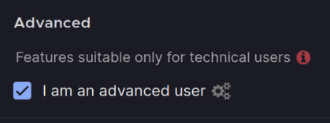
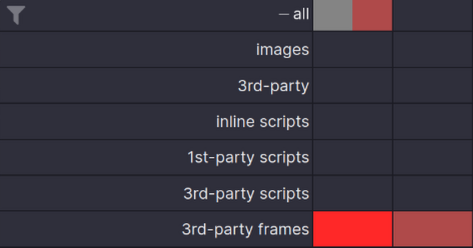
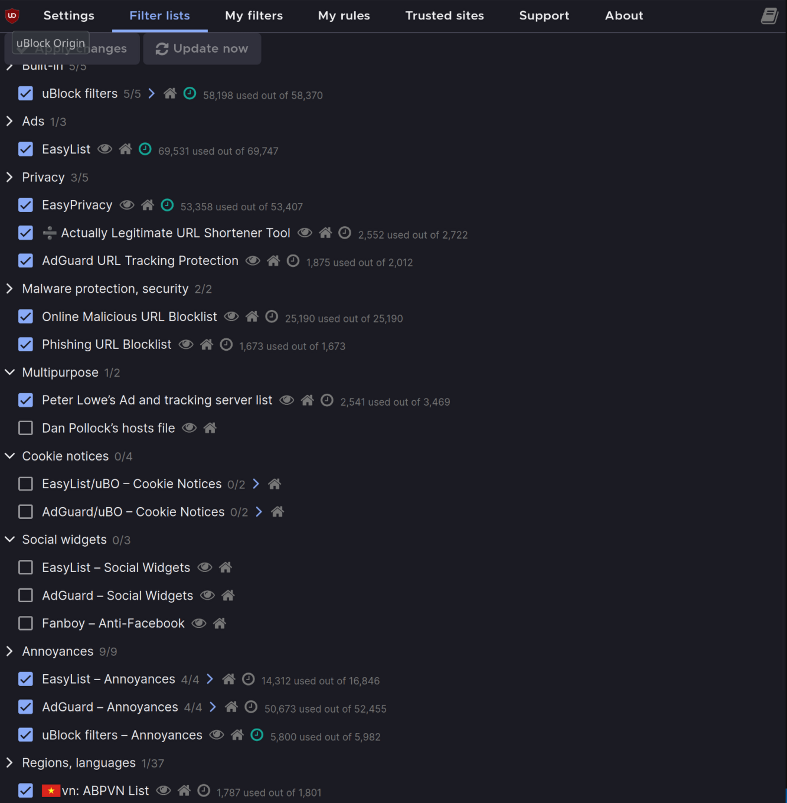

# uBlock Origin

<!-- tl;dr starts -->

The first rule of ad blockers: We don't talk about ad blockers. Yet here I am, because this piece of technology is too valuable but only a few people know about it. The documentation is exhaustive so I will only note what needs to be remembered here.

<!-- tl;dr ends -->

## Quick guide

If you can't understand UI, **that's perfectly normal**. uBlock Origin UI/UX has been criticized for a long time but there wasn't any progress in changing.

Read this: https://github.com/gorhill/uBlock/wiki/Quick-guide:-popup-user-interface

and this: https://github.com/gorhill/uBlock/wiki/Per-site-switches

## Blocking mode

My blocking mode is Enhanced Easy Mode.

- Go into _Settings > Advanced:_, checked _I am an advanced user_ setting. Then go into pop up and disable all 3rd-party frames.

> **NOTE:** I am not sure about [Dynamic filtering: to easily reduce privacy exposure](https://github.com/gorhill/uBlock/wiki/Dynamic-filtering:-to-easily-reduce-privacy-exposure) since I don't know where to get exhaustive ubiquitous servers list.

> **TIPS:** If your web page happened to be broken, use [W3School](https://www.w3schools.com/tags/tryit.asp?filename=tryhtml_iframe) to fix.

| Settings                     | Popup                                |
| ---------------------------- | ------------------------------------ |
|  |  |

- Go into _Filter lists_ and checked the following settings:

  - Built-in:

    - uBlock Filters.

  - Ads:

    - EasyList.

  - Privacy:

    - EasyPrivacy.
    - Actually Legitimate URL Shortener Tool.
    - AdGuard URL Tracking Protection.

  - Malware Protection, security:

    - Online Malicious URL Blocklist.
    - Phishing URL Blocklist.

  - Multipurpose:

    - Peter Lowe's Ad and tracking server list

  - Annoyances:

    - EasyList - Annoyances
    - AdGuard - Annoyances
    - uBlock filters - Annoyances

  - Regions, languages:

    - vn: ABPVN List



## Dynamic filtering

### Rule syntax

Basically, there are 4 elements in a rule

```
source destination type action
```

In terms of categorization, there are 2 types of dynamic filtering rule: **Type-based rule** and **Hostname-based rule**

Valid values:

<!-- prettier-ignore -->
|Rule type|Source|Destination|Type|Action|
|:-:|:-:|:-:|---|---|
|**Type-based**|`*`<br/>*hostname* | `*` | <pre>*</br>image<br/>inline-script<br/>1p-script<br/>3p<br/>3p-script<br/>3p-frame</pre> | <pre>block<br/>noop<br/>allow</pre>|
|**Hostname-based**|`*`<br/>*hostname*|*hostname*|`*`|<pre>block<br/>noop<br/>allow</pre>|

- **Source**: the hostname extracted from URL of the web page.
- **Destination** the hostname extracted from URL of the remote resources which the web page is trying to fetch.
- **Type**: the request type to which the **Action** would be applied.
- **Action**:
  - `block`:
    - Matching network request will be blocked.
    - `block` override any existing _static filters_, therefore block with 100% certainty (unless you set another overriding dynamic filter rule).
  - `allow`:
    - Matching network request will be allowed.
    - `allow` override **BOTH** existing blocked _static filters_ and _dynamic filters_
  - `noop`:
    - Matching network request will be ignored if it's also matched with `block` and/or `allow` rules.
    - `noop` does NOT cancel static filtering.

**NOTE:** A rule propagates to all subdomains of the source hostname and all subdomains of the destination hostname:

- No need to prefix the hostname with a wildcard `*.`. Doing so is invalid and cause the rule to be discarded.

- Rules for specific subdomains take precedence over rules for parent domains.

> Example: rule for `sub.example.com` will override a rule for `example.com` when accessing that subdomain. If you block `example.com` but allow `sub.example.com`, the subdomain will be accessible.

### Type-based rule

_Definition:_ Rules that filter a **specific** type of _request_ (or **all** types of request) to **every** destination.

_Syntax:_

<!-- prettier-ignore -->
|Rule type|Source|Destination|Request type|Action|
|:-:|:-:|:-:|---|---|
|**Type-based**|`*`<br/>*hostname* | `*` | <pre>*</br>image<br/>inline-script<br/>1p-script<br/>3p<br/>3p-script<br/>3p-frame</pre> | <pre>block<br/>noop<br/>allow</pre>|

7 types of network request can be dynamically filtered:

- `*`: any type of request.
- `image`: images.
- `3p`: any request which 3rd-party to the web page.
- `inline-script`: scripts embedded in the main document.
- `1p-script`: scripts which are pulled from the same domain name of the current web page.
- `3p-script`: scripts which are pulled from a different domain name than that of the current web page.
- `3p-frame`: iframes which are publled from a different domain name than that of the current web page.

_Example:_

```
* * 3p-frame block            # globally block 3rd-party frames
github.com * 3p-frame noop    # locally allow GitHub to embed frames
```

### Hostname-based rule

_Definition:_ Rules that filter **ALL** types of request to a **specific** destination. They have a higher specificity than Type-based rules, and thus they always override Type-based rules whenever a network request end up matching both a type-based and a hostname-based rule.

_Syntax:_

<!-- prettier-ignore -->
|Rule type|Source|Destination|Request type|Action|
|:-:|:-:|:-:|---|---|
|**Hostname-based**|`*`<br/>*hostname*|*hostname*|`*`|<pre>block<br/>noop<br/>allow</pre>|

_Example:_

```
# do not apply dynamic filtering to network requests to youtube.com when visiting any webpage
* youtube.com * noop

# do not apply dynamic filtering to network requests to google.com when visiting any webpage
* google.com * noop
```

## Dynamic URL filtering

## FAQ

**Q: What is the difference between dynamic filtering and static filtering?**

**A:** Dynamic filtering offers broader granularity with a basic syntax for general users. Static filtering provides much finer granularity and precision, typically used by advanced users and filter list maintainers.

## Reference

- [gorhill/uBlock's Wiki, 2022-04-25, Blocking mode: easy mode](https://github.com/gorhill/ublock/wiki/Blocking-mode:-easy-mode)

- [gorhill/uBlock's Wiki, 2022-04-25, Dynamic filtering: Benefits of blocking 3rd party iframe tags](https://github.com/gorhill/ublock/wiki/Dynamic-filtering:-Benefits-of-blocking-3rd-party-iframe-tags)

- [gorhill/uBlock's Wiki, 2024-05-25, Dynamic filtering: rule syntax](https://github.com/gorhill/ublock/wiki/Dynamic-filtering:-rule-syntax)
