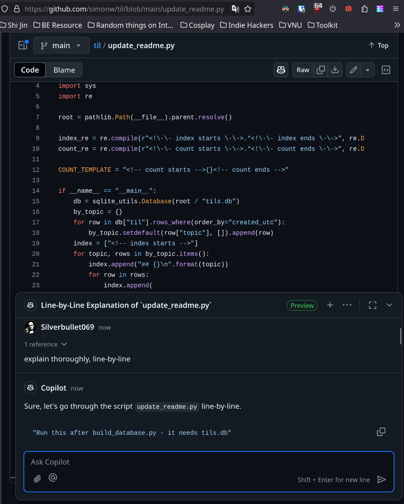
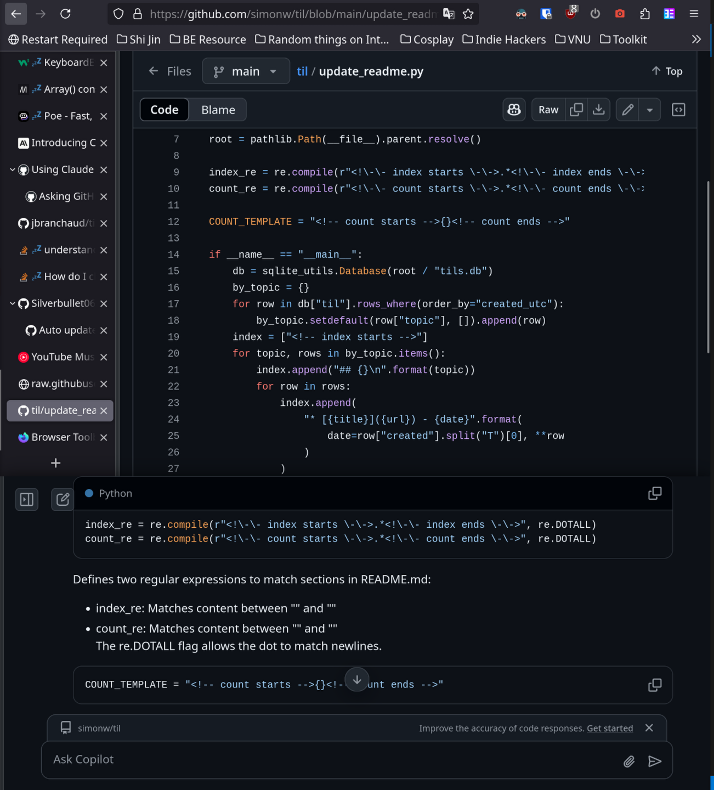
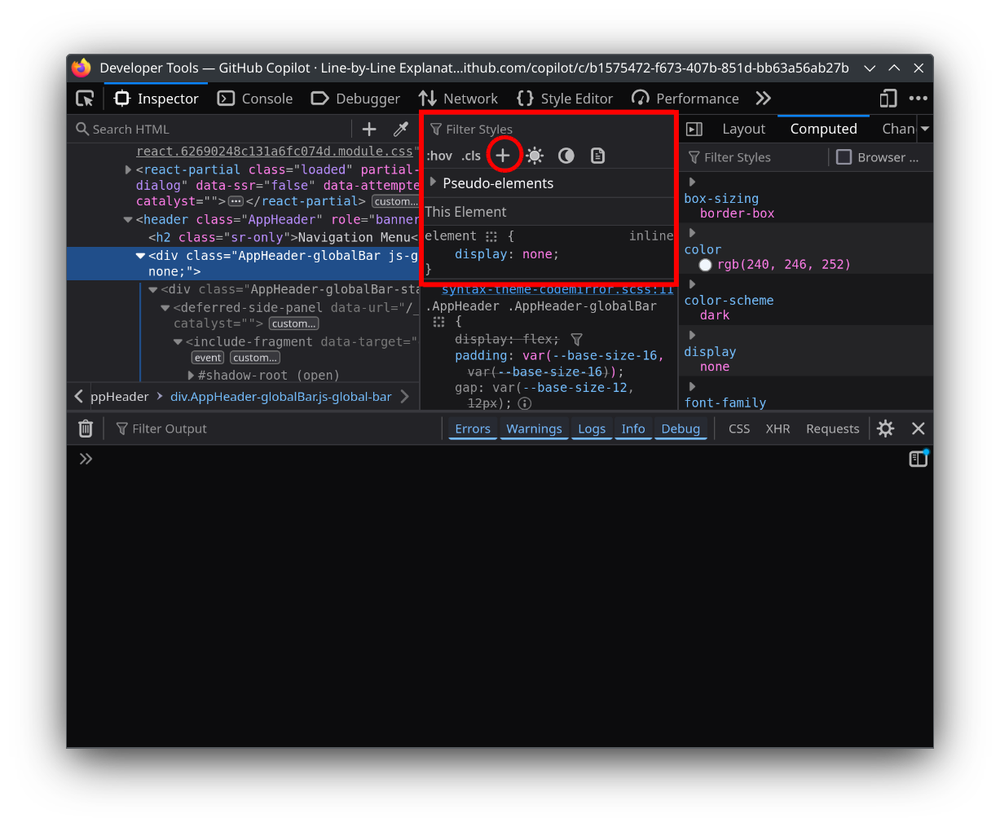

# Maximize "Learn in Public" Efficiency by Chatting Directly with Code Using GitHub Copilot Chat on Browser

While researching a new feature for my OSS, I wanted to quickly and thoroughly understand how similar features are implemented in other OSS projects on GitHub.

Then, I stumbled across **GitHub Copilot Chat on Browser**. Go to any GitHub repository and click the GitHub Copilot icon next to the search bar at the top right of the page to open Chat View.

There you can start asking questions about the current repository. To ask specifically about a file or more specifically, a class or a function, use Attach files or symbols. You can specify the name of a file or symbols in your prompt, but I find this approach inconsistent.

I've designed two setups, use what worked best for you.

## Setup #1: One browser window

One tab opening GitHub Repository/File/Issue/... Content on the top, Chat View on the bottom

It's perfect. Fast, spot on, fine-grained.

**However**, according to [this GitHub Docs about changing your AI model](https://docs.github.com/en/copilot/using-github-copilot/asking-github-copilot-questions-in-github#changing-your-ai-model), you can't change model inside Chat View. It would be hard for people like to use model other than GPT-4o like Claude 3.5 Sonnet, which I really like.

## Setup #2: Two browser windows

One window consists of one tab opening GitHub Repository/File/Issue/... The other window consists of one tab opening GitHub Copilot Chat on Browser in Immersive View.

For this setup, I would like to remove all unnecessary UI from both GitHub website and the browser itself.

If you're using Firefox:

- Step 1: Open Firefox Developer Tools, by either: 1. _Hamburger button > More tools > Web Developer Tools_ or 2. Press `Ctrl` + `Shift` + `I` key combination.

- Step 2: Then press `Ctrl` + `Shift` + `C` to enter page element picker mode, point your cursor to the browser header bar and click the plus sign below "Filter Styles" to add `display: none` CSS property to the desired element.

- Step 3: [Enable **Browser Toolbox**](https://firefox-source-docs.mozilla.org/devtools-user/browser_toolbox/index.html#enabling-the-browser-toolbox) by checks the settings “Enable chrome and addon debugging” and “Enable remote debugging”.

- Step 4: [Open **Browser Toolbox**](https://firefox-source-docs.mozilla.org/devtools-user/browser_toolbox/index.html#opening-the-browser-toolbox) by either: 1. _Hamburger button > More tools > Browser Toolbox_ or 2. Press `Ctrl` + `Alt` + `Shift` + `I` key combination.

- Step 5: Same as Step 2, but applied to Browser Header UI.

Cre:

- https://docs.github.com/en/copilot/using-github-copilot/asking-github-copilot-questions-in-github#asking-exploratory-questions-about-a-repository

- https://docs.github.com/en/copilot/using-github-copilot/asking-github-copilot-questions-in-github#asking-a-question-about-a-specific-file-or-symbol
