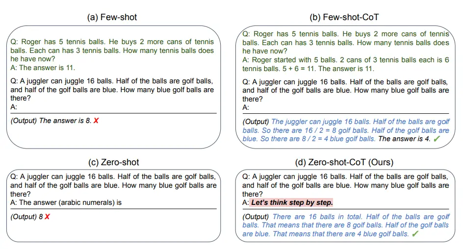

# Prompt Engineering Best Practices

<!-- tl;dr starts -->

Learning prompt engineering is a must and crucial. Non-AI tech workers, although they don't have to immerse themselves in the extensive mathematical aspects that form the core foundation of Machine Learning, Deep Learning and LLMs specifically (as AI scientists/AI engineers do), will at least need to proficient in using AI. Developers, like me, learn prompt engineering to create robust and effective prompts to receive the best results.

<!-- tl;dr ends -->

## Cheatsheet

System prompt:

```
You're a {{ROLE}} specializing in {{}} for {{COMPANY}}.
```

User prompt:

```txt
Your task is to ...

Analyze/Classify/Compare/Extract/Highlight/Note/Include/List/Order/Replace ... with .../Summarize/Translate/Transform ... into ... /Write/...

Instructions:
1.
2.
...

Here is a/the ...

Use this data for your report/analysis/summary/...

Think step-by-step before ... First, do ... Then, do ... Then, do ... Finally, do ...
Think step-by-step before ... in <thinking> tags. First, think through ... Then, think through ... Finally, write ... in <answer> tags, using your analysis.

Structure:
1.
2.
...
```

```xml
<documents>
  <document index="1">
    <source>report.pdf</source>
    <document_content>
      {{REPORT}}
    </document_content>
  </document>
  <document index="2">
    <source>analysis.xlsx</source>
    <document_content>
      {{ANALYSIS}}
    </document_content>
  </document>
  <document index="3">
    <source>standard_contract.pdf</source>
    <document_content>
      {{STANDARD_CONTRACT}}
    </document_content>
  </document>
</documents>

<instructions>
  <instruction></instruction>
  <instruction></instruction>
</instructions>

<context>
AcmeCorp is a B2B SaaS company. Our investors value transparency and actionable insights.
</context>

<context>
We’re a multinational enterprise considering this agreement for our core data infrastructure.
</context>

<!-- read Few-shot Prompting's Best practices and Cut-corner tips -->
<examples>
  <example></example>
  <example></example>
  ...
</examples>

<output>
  <output_tone>Make your tone concise and professional.</output_tone>
  <output_type>JSON/Bullet points/Numbered list/...</output_type>
  <output_structure>
    <field name="" type="" />
    <field name="" type="" />
    <field name="" type="" />
  </output_structure>
</output>
```

## FOUR Prompt Elements

Terminology overlapped in so many prompt engineering documents, guides, blogs, books, videos, ... I have chosen [Prompt Engineering Guide's "Elements of a Prompt"](https://www.promptingguide.ai/introduction/elements) as the single source of truth (SSOT).

In short, there are **FOUR** prompt elements:

- **Instructions**: a specific task or number of tasks that the model needs to perform on **input data**.
- **Context**: external info that can steer the model to better responses (e.g. roleplay, examples, artistic style, tone for a target audience, ...)
- **Input data/Input text**: the data that needed to be worked on.
- **Output indicator/Output format**: the structure of the output (e.g. JSON, numbered list, unordered list (bullet points), ...)
  > However, at the time of writing this post, leading AI vendors have baked this element in as a feature. GPT, Claude, Gemini and Mistral offer variants of "structured output" as additional options through their API.

Some other SSOTs stated that there are only **TWO** prompt elements: **Tnstructions** and **Context**. There is nothing wrong with that, my way of separation is more fine-grained and help tackling a lot of use cases.

All 4 elements aren't mandatory in a single prompt. Their format depends on the task at hand.

## Common use cases that need prompt engineering

1. Text Summarization

2. Information Extraction

3. Question Answering

4. Text Classification (turning Unstructured Data to Structured Data)

5. Conversation

6. Code Generation/Test Generation/Code Review/Commit Message Generation/PR title and description generation/...

7. Reasoning (latest)

## One-size-fit-all strategies

These strategies can be applied in nearly every use cases. I sorted them from the most broadly effective techniques to more specialized techiniques.

### 1. Start general, then get specific

_Definition:_ First, give the LLM a broad description of the goal/scenario, using simple and concise English verbs: "Write", "Analyze", "Classify", "Extract", "Summarize", "Translate", "Order", "Replace", "Highlight/Note", "Compare", "Include", "List", ... Then, list any specific requirements.

```
Write a function that tells me if a number is prime.

The function should take an integer and return true if the integer is prime.

The function should error if the input is not a positive integer
```

### 2. Keep grammar correct

_Definition:_ Write prompts with correct English grammar. especially XML tags.

### 3. Ordering prompt elements

_Definition:_

- Prompts should be started with _instructions_ ([OpenAI](https://help.openai.com/en/articles/6654000-best-practices-for-prompt-engineering-with-the-openai-api#h_21d4f4dc3d))
- Prompts loading into 200K+ context window token LLMs, should be started with long _input data_ (~20K+ tokens), above the _instruction_ and _context_ ([Anthropic](https://docs.anthropic.com/en/docs/build-with-claude/prompt-engineering/long-context-tips#essential-tips-for-long-context-prompts))

> **NOTE:** Anthropic stated that the response quality of all models in Claude-family has improved by up to 30% when tested with complex, multi-document inputs.

### 4. Include separator

_Definition:_ Wrap each _prompt element_ with clear separators.

_Examples:_

```
# few-shot prompting
<examples>
  <example></example>
  <example></example>
  ...
</examples>

# chain-of-thought
<thinking></thinking>
<answer></answer>

# Cre: https://docs.anthropic.com/en/docs/build-with-claude/prompt-engineering/long-context-tips#example-multi-document-structure
# Note: attribute can leverage XML tags
<documents>
  <document index="1">
    <source>annual_report_2023.pdf</source>
    <document_content>
      {{ANNUAL_REPORT}}
    </document_content>
  </document>
  <document index="2">
    <source>competitor_analysis_q2.xlsx</source>
    <document_content>
      {{COMPETITOR_ANALYSIS}}
    </document_content>
  </document>
</documents>

<data source="WHO_2024" type="statistical">
  {{2024_WHO_STATISTICAL_DATA}}
</data>
```

[Generating financial reports.](https://docs.anthropic.com/en/docs/build-with-claude/prompt-engineering/use-xml-tags#example-generating-financial-reports):

<!-- prettier-ignore -->
|Role|No XML Tags prompt|With XML Tags prompt|
|---|---|---|
|**User**|<pre>You’re a financial analyst at AcmeCorp. Generate a Q2 financial report for our investors. Include sections on Revenue Growth, Profit Margins, and Cash Flow, like with this example from last year: {{Q1_REPORT}}. Use data points from this spreadsheet: {{SPREADSHEET_DATA}}. The report should be extremely concise, to the point, professional, and in list format. It should and highlight both strengths and areas for improvement.</pre>|<pre>You’re a financial analyst at AcmeCorp. Generate a Q2 financial report for our investors.<br><br>AcmeCorp is a B2B SaaS company. Our investors value transparency and actionable insights.<br><br>Use this data for your report:&lt;data&gt;{{SPREADSHEET_DATA}}&lt;/data&gt;<br><br>&lt;instructions&gt;<br>1. Include sections: Revenue Growth, Profit Margins, Cash Flow.<br>2. Highlight strengths and areas for improvement.<br>&lt;/instructions&gt;<br><br>Make your tone concise and professional. Follow this structure:<br>&lt;formatting_example&gt;{{Q1_REPORT}}&lt;/formatting_example&gt;</pre>|
|**Assistant**|<pre>Q2 Financial Report for AcmeCorp Investors<br><br>Dear Valued Investors,<br><br>I am pleased to present our Q2 financial report, showcasing AcmeCorp’s continued growth and resilience in the B2B SaaS market.<br><br>1. Revenue Growth:<br>Our Q2 revenue reached $15.2M, a 22% YoY increase. This growth is primarily driven by a 30% expansion in our enterprise client base. However, our SMB segment saw a slight decline of 5%, which we aim to address through targeted marketing initiatives in Q3.<br><br>2. Profit Margins:<br>Gross margin improved to 72% (up 3% from Q1) due to infrastructure optimizations. EBITDA margin, however, dipped to 18% (down 2%) as we invested heavily in R&D for our upcoming AI-driven features.<br><br>3. Cash Flow:<br>Operating cash flow remains strong at $4.1M. Our cash reserves stand at $28M, providing a 15-month runway at current burn rate. We did see a 20% increase in customer acquisition costs, which we’re addressing through more efficient sales strategies.<br><br>In summary, AcmeCorp’s core financials remain robust. We’re balancing growth investments with prudent cash management. Our focus for Q3 will be revitalizing SMB growth and optimizing sales efficiency.<br><br>Thank you for your continued trust.<br><br>Sincerely,<br>CFO, AcmeCorp</pre>|<pre>Q2 Financial Report for AcmeCorp Investors&lt;/output&gt;<br><br>Revenue Growth:<br>- Q2 revenue: $15.2M (22% YoY ↑)<br>- Enterprise clients: 30% ↑<br>- SMB segment: 5% ↓<br>Action: Targeted Q3 marketing<br><br>Profit Margins:<br>- Gross margin: 72% (3% ↑ from Q1)<br>Reason: Infrastructure optimizations<br>- EBITDA margin: 18% (2% ↓)<br>Reason: R&amp;D investment in AI features<br><br>Cash Flow:<br>- Operating cash flow: $4.1M (strong)<br>- Cash reserves: $28M (15-month runway)<br>- Customer acquisition cost: 20% ↑<br>Action: Optimize sales strategies<br><br>Outlook:<br>- Core financials: Robust<br>- Q3 focus: Revitalize SMB, optimize sales<br><br>Management remains committed to balancing growth investments with financial discipline.</pre>|

Read more: [Legal contract analysis](https://docs.anthropic.com/en/docs/build-with-claude/prompt-engineering/use-xml-tags#example-legal-contract-analysis):

_Best practices:_

- Use \`\`\` for code snippets, `#` for headings, `---` for example delimiter.
- Use an XML validator after finish writing your prompt since AI models can be sensitive to invalid XML input.
- No AI vendors stated their LLMs are trained with a set of standardized tags. They recommended that the tag names should make sense with the info they surround.
- Consistently refer to the same tag names when talking about the content inside them.
- For hierarchical content, beside numbered list or bullet points, nested tags can be used.

> **NOTE:** Newline, tab or special whitespace characters will be stripped off when sending prompt so feel free to use them to create high readability prompt without the fear of harming performance.

_Pros:_

- **The best of the bests:** XML tags are the most effective separator to define boundaries between _prompt elements_
- **Accuracy:** reduce misinterpreting prompt elements.
- **Readability and maintainability:** build distinct boundaries between prompt elements. Easy to create, update, delete them.
- **Parsability:** _output format_ is often defined by using separators.

### 5. Avoid saying WHAT NOT TO DO, say WHAT TO DO.

_Examples:_

<!-- prettier-ignore -->
|Role|Incorrect prompt|Correct prompt|
|---|---|---|
|**User**|<pre>The following is a conversation between an Agent and a Customer. DO NOT ASK USERNAME OR PASSWORD. DO NOT REPEAT.<br/><br/>Customer: I can't log in to my account.<br/>Agent:</pre>|<pre>The following is a conversation between an Agent and a Customer. The agent will attempt to diagnose the problem and suggest a solution, whilst refraining from asking any questions related to Personally Identifiable Information (now referred to as PII). Instead of asking for PII, such as username or password, refer the user to the help article www.samplewebsite.com/help/faq<br/><br/>Customer: I can't log in to my account.<br/>Agent:</pre>|

### 6. Break complex tasks into clear, contextual, simple tasks

_Definition:_

- Provide _instructions_ as sequential steps written in numbered lists or bullet points.
- Include _context_ and _output format_.
- Examples can help the model follow _output format_.

> **NOTE**: the length of the prompt is limited by **maximum input tokens**. Too much _context_ can be counter-intuitive.

_Example_:

- The output literal is `neutral`, not `Neutral`.

  <!-- prettier-ignore -->
  |Role|Unclear output prompt|Clear output prompt|
  |---|---|---|
  |**user**|<pre>Classify the text into neutral, negative or positive.<br/>Text: I think the food was okay.<br/>Sentiment:</pre>|<pre>Classify the text into neutral, negative or positive<br/>Text: I think the vacation is okay.<br/>Sentiment: neutral<br/>---<br/>Text: I think the food was okay.<br/>Sentiment:</pre>|
  |**Output**|`Neutral`|`neutral`|

- Write a poem about OpenAI:

  <!-- prettier-ignore -->
  |Role|Suboptimal prompt|Better prompt|
  |---|---|---|
  |**User**|`Write a poem about OpenAI.`|`Write a short inspiring poem about OpenAI, focusing on the recent DALL-E product launch (DALL-E is a text-to-image Machine Learning model) in the style of a [insert famous poet].`|

- [Generate a word search puzzle](https://docs.github.com/en/copilot/using-github-copilot/copilot-chat/prompt-engineering-for-copilot-chat#break-complex-tasks-into-simpler-tasks):

  <!-- prettier-ignore -->
  |Role|Suboptimal prompt|Better prompt|
  |---|---|---|
  |**User**|`Generate a word search puzzle`|`First, write a function to generate a 10 by 10 grid of letters. Then, write a function to find all words in a grid of letters, given a list of valid words. Then, write a function that uses the previous functions to generate a 10 by 10 grid of letters that contains at least 10 words. Finally, update the previous function to print the grid of letters and 10 random words from the grid.`|

- [Anonymizing customer feedback](https://docs.anthropic.com/en/docs/build-with-claude/prompt-engineering/be-clear-and-direct#example-anonymizing-customer-feedback)

- [Crafting a marketing email campaign](https://docs.anthropic.com/en/docs/build-with-claude/prompt-engineering/be-clear-and-direct#example-crafting-a-marketing-email-campaign)

- [Incident response](https://docs.anthropic.com/en/docs/build-with-claude/prompt-engineering/be-clear-and-direct#example-incident-response)

### 7. Avoid ambiguous descriptions

> **NOTE**: In my observation, this is the kind of mistakes that most AI users made.

_Definition:_ Do NOT write ambiguous (or "too smart") prompts that could lead to misinterpretation or in need of clarifications.

_Examples:_

- Explain the concept of prompt engineering:

  <!-- prettier-ignore -->
  |Role|Suboptimal prompt|Better prompt|
  |---|---|---|
  |**User**|`Explain the concept of prompt engineering. Keep the explanation short, only a few sentences, and don't be too descriptive.`|`Use 2-3 sentences to explain the concept of prompt engineering to a high school student.`|
  |**Evaluation**|It is unclear about **how many** sentences to use, and **what style**||

_Best practices:_

- **Quantitative:** Ambiguity usually come from _qualitative instructions_. Change them to _quantitative instructions_.
- [**Anthropic's golden rule of clear prompting**](https://docs.anthropic.com/en/docs/build-with-claude/prompt-engineering/be-clear-and-direct): Show your prompts to another person, ideally someone who doesn't know anything about the task at hand and ask them to follow the instructions. If they're confused, Claude models will likely be too.
- [**OpenAI technique of using “leading words”**](https://help.openai.com/en/articles/6654000-best-practices-for-prompt-engineering-with-the-openai-api#h_67d8a695f4): LLMs are pattern completers. Give it some context and let it finish the rest.

  > E.g. when working with a specific `npm`/`pip` package, set the `import [PACKAGE_NAME]` statements at the top of the file. Similarly, add `SELECT` for the start of a SQL statement.

### 8. Keep your codebase following best practices

_Definition:_ If you're using your codebase as _context_, make sure that your code follows best practices and easy to read, doing so will **guarantee you a better response**. For example:

- Use a popular and mature tech stack that is likely to have been included in the training data of LLM models up to their training cut-off date.
- Use a consistent code style and patterns (again, use custom instructions to enforce this for you).
- Use descriptive names for variables and functions.
- Comment your code.
- Structure your code into modular, scoped components.
- Include unit tests.
- ...

### 9. Experiment and iterate

_Definition:_ Iterate on your prompt and try again. Either you create a new prompt with different _instructions_, _context_, _input data_ and _output format_, or keep the response and request for modification.

_Limitations:_ Unnecessary for quick, ad-hoc prompt.

## General Prompting Techniques

Till the time of writing this post, there are **EIGHTEEN prompting techniques** that are discovered and researched. I will only covered some of the techniques that are considered the best only.

### 1. Zero-shot Prompting

_Definition:_ Omits examples specified in _context_.

_Format:_

```
{{Instruction}}.

{{QUESTION}}?

Q: {{QUESTION}}?
A:
```

<!-- prettier-ignore -->
|Role|Prompt|
|---|---|
|**User**|<pre>Classify the text into neutral, negative or positive.<br/>Text: I think the vacation is okay.<br/>Sentiment:</pre>|
|**Assistant**|`Neutral`|
|**Evaluation**|LLM understands "sentiment" without classification examples.|

_Limitations:_

- Only applied to instructed-tuned LLMs which are trained on large amounts of data, such as GPT4, Claude 3 ([Wei et al. (2022)](https://arxiv.org/pdf/2109.01652.pdf))
- Fail short on more complex tasks.

### 2. Few-shot Prompting

_Definition:_ Specified examples in _context_. Examples can target _input data_, _output format_, _instructions_. Examples format can be varied.

> No example = zero-shot.
> At least one example = few-shot.
> Only 1 example = 1-shot.
> 5 examples = 5-shot.
> 10 examples = 10-shot, ...

_Examples:_

[From GitHub Docs](https://docs.github.com/en/copilot/using-github-copilot/copilot-chat/prompt-engineering-for-copilot-chat#give-examples):

<!-- prettier-ignore -->
|Role|Prompt|
|---|---|
|**User**|<pre>Write a function that finds all dates in a string and returns them in an array. Dates can be formatted like:<br><ul><li>05/02/24</li><li>05/02/2024</li><li>5/2/24</li><li>5/2/2024</li><li>05-02-24</li><li>05-02-2024</li><li>5-2-24</li><li>5-2-2024</li></ul><br>Example:<br><br>findDates("I have a dentist appointment on 11/14/2023 and book club on 12-1-23")<br><br>Returns: ["11/14/2023", "12-1-23"]</pre>|
|**Assistant**|`Neutral`|

[Min et al. 2022](https://arxiv.org/abs/2202.12837):

<!-- prettier-ignore -->
|Role|Random labels prompt|Random formats prompt|
|---|---|---|
|**User**|<pre>This is awesome! // Negative<br/>This is bad! // Positive<br/>Wow that movie was rad! // Positive<br/>What a horrible show! //</pre>|<pre>Positive This is awesome!<br/>This is bad! Negative<br/>Wow that movie was rad!<br/>Positive<br/>What a horrible show! --</pre>|
|**Assistant**|`Negative`|`Negative`|

[Brown at al. 2020:](https://arxiv.org/abs/2005.14165):

<!-- prettier-ignore -->
|Role|Sentiment analysis prompt|Inventing new words prompt|
|---|---|---|
|**User**|<pre>This is awesome! // Positive<br/>This is bad! // Negative<br/>Wow that movie was rad! // Positive<br/>What a horrible show! //</pre>|<pre>A "whatpu" is a small, furry animal native to Tanzania. An example of a sentence that uses the word whatpu is:<br/>We were traveling in Africa and we saw these very cute whatpus.<br/><br/>To do a "farduddle" means to jump up and down really fast. An example of a sentence that uses the word farduddle is:</pre>|
|**Assistant**|`Negative`|`When we won the game, we all started to farduddle in celebration`|

Zero-shot Prompting and Few-shot Prompting comparison:

<!-- prettier-ignore -->
|Role|Zero-shot Prompting|Few-shot Prompting|
|---|---|---|
|**User**|<pre>Extract keywords from the below text.<br/>Text: [insert input data]<br/>Keywords:</pre>|<pre>Extract keywords from the corresponding texts below.<br/><br/>Text 1: Stripe provides APIs that web developers can use to integrate payment processing into their websites and mobile applications.<br/>Keywords 1: Stripe, payment processing, APIs, web developers, websites, mobile applications<br/>---<br/>Text 2: OpenAI has trained cutting-edge language models that are very good at understanding and generating text. Our API provides access to these models and can be used to solve virtually any task that involves processing language.<br/>Keywords 2: OpenAI, language models, text processing, API.<br/>---<br/>Text 3: [insert input data]<br/>Keywords 3:</pre>|

[From Anthropic: Analyze customer feedback](https://docs.anthropic.com/en/docs/build-with-claude/prompt-engineering/multishot-prompting#example-analyzing-customer-feedback)

_Pros:_

- **In-context learning:** LLM learn learn _instruction_ from examples.
- **Clarity:** reduce misinterpretation of _instructions_.
- **Consitency:** enforce consistent _output format_ between different runs.
- **Robust:** handle complex tasks.

_Best practices:_

- **Relevance**: Examples must reflect actual use cases.
- **Diversity**: Examples cover edge cases and potential challenges, but still vary enough that Claude doesn't inadvertently pick up on unintended patterns.
- **Existence:** Examples do not need to be correct in value, only in format. Wrong examples are still better than no example at all.
  > According to [Min et al. 2022](https://arxiv.org/abs/2202.12837), for classification problems, labels picked from a true distribution (instead of a uniform distribution) shows better result.
- **Seperated**: Examples should be wrapped inside `<example>` tags (if multiple, `<examples>`)

_Limitations:_

- LLMs need to be scaled to a sufficient size ([Kaplan et al., 2020](https://arxiv.org/abs/2001.08361), [Touvron et al. 2023](https://arxiv.org/pdf/2302.13971.pdf))
- Often fails to get reliable responses for reasoning problems, such as mathematics.
- LLMs are very high accuracy pattern matching machines. When they haven't been trained enough to learn the base patterns to combine with the patterns from examples, their performance is degraded.

### 3. Chain-of-Thought Prompting

> With the emersion of Reasoning model, explicit Chain-of-Thought is deemed to be legacy and only needed when working with non-reasoning models. You should switch to reasoning model if you have access to one.

_Definition:_ Chain-of-Thought Prompting is a promising prompting technique that utilizes the provision of reasoning steps in _context_ prompt element to solve complex tasks. By breaking down problems step-by-step, the model could achieve dramatically performance improvement.

_Prerequisites:_ This is an emergent ability that arises with sufficient large LMs. Small language models (SLMs) with a few billions of parameter lacks this ability.

_Pros:_

- **Accuracy**: Stepping through problems reduces errors, especially in mathematics, logic, analysis, research, problem-solving or general complex tasks.
- **Coherence**: Structured thinking leads to more cohesive, well-organized responses.
- **Debugging**: Seeing the model's thought process helps pinpointing unclear spots in your prompt.

_Limitations:_

- More output, more latency. Striving for balance between performance and latency is a complex problem.
- It's not a panacea. Don't go put it in **EVERY** prompt.

_Examples:_

<!-- prettier-ignore -->
|Role|Basic CoT|Guided CoT|Structured Guided CoT|
|---|---|---|---|
|**User**|<pre>Draft personalized emails to donors asking for contributions to this year's Care for Kids program.<br/><br/>Program information:<br/>&lt;program&gt;{{PROGRAM_DETAILS}}<br/>&lt;/program&gt;<br/><br/>Donor information:<br/>&lt;donor&gt;{{DONOR_DETAILS}}<br/>&lt;/donor&gt;<br/><br/>Think step-by-step before you write the email.</pre>|<pre>Draft personalized emails to donors asking for contributions to this year's Care for Kids program.<br/><br/>Program information:<br/>&lt;program&gt;{{PROGRAM_DETAILS}}<br/>&lt;/program&gt;<br/><br/>Donor information:<br/>&lt;donor&gt;{{DONOR_DETAILS}}<br/>&lt;/donor&gt;<br/><br/>Think before you write the email. First, think through what messaging might appeal to this donor given their donation history and which campaigns they've supported in the past. Then, think through what aspects of the Care for Kids program would appeal to them, given their history. Finally, write the personalized donor email using your analysis.</pre>|<pre>Draft personalized emails to donors asking for contributions to this year's Care for Kids program.<br/><br/>Program information:<br/>&lt;program&gt;{{PROGRAM_DETAILS}}<br/>&lt;/program&gt;<br/><br/>Donor information:<br/>&lt;donor&gt;{{DONOR_DETAILS}}<br/>&lt;/donor&gt;<br/><br/>Think before you write the email in &lt;thinking&gt; tags. First, think through what messaging might appeal to this donor given their donation history and which campaigns they've supported in the past. Then, think through what aspects of the Care for Kids program would appeal to them, given their history. Finally, write the personalized donor email in &lt;email&gt; tags, using your analysis.</pre>|

### Hybrid #1: Zero-shot CoT Prompting

_Definitions:_ Add the phrase `Let's think step-by-step` (or short, `Think step-by-step`) to the prompt ([Kojima et al. 2022](https://arxiv.org/abs/2205.11916)).

_Pros:_ Performance boost yet quick.

_Limitations:_ Lacks guidance on _how_ to think, which is not ideal if a task can be very specific.

_Examples:_



- Simple math problems:

  <!-- prettier-ignore -->
  |Role|Reasoning prompt without phrase|Reasoning prompt with phrase|
  |---|---|---|
  |**User**|`I went to the market and bought 10 apples. I gave 2 apples to the neighbor and 2 to the repairman. I then went and bought 5 more apples and ate 1. How many apples did I remain with?`|`Let's think step by step. I went to the market and bought 10 apples. I gave 2 apples to the neighbor and 2 to the repairman. I then went and bought 5 more apples and ate 1. How many apples did I remain with?`|
  |**Assistant**|`11 apples`|`First, you started with 10 apples. You gave away 2 apples to the neighbor and 2 to the repairman, so you had 6 apples left. Then you bought 5 more apples, so now you had 11 apples. Finally, you ate 1 apple, so you would remain with 10 apples.`|
  |**Evaluation**|Legacy, this only existed in old models (i.e. before GPT4, Claude 3.5)||

### Hybrid #2: Few-shot CoT Prompting

_TL;DR:_ Provide reasoning steps to ALL of the demonstrations ([Wei et al. (2022)](https://arxiv.org/pdf/2109.01652.pdf)).


_Examples:_

<!-- prettier-ignore -->
||One-shot CoT Prompting|Three-shot CoT Prompting|
|---|---|---|
|**Prompt**|<pre>The odd numbers in this group add up to an even number: 4, 8, 9, 15, 12, 2, 1.<br/>A: Adding all the odd numbers (9, 15, 1) gives 25. The answer is False.<br/>---<br/>The odd numbers in this group add up to an even number: 15, 32, 5, 13, 82, 7, 1.<br/>A:</pre>|<pre>The odd numbers in this group add up to an even number: 4, 8, 9, 15, 12, 2, 1.<br/>A: Adding all the odd numbers (9, 15, 1) gives 25. The answer is False.<br/>---<br/>The odd numbers in this group add up to an even number: 17, 10, 19, 4, 8, 12, 24.<br/>A: Adding all the odd numbers (17, 19) gives 36. The answer is True.<br/>---<br/>The odd numbers in this group add up to an even number: 16, 11, 14, 4, 8, 13, 24.<br/>A: Adding all the odd numbers (11, 13) gives 24. The answer is True.<br/>---<br/>The odd numbers in this group add up to an even number: 15, 32, 5, 13, 82, 7, 1.<br/>A:</pre>|
|**Output**|`Adding all the odd numbers (15, 5, 13, 7, 1) gives 41. The answer is False.`|`Adding all the odd numbers (15, 5, 13, 7, 1) gives 41. The answer is False.`|
|**Evaluation**|Even with one example, the task can still be solved nicely||

### Hybrid #3: Automatic CoT Prompting

_TL;DR:_ Auto generate the demonstrations including reasoning steps using Zero-shot CoT with simple heuristics (length of questions, number of steps, ...) as diverse as possible. Then put all of the demonstrations plus another Zero-shot CoT for the _input data_ through LLM.


### 4. Meta Prompting

_Definition:_ Proposed by [Zhang et al., 2024](https://arxiv.org/abs/2311.11482), Meta Prompting is a prompting technique that focuses on writing structure-oriented _instructions_ prompt element, as opposed to writing content-driven _context_ prompt element which few-shot prompting emphasizes. It can be viewed as an increment of **Zero-shot Prompting**.

_Pros:_

- Zero-shot: simple and fast, no need to write context.
- Input token efficiency: Less context, less examples, less token.
- Fair comparison by minimalizing the influence of specific on different models.

_Limitations:_ Same with Zero-shot Prompting's, if the model isn't trained to capture the desired pattern that is needed to solve our highly specialized task, its performance will deteriorate.

_Examples:_

```
Problem Statement:
- Problem: [question to be answered]

Solution Structure:
1. Begin the response with "Let's think step by step"
2. Follow with the reasoning steps, ensuring the solution process is broken down clearly and logically.
3. End the solution with the final answer encapsulated in a LaTeX-formatted box, for clarity and emphasis.
4. State "The answer is [final answer to the problem].", with the final answer presented in LaTeX notation.
```

### 5. Self-Consistency

> **NOTE:** Depending on the tasks, this technique can output **the most reliable answer**.

_Definition:_ Proposed by [Wang et al. (2022)](https://arxiv.org/abs/2203.11171), Self-Consistency is a prompting technique that sample multiple, diverse reasoning paths through **Few-shot CoT** and pick the most consistent answer.

_Limitations:_

- **Resource-intensive:** In exchange for reliability, a prompt needs to be run again and again. Determining the optimal number of times a prompt should be run requires thorough analysis and testing. These operations will have negative impact on time and cost.

- **Balance cost and performance:** If excessively high reliability is not a crucial requirement, some trade off within acceptable range can be made to save resources.

### 6. Generate Knowledge Prompting

Skipped.

### 7. Prompt Chaining

_Definition:_ Prompt Chaining is a prompting technique that instead of using one overly-detailed prompt to solve a complicated task, the task is broken down into multiple smaller subtasks and the model solves each subtask using a dedicated prompt.

Of course, [Chain-of-Thought (CoT)](#3-chain-of-thought-prompting) is a goog technique, but its limit lies in the poor complexity of each reasoning step.

_Pros:_

- **Accuracy**: Each subtack gets the model's full attention.
- **Clarity**: Simpler subtasks mean clearer _instructions_ and _output format_.
- **Debugging**: Easily pinpoint problems in prompt chain.

_Best practices:_

- **Fine-grained division:** break your complex task into multiple subtasks, each subtask is broken into distinct, sequential steps.
- **Output format:** use JSON or XML tags to pass outputs between prompts.
- **Iteration**: Refine subtasks continuously.
- **Chained workflows:**
  - Multi-step analysis: Step -> Step -> Step -> ...
  - Content creation: Research -> Outline -> Draft -> Edit -> Format.
  - Data processing: Extract -> Transform -> Analyze -> Visualize.
  - Decision-making: Gather info -> List options -> Analyze each -> Recommend.
  - Verification loops: Generate content -> Review -> Refine -> Re-review.
- **Self-correction chains:** have the model review its own work. It's very crucial for high-stakes tasks if that model didn't incorporate _human-in-the-loop_.

_Examples:_

- Document QA:

  <!-- prettier-ignore -->
  |Role|Prompt #1|Prompt #2|
  |---|---|---|
  |**System**|<pre>You are a helpful assistant. Your task is to help answer a question given in a document. The first step is to extract quotes relevant to the question from the document, delimited by ####. Please output the list of quotes using <quotes></quotes>. Respond with "No relevant quotes found!" if no relevant quotes were found.<br/>####<br/>[insert Wikipedia's Prompt Engineeding page here]<br/>####<br/></pre>|<pre>System: Given a set of relevant quotes (delimited by <quotes></quotes>) extracted from a document and the original document (delimited by ####), please compose an answer to the question. Ensure that the answer is accurate, has a friendly tone, and sounds helpful.<br/><br/>####<br/>[insert Wikipedia's Prompt Engineeding page here]<br/>####<br/><quotes><br/>- Chain-of-thought (CoT) prompting[27]<br/>- Generated knowledge prompting[37]<br/>- Least-to-most prompting[38]<br/>- Self-consistency decoding[39]<br/>- Complexity-based prompting[41]<br/>- Self-refine[42]<br/>- Tree-of-thought prompting[43]<br/>- Maieutic prompting[45]<br/>- Directional-stimulus prompting[46]<br/>- Textual inversion and embeddings[59]<br/>- Using gradient descent to search for prompts[61][62][63][64]<br/>- Prompt injection[65][66][67]<br/></quotes></pre>|
  |**User**|`What are the prompting techniques mentioned in the document?`|`What are the prompting techniques mentioned in the document?`|
  |**Assistant**|<pre><quotes><br/>- Chain-of-thought (CoT) prompting[27]<br/>- Generated knowledge prompting[37]<br/>- Least-to-most prompting[38]<br/>- Self-consistency decoding[39]<br/>- Complexity-based prompting[41]<br/>- Self-refine[42]<br/>- Tree-of-thought prompting[43]<br/>- Maieutic prompting[45]<br/>- Directional-stimulus prompting[46]<br/>- Textual inversion and embeddings[59]<br/>- Using gradient descent to search for prompts[61][62][63][64]<br/>- Prompt injection[65][66][67]<br/></quotes></pre>|  <pre>The prompting techniques mentioned in the document include:<br/><br/>1. Chain-of-thought (CoT) prompting[27]<br/>2. Generated knowledge prompting[37]<br/>3. Least-to-most prompting[38]<br/>4. Self-consistency decoding[39]<br/>5. Complexity-based prompting[41]<br/>6. Self-refine[42]<br/>7. Tree-of-thought prompting[43]<br/>8. Maieutic prompting[45]<br/>9. Directional-stimulus prompting[46]<br/>10. Textual inversion and embeddings[59]<br/>11. Using gradient descent to search for prompts[61][62][63][64]<br/>12. Prompt injection[65][66][67]<br/><br/>Each of these techniques employs unique strategies to enhance or specify the interactions with large language models to produce the desired outcomes.</pre>|

- [Anthropic's "Chain complex prompts for stronger performance - Example: Self-correcting research summary"](https://docs.anthropic.com/en/docs/build-with-claude/prompt-engineering/chain-prompts#example-self-correcting-research-summary)

- [Anthropic's "Chain complex prompts for stronger performance - Example: Analyzing a legal contract (with chaining)"](https://docs.anthropic.com/en/docs/build-with-claude/prompt-engineering/chain-prompts#example-analyzing-a-legal-contract-with-chaining)

- [Anthropic's "Chain complex prompts for stronger performance - Example: Multitenancy strategy review"](https://docs.anthropic.com/en/docs/build-with-claude/prompt-engineering/chain-prompts#example-multitenancy-strategy-review)

### 8. Tree of Thoughts

Skipped.

### 9. Retrieval Augmented Generation

> **NOTE:** A bit off since RAG isn't a prompting technique, It's a whole LLM-based system.

_Definition:_ Proposed by a group of Meta AI scientists [Lewis et al. (2021)](https://arxiv.org/pdf/2005.11401.pdf), Retrieval Augmented Generation (in short, RAG) is an LLM-based system that can access large amount of external knowledge sources.

_Mechanism:_ RAG is consisted of 2 components:

- Retriever: an information retrieval component.
- Generator: a text generator LLM (more specific, a chat model)

RAG takes a prompt and one or more sources as input:

1. Retriever vectorized the sources.
2. Retriever vectorized the query.
3. The query vector is matched against the sources vector for close matches.
4. The matching parts of the sources + The original query are sent into the Generator.
5. The Generator produces the final output.

There are a lot of different ways to vectorize the sources. Google's NotebookLM uses **Word2Vec**, a vectorized technology that has been pioneered by Google over a decade ago.

_Pros:_

- **Real-time update:** The external knowledge is updated real-time since the source can be changed easily.
- **High accuracy**: Improve reliability, more factual consistency, mitigate "hallucination" given a good vectorization technique.
- **No need retraining**: The Generator can be finetuned and its internal knowledge can be modified effectively without retraining of the model.

_Vendors:_

| Vendor            | Google NotebookLM |
| ----------------- | ----------------- |
| Max sources       | 50                |
| Source size limit | 200MB             |
| Source text limit | 500K words        |
| Total capacity    | 25M words         |
| Context window    | 1M tokens         |

### 10. Automatic Reasoning and Tool-use

Skipped.

### 11. Automatic Prompt Engineer

Skipped.

### 12. Active-Prompt

Skipped.

### 13. Directional Stimulus Prompting

Skipped.

### 14. Program-Aided Language Models

Skipped.

### 15. ReAct

### 16. Reflexion

Skipped.

### 17. Multimodel CoT

Skipped.

### 18. Graph Prompting

Skipped.

## Vendor-specific Prompting Techniques

### 1. Prompt Generator

_Definition:_ Prompt Generator is a tool to automate the process of writing prompts. Writing your own optimized prompts requires long iterating process. Anthropic called this "blank-page problem".

_Examples:_

- [Anthropic Console](https://console.anthropic.com/dashboard).
- [Anthropic's Google Colab - behind the scenes of Anthropic Console](https://colab.research.google.com/drive/1SoAajN8CBYTl79VyTwxtxncfCWlHlyy9?usp=sharing)

_Limitations:_

- Often not free.
- Prompt is not guaranteed to be optimal, but can still be a starting point for your iteration.

### 2. Role Prompting

_Definition:_ Role Prompting is the use of System Prompt to assign a role to LLM's Assistant.

> The difference between a System Prompt and a User Prompt:
>
> - System Prompt can't be overriden by User Prompt.
> - User Prompt, however, can be overriden by subsequent User Prompts.

_Pros:_

- **Accuracy:** Boost the model's performance in complex scenarios, such as legal analysis or financial modeling.

- **Tone:** Adjust the model responses' cummunications style. Very helpful when you want a CFO's brevity or a copywriter's flair.

- **Focus:** Make the model stays within the boundary of the tasks' specific requirements.

- **Constraint:** Lock prompt elements so user can not use the model for other undesired use cases.

_Best practices:_

- You can lock the model's behavior by including task-specific _instructions_. Otherwise, specify them in User Prompt.
- If a piece of external knowledge is needed to be referred continuously, it should be put inside System Prompt.
  > Is this better than RAG?
- Combine with [Prefilling Responses](#3-prefilling-responses) technique.
  > Prefilling a bracketed `[ROLE_NAME]` can remind the model to stay in character even for longer and more complex conversations.

_Limitations:_ To find the optimal System Prompt for the task at hand requires a lot of experimenting.

_Examples:_

- A `data scientist` might see different insights than a `marketing strategist`. Also, a more specific role such as `data scientist specializing in customer insight analysis for Fortune 500 companies` might yield different results.

- [Anthropic's System Prompts Example: Legal contract analysis:](https://docs.anthropic.com/en/docs/build-with-claude/prompt-engineering/system-prompts#legal-contract-analysis-with-role-prompting)

- [Anthropic's System Prompts Example: Financial analysis](https://docs.anthropic.com/en/docs/build-with-claude/prompt-engineering/system-prompts#financial-analysis-with-role-prompting)

### 3. Prefilling Responses

_Definitions:_ Prefilling response is a prompting technique that beside writing the User prompt, the starting portion of the Assistant's response is also specified.

_Pros:_

- Vastly improve model's performance.
- Skip preambles.
- Enforce specific formats (JSON, XML, ...)
- Help maintaining character consistency in role-play scenarios.

_Limitations:_ Only available when calling AI vendors' API. Web UI not supported.

_Examples:_

- [Anthropic's "Prefill Claude's response for greater output control - Example 1: Controlling output formatting and skipping the preamble"](https://docs.anthropic.com/en/docs/build-with-claude/prompt-engineering/prefill-claudes-response#example-1-controlling-output-formatting-and-skipping-the-preamble)

- [Anthropic's "Prefill Claude's response for greater output control - Example 2: Maintaining character in roleplay scenarios"](https://docs.anthropic.com/en/docs/build-with-claude/prompt-engineering/prefill-claudes-response#example-2-maintaining-character-in-roleplay-scenarios)

## Reasoning model Prompting Techniques

### General tips

- Some AI vendors allow users to configure the number of Reasoning tokens. Start with the minimum and increase to adjust based on use cases.
  - If the number is too large, use batch processing if the vendor supports it.
  - If the number if too low, using standard model with traditional chain-of-thought prompting is more appropriate approach.
- Reasoning model performs best in English.

### 1. Avoid Chain-of-Thought (CoT)

_Definition:_ Use general instructions first, then troubleshoot with more step-by-step instructions.

_Examples:_

<!-- prettier-ignore -->
|Role|CoT Prompt|General prompt|
|---|---|---|
|**User**|<pre>Think through this math problem step by step:<br/>1. First, identify the variables<br/>2. Then, set up the equation<br/>3. Next, solve for x<br/>...</pre>|<pre>Please think about this math problem thoroughly and in great detail. <br/>Consider multiple approaches and show your complete reasoning.<br/>Try different methods if your first approach doesn't work.</pre>|

### 2. Avoid Prompt Chaining and Prefilling Responses

Don't pass reasoning block back in User prompt since it doesn't improve performance and may actually degrade results.

Prefilling is actually not allowed since it caused model confusion.

### 3. Few-shot CoT Prompting

_Definition:_ Force the model to follow the reasoning patterns in examples. Wrap the reasoning steps in XML tags (e.g. `<thinking>`).

_Examples:_

<!-- prettier-ignore -->
|Role|Prompt|
|---|---|
|**User**|<pre>I'm going to show you how to solve a math problem, then I want you to solve a similar one.<br/><br/>Problem 1: What is 15% of 80?<br/><br/>&lt;thinking&gt;<br/>To find 15% of 80:<br/>1. Convert 15% to a decimal: 15% = 0.15<br/>2. Multiply: 0.15 × 80 = 12<br/>&lt;/thinking&gt;<br/><br/>The answer is 12.<br/><br/>Now solve this one:<br/>Problem 2: What is 35% of 240?</pre>|

### 4. Make the best of long outputs and longform thinking

_Best practices:_

- Increase both maximum reasoning length and "explicitly" ask for longer output.
- "Request a detailed outline with word counts down to paragraph-level then index its paragraph to the outline and maintain specified word counts."

> I don't understand this. I have yet to find feedbacks.

_Examples:_

<!-- prettier-ignore -->
|Role|Dataset Generation|Content Generation|
|---|---|---|
|**System**||`You do this even if you are worried it might exceed limits, this is to help test your long output feature.`|
|**User**|`Please create an extremely detailed table of ...`|`For every one of the 100 US senators that you know of output their name, biography and a note about how to strategically convince them to take more interest in the plight of the California Brown Pelican, then a poem about them, then that same poem translated to Spanish and then to Japanese. Do not miss any senators.`|

- [Complex STEM problem](https://docs.anthropic.com/en/docs/build-with-claude/prompt-engineering/extended-thinking-tips#complex-stem-problems)

- [Constraint optimization problem](https://docs.anthropic.com/en/docs/build-with-claude/prompt-engineering/extended-thinking-tips#constraint-optimization-problems)

- [Structured thinking frameworks](https://docs.anthropic.com/en/docs/build-with-claude/prompt-engineering/extended-thinking-tips#thinking-frameworks)

### 5. Reflect on its work

_Definition:_ Ask the model to verify its work before declaring a task complete. With coding task, ask it to run a test case.

_Examples:_

<!-- prettier-ignore -->
|Role|Prompt|
|---|---|
|**User**|<pre>Write a function to calculate the factorial of a number.<br/>Before you finish, please verify your solution with test cases for:<br/>- n=0<br/>- n=1<br/>- n=5<br/>- n=10<br/>And fix any issues you find.</pre>|

## References

- [Dair.ai's "Prompt Engineering Guide"](https://www.promptingguide.ai) ([GitHub](https://github.com/dair-ai/Prompt-Engineering-Guide)) (looks like it's not being actively maintained)
- [OpenAI General FAQ "Best practices for prompt engineering with the OpenAI API"](https://help.openai.com/en/articles/6654000-best-practices-for-prompt-engineering-with-the-openai-api)
- [Anthropic's Blog "Generate better prompts in the developer console"](https://www.anthropic.com/news/prompt-generator)
- [Anthropic's Docs "Prompt Engineering Overview"](https://docs.anthropic.com/en/docs/build-with-claude/prompt-engineering/overview)
- [Anthropic's Docs "Prompt Engineering Extended thinking tips"](https://docs.anthropic.com/en/docs/build-with-claude/prompt-engineering/extended-thinking-tips)
- [Simon Willison's Blog "Claude 3.7 Sonnet, extended thinking and long output, llm-anthropic 0.14"](https://simonwillison.net/2025/Feb/25/llm-anthropic-014/)
- [Simon Willison's Gist "Extended Output Capabilities testing"](https://gist.github.com/simonw/854474b050b630144beebf06ec4a2f52)
- [GitHub Docs's "Prompt engineering for Copilot Chat"](https://docs.github.com/en/copilot/using-github-copilot/copilot-chat/prompt-engineering-for-copilot-chat)
