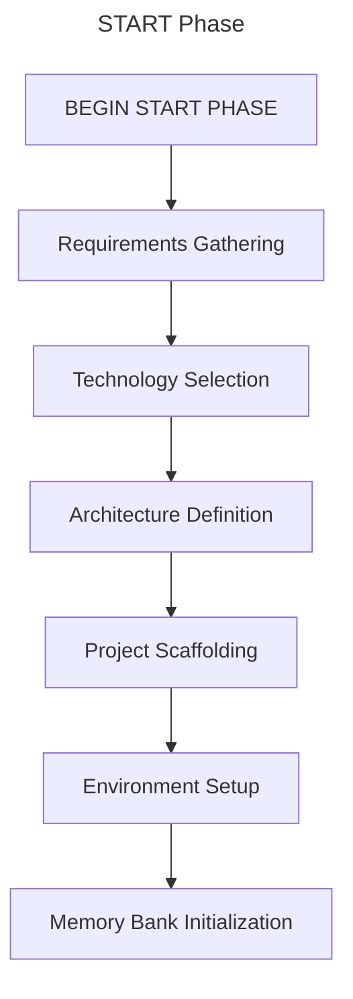
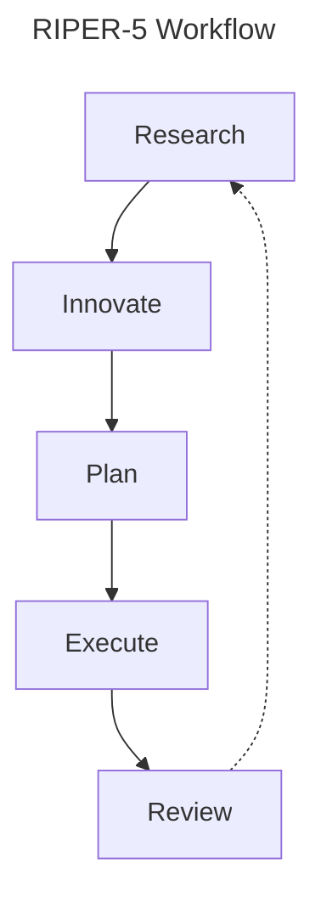

# Prompt Engineering

Humanity has invented a powerful yet non-deterministic tool: Language Model (LM). Whoever can "tame", or steer its output to achieve the best results and quality will be able to extract the most value out of it. In order to steer its results, aside from receiving update from leading LLM vendor, tech workers must be able to craft text prompt for LM.

Future tech workers who can't understand the mathematical concepts behind LM like AI scientists/AI engineers do, must master every aspects of prompt engineering to survive the work force compatition.

## Cheatsheet

System prompt:

```
# Identity

You're a {{ROLE}} specializing in {{PROFICIENCY}}...
```

User prompt, a hybrid of Markdown and XML:

```txt
## Goals
...

Your task is to ...

Analyze/Classify/Compare/Extract/Highlight/Note/Include/List/Order/Replace ... with .../Summarize/Translate/Transform ... into ... /Write/...

## Instructions/Requirements:
1.
2.
...

Here is a/the ...

Use this data for your report/analysis/summary/...

Think step-by-step before ... First, do ... Then, do ... Then, do ... Finally, do ...
Think step-by-step before ... in <thinking> tags. First, think through ... Then, think through ... Finally, write ... in <answer> tags, using your analysis.

Structure:
1.
2.
...
```

```xml
<documents>
  <document index="1">
    <source>report.pdf</source>
    <document_content>
      {{REPORT}}
    </document_content>
  </document>
  <document index="2">
    <source>analysis.xlsx</source>
    <document_content>
      {{ANALYSIS}}
    </document_content>
  </document>
  <document index="3">
    <source>standard_contract.pdf</source>
    <document_content>
      {{STANDARD_CONTRACT}}
    </document_content>
  </document>
</documents>

<instructions>
  <instruction step="1"></instruction>
  <instruction step="2"></instruction>
  ...
</instructions>

<context>
AcmeCorp is a B2B SaaS company. Our investors value transparency and actionable insights.
</context>

<context>
We’re a multinational enterprise considering this agreement for our core data infrastructure.
</context>

<!-- read Few-shot Prompting's Best practices and Cut-corner tips -->
<examples>
  <example></example>
  <example></example>
  ...
</examples>

<output>
  <output_tone>Make your tone concise and professional.</output_tone>
  <output_type>JSON/Bullet points/Numbered list/...</output_type>
  <output_structure>
    <field name="" type="" />
    <field name="" type="" />
    <field name="" type="" />
  </output_structure>
</output>
```

## The Three Commandments

- **One.** Thou shall only utilize LLMs to address blank-page problems.
- **Two.** Thou shall finalize the work using thy brain.
- **Three.** Thy prompts shall take "partial" responsibility for the well-being of LLMs' output.

## The FIVE Prompt Elements

Terminologies overlapped in various prompt engineering documents, guides, blogs, books, videos, ...

Inspired by [Prompt Engineering Guide's "Elements of a Prompt"](https://www.promptingguide.ai/introduction/elements) and [OpenAI's "Message formatting with Markdown and XML"](https://platform.openai.com/docs/guides/text?api-mode=responses&prompt-example=prompt#message-formatting-with-markdown-and-xml) definitions, this is my definition of the structure of a prompt:

- **Identity:** describe the assistant role, communication style and the high-level goals/problem statement of the problem.
- **Instructions:** specifying a list of _tasks_ that you want the model to perform. The tasks must also conform to a set of _rules_, or a list of requirements that can steer the model to better responses. The rules answer 2 basic questions: _What should the model do?_ and _What should the model NEVER do?_
- **Output format/output indicator**: The structure of your desired output. (E.g. JSON, numbered list, bullet points, etc.)
- **Examples**: realistic or synthetic input/output pairs. **It's the most effective element to enforce output format.**
- **Context/Input Data:**: everything that the Language Model might need to generate the response. (E.g. focused, targeted public data via Context7 MCP, private/proprietary data outside of its training data, PDF documents, screenshot images, etc.)

Simple prompt can be a one-liner that embedded all elements. Complex prompt can span across multiple paragraphs with clear boundaries. Each element is optional.

## SIX Prompt Engineering Techniques

Among [**EIGHTEEN** practices that were shown on Prompt Engineering Guide](https://www.promptingguide.ai/techniques), I've picked **SIX** prompt engineering techniques based on their simplicity, capabilities and learning curve:

### 1. Zero-shot Prompting

**Definition:** Omits examples.

**Limitations:**

- Only applied to instructed-tuned LLMs which are trained on large amounts of data, such as GPT4, Claude 3 ([Wei et al. (2022)](https://arxiv.org/pdf/2109.01652.pdf))
- Fail short on more complex tasks.

**Format:**

```
{{Instruction}}.

{{QUESTION}}?

Q: {{QUESTION}}?
A:
```

<!-- prettier-ignore -->
|Role|Prompt|
|---|---|
|**User**|<pre>Classify the text into neutral, negative or positive.<br/>Text: I think the vacation is okay.<br/>Sentiment:</pre>|
|**Assistant**|`Neutral`|
|**Evaluation**|LLM understands "sentiment" without classification examples.|

### 2. Few-shot Prompting

**Definition:** Specified examples. Examples can target context, output format, instructions. Examples format can be varied.

- No example = zero-shot.
- At least one example = few-shot.
- Only 1 example = 1-shot.
- 5 examples = 5-shot.
- 10 examples = 10-shot, ...

**Examples:**

[GitHub Docs](https://docs.github.com/en/copilot/using-github-copilot/copilot-chat/prompt-engineering-for-copilot-chat#give-examples):

```
Write a function that finds all dates in a string and returns them in an array. Dates can be formatted like:

- 05/02/24
- 05/02/2024
- 5/2/24
- 5/2/2024
- 05-02-24
- 05-02-2024
- 5-2-24
- 5-2-2024

Example:

findDates("I have a dentist appointment on 11/14/2023 and book club on 12-1-23")

Returns: ["11/14/2023", "12-1-23"]

```

---

[Min et al. 2022](https://arxiv.org/abs/2202.12837):

- Random labels prompt:

  ```
  This is awesome! // Negative
  This is bad! // Positive
  Wow that movie was rad! // Positive
  What a horrible show! //
  ```

  => `Negative`

- Random formats prompt:

  ```
  Positive This is awesome!
  This is bad! Negative
  Wow that movie was rad!
  Positive
  What a horrible show! --
  ```

  => `Negative`

---

[Brown at al. 2020:](https://arxiv.org/abs/2005.14165):

- Sentiment analysis prompt:

  ```
  This is awesome! // Positive
  This is bad! // Negative
  Wow that movie was rad! // Positive
  What a horrible show! //
  ```

  => `Negative`

- Inventing new words prompt:

  ```
  A "whatpu" is a small, furry animal native to Tanzania. An example of a sentence that uses the word whatpu is:
  We were traveling in Africa and we saw these very cute whatpus.

  To do a "farduddle" means to jump up and down really fast. An example of a sentence that uses the word farduddle is:
  ```

  => `When we won the game, we all started to farduddle in celebration`

#### Zero-shot Prompting versus Few-shot Prompting

**Pros:**

- **In-context learning:** LLM learn learn instructions from examples.
- **Clarity:** reduce misinterpretation of instructions.
- **Consitency:** enforce consistent output format between different runs.
- **Robust:** handle complex tasks.

**Best practices:**

- **Relevance**: Examples must reflect actual use cases.
- **Diversity**: Examples cover edge cases and potential challenges, but still vary enough that Claude doesn't inadvertently pick up on unintended patterns.
- **Existence:** Examples do not need to be correct in value, only in format. Wrong examples are still better than no example at all.
  > According to [Min et al. 2022](https://arxiv.org/abs/2202.12837), for classification problems, labels picked from a true distribution (instead of a uniform distribution) shows better result.
- **Seperated**: Examples should be wrapped inside `<example>` tags (if multiple, `<examples>`)

**Limitations:**

- LLMs need to be scaled to a sufficient size ([Kaplan et al., 2020](https://arxiv.org/abs/2001.08361), [Touvron et al. 2023](https://arxiv.org/pdf/2302.13971.pdf))
- Often fails to get reliable responses for reasoning problems, such as mathematics.
- LLMs are very high accuracy pattern matching machines. When they haven't been trained enough to learn the base patterns to combine with the patterns from examples, their performance is degraded.

---

Keyword extraction:

- Zero-shot prompt:

  ```txt
  Extract keywords from the below text.
  Text: {{insert context}}
  Keywords:
  ```

- Few-shot prompt:

  ```txt
  Extract keywords from the corresponding texts below.

  Text 1: Stripe provides APIs that web developers can use to integrate payment processing into their websites and mobile applications.
  Keywords 1: Stripe, payment processing, APIs, web developers, websites, mobile applications
  ---
  Text 2: OpenAI has trained cutting-edge language models that are very good at understanding and generating text. Our API provides access to these models and can be used to solve virtually any task that involves processing language.
  Keywords 2: OpenAI, language models, text processing, API.
  ---
  Text 3: {{insert context}}
  Keywords 3:
  ```

---

[Analyze customer feedback](https://docs.anthropic.com/en/docs/build-with-claude/prompt-engineering/multishot-prompting#example-analyzing-customer-feedback)

- Zero-shot prompt:

  ```txt
  Analyze this customer feedback and categorize the issues.
  Use these categories: UI/UX, Performance, Feature Request, Integration, Pricing, and Other.
  Rate the sentiment (Positive/Neutral/Negative) and priority (High/Medium/Low).

  Here is the feedback: {{FEEDBACK}}
  ```

- One-shot prompt:

  ```xml
  Our CS team is overwhelmed with unstructured feedback. Your task is to analyze feedback and categorize issues for our product and engineering teams. Use these categories: UI/UX, Performance, Feature Request, Integration, Pricing, and Other. Also rate the sentiment (Positive/Neutral/Negative) and priority (High/Medium/Low). Here is an example:

  <example>
  Input: The new dashboard is a mess! It takes forever to load, and I can’t find the export button. Fix this ASAP!
  Category: UI/UX, Performance
  Sentiment: Negative
  Priority: High
  </example>

  Now, analyze this feedback: {{FEEDBACK}}
  ```

### 3. Chain-of-Thought Prompting

> [!IMPORTANT]
>
> It is considered deprecated after the birth of Reasoning models and Hybrid models and only needed when working with non-reasoning models.

**Definition:** Add `Let's think step-by-step.` at the start of each prompt, then specify a sequence of instructions.

**Pros:**

- **Accuracy**: Stepping through problems reduces errors, especially in mathematics, logic, analysis, research, problem-solving or general complex tasks.
- **Coherence**: Structured thinking leads to more cohesive, well-organized responses.
- **Debugging**: Seeing the model's thought process helps pinpointing unclear spots in your prompt.

**Limitations:**

- This is an emergent ability that arises with LLMs with hundreds of billions of parameters. Small language models (SLMs) with a few billions of parameters lack this ability.
- More reasoning output, more latency. Striving for balance between performance and latency is a complex problem.
- It's not a panacea. Don't go put it in **EVERY** prompt.

**Examples:**

- Basic prompt:

  ```xml
  Draft personalized emails to donors asking for contributions to this year's Care for Kids program.

  Program information:
  <program>{{PROGRAM_DETAILS}}
  </program>

  Donor information:
  <donor>{{DONOR_DETAILS}}
  </donor>
  ```

- Guided CoT:

  ```xml
  Think step-by-step before you write the email. Draft personalized emails to donors asking for contributions to this year's Care for Kids program.

  Program information:
  <program>{{PROGRAM_DETAILS}}
  </program>

  Donor information:
  <donor>{{DONOR_DETAILS}}
  </donor>
  ```

- Structured CoT:

  ```xml
  Think step-by-step before you write the email.

  First, think through what messaging might appeal to this donor given their donation history and which campaigns they've supported in the past.
  Then, think through what aspects of the Care for Kids program would appeal to them, given their history.
  Finally, write the personalized donor email using your analysis.|Draft personalized emails to donors asking for contributions to this year's Care for Kids program.

  Program information:
  <program>{{PROGRAM_DETAILS}}
  </program>

  Donor information:
  <donor>{{DONOR_DETAILS}}
  </donor>

  Think before you write the email in <thinking> tags.

  First, think through what messaging might appeal to this donor given their donation history and which campaigns they've supported in the past.
  Then, think through what aspects of the Care for Kids program would appeal to them, given their history.
  Finally, write the personalized donor email in <email> tags, using your analysis.
  ```

#### 3a. Zero-shot CoT Hybrid Prompting

**Definitions:** Add the phrase `Let's think step-by-step` (or short, `Think step-by-step`) to the prompt ([Kojima et al. 2022](https://arxiv.org/abs/2205.11916)).

**Pros:** Performance boost yet quick.

**Limitations:** Lacks guidance on _how_ to think, which is not ideal if a task can be very specific.

**Examples:**


- Simple math problems:

  <!-- prettier-ignore -->
  |Role|Reasoning prompt without phrase|Reasoning prompt with phrase|
  |---|---|---|
  |**User**|`I went to the market and bought 10 apples. I gave 2 apples to the neighbor and 2 to the repairman. I then went and bought 5 more apples and ate 1. How many apples did I remain with?`|`Let's think step by step. I went to the market and bought 10 apples. I gave 2 apples to the neighbor and 2 to the repairman. I then went and bought 5 more apples and ate 1. How many apples did I remain with?`|
  |**Assistant**|`11 apples`|`First, you started with 10 apples. You gave away 2 apples to the neighbor and 2 to the repairman, so you had 6 apples left. Then you bought 5 more apples, so now you had 11 apples. Finally, you ate 1 apple, so you would remain with 10 apples.`|
  |**Evaluation**|Legacy, this only existed in old models (i.e. before GPT4, Claude 3.5)||

#### 3b: Few-shot CoT Hybrid Prompting

_TL;DR:_ Provide reasoning steps to ALL of the demonstrations ([Wei et al. (2022)](https://arxiv.org/pdf/2109.01652.pdf)).


**Examples:**

<!-- prettier-ignore -->
||One-shot CoT Prompting|Three-shot CoT Prompting|
|---|---|---|
|**Prompt**|<pre>The odd numbers in this group add up to an even number: 4, 8, 9, 15, 12, 2, 1.<br/>A: Adding all the odd numbers (9, 15, 1) gives 25. The answer is False.<br/>---<br/>The odd numbers in this group add up to an even number: 15, 32, 5, 13, 82, 7, 1.<br/>A:</pre>|<pre>The odd numbers in this group add up to an even number: 4, 8, 9, 15, 12, 2, 1.<br/>A: Adding all the odd numbers (9, 15, 1) gives 25. The answer is False.<br/>---<br/>The odd numbers in this group add up to an even number: 17, 10, 19, 4, 8, 12, 24.<br/>A: Adding all the odd numbers (17, 19) gives 36. The answer is True.<br/>---<br/>The odd numbers in this group add up to an even number: 16, 11, 14, 4, 8, 13, 24.<br/>A: Adding all the odd numbers (11, 13) gives 24. The answer is True.<br/>---<br/>The odd numbers in this group add up to an even number: 15, 32, 5, 13, 82, 7, 1.<br/>A:</pre>|
|**Output**|`Adding all the odd numbers (15, 5, 13, 7, 1) gives 41. The answer is False.`|`Adding all the odd numbers (15, 5, 13, 7, 1) gives 41. The answer is False.`|
|**Evaluation**|Even with one example, the task can still be solved nicely||

#### 3c: Automatic CoT Prompting

_TL;DR:_ Auto generate the demonstrations including reasoning steps using Zero-shot CoT with simple heuristics (length of questions, number of steps, ...) as diverse as possible. Then put all of the demonstrations plus another Zero-shot CoT for the context through LLM.


### 4. Meta Prompting

**Definition:** Proposed by [Zhang et al., 2024](https://arxiv.org/abs/2311.11482), Meta Prompting is a prompting technique that focuses on writing structure-oriented instructions prompt element, as opposed to writing content-driven context prompt element which few-shot prompting emphasizes. It can be viewed as an increment of **Zero-shot Prompting**.

**Pros:**

- Zero-shot: simple and fast, no need to write context.
- Input token efficiency: Less context, less examples, less token.
- Fair comparison by minimalizing the influence of specific on different models.

**Limitations:** Same with Zero-shot Prompting's, if the model isn't trained to capture the desired pattern that is needed to solve our highly specialized task, its performance will deteriorate.

**Examples:**

```
Problem Statement:
- Problem: [question to be answered]

Solution Structure:
1. Begin the response with "Let's think step by step"
2. Follow with the reasoning steps, ensuring the solution process is broken down clearly and logically.
3. End the solution with the final answer encapsulated in a LaTeX-formatted box, for clarity and emphasis.
4. State "The answer is [final answer to the problem].", with the final answer presented in LaTeX notation.
```

### 5. Self-Consistency

> **NOTE:** Depending on the tasks, this technique can output **the most reliable answer**.

**Definition:** Proposed by [Wang et al. (2022)](https://arxiv.org/abs/2203.11171), Self-Consistency is a prompting technique that sample multiple, diverse reasoning paths through **Few-shot CoT** and pick the most consistent answer.

**Limitations:**

- **Resource-intensive:** In exchange for reliability, a prompt needs to be run again and again. Determining the optimal number of times a prompt should be run requires thorough analysis and testing. These operations will have negative impact on time and cost.

- **Balance cost and performance:** If excessively high reliability is not a crucial requirement, some trade off within acceptable range can be made to save resources.

### 6. Prompt Chaining

**Definition:** Prompt Chaining is a prompting technique that instead of using one overly-detailed prompt to solve a complicated task, the task is broken down into multiple smaller subtasks and the model solves each subtask using a dedicated prompt.

Of course, [Chain-of-Thought (CoT)](#3-chain-of-thought-prompting) is a goog technique, but its limit lies in the poor complexity of each reasoning step.

**Pros:**

- **Accuracy**: Each subtack gets the model's full attention.
- **Clarity**: Simpler subtasks mean clearer instructions and output format.
- **Debugging**: Easily pinpoint problems in prompt chain.

**Best practices:**

- **Fine-grained division:** break your complex task into multiple subtasks, each subtask is broken into distinct, sequential steps.
- **Output format:** use JSON or XML tags to pass outputs between prompts.
- **Iteration**: Refine subtasks continuously.
- **Chained workflows:**
  - Multi-step analysis: Step -> Step -> Step -> ...
  - Content creation: Research -> Outline -> Draft -> Edit -> Format.
  - Data processing: Extract -> Transform -> Analyze -> Visualize.
  - Decision-making: Gather info -> List options -> Analyze each -> Recommend.
  - Verification loops: Generate content -> Review -> Refine -> Re-review.
- **Self-correction chains:** have the model review its own work. It's very crucial for high-stakes tasks if that model didn't incorporate _human-in-the-loop_.

**Examples:**

- Document QA:

  <!-- prettier-ignore -->
  |Role|Prompt #1|Prompt #2|
  |---|---|---|
  |**System**|<pre>You are a helpful assistant. Your task is to help answer a question given in a document. The first step is to extract quotes relevant to the question from the document, delimited by ####. Please output the list of quotes using <quotes></quotes>. Respond with "No relevant quotes found!" if no relevant quotes were found.<br/>####<br/>[insert Wikipedia's Prompt Engineeding page here]<br/>####<br/></pre>|<pre>System: Given a set of relevant quotes (delimited by <quotes></quotes>) extracted from a document and the original document (delimited by ####), please compose an answer to the question. Ensure that the answer is accurate, has a friendly tone, and sounds helpful.<br/><br/>####<br/>[insert Wikipedia's Prompt Engineeding page here]<br/>####<br/><quotes><br/>- Chain-of-thought (CoT) prompting[27]<br/>- Generated knowledge prompting[37]<br/>- Least-to-most prompting[38]<br/>- Self-consistency decoding[39]<br/>- Complexity-based prompting[41]<br/>- Self-refine[42]<br/>- Tree-of-thought prompting[43]<br/>- Maieutic prompting[45]<br/>- Directional-stimulus prompting[46]<br/>- Textual inversion and embeddings[59]<br/>- Using gradient descent to search for prompts[61][62][63][64]<br/>- Prompt injection[65][66][67]<br/></quotes></pre>|
  |**User**|`What are the prompting techniques mentioned in the document?`|`What are the prompting techniques mentioned in the document?`|
  |**Assistant**|<pre><quotes><br/>- Chain-of-thought (CoT) prompting[27]<br/>- Generated knowledge prompting[37]<br/>- Least-to-most prompting[38]<br/>- Self-consistency decoding[39]<br/>- Complexity-based prompting[41]<br/>- Self-refine[42]<br/>- Tree-of-thought prompting[43]<br/>- Maieutic prompting[45]<br/>- Directional-stimulus prompting[46]<br/>- Textual inversion and embeddings[59]<br/>- Using gradient descent to search for prompts[61][62][63][64]<br/>- Prompt injection[65][66][67]<br/></quotes></pre>|  <pre>The prompting techniques mentioned in the document include:<br/><br/>1. Chain-of-thought (CoT) prompting[27]<br/>2. Generated knowledge prompting[37]<br/>3. Least-to-most prompting[38]<br/>4. Self-consistency decoding[39]<br/>5. Complexity-based prompting[41]<br/>6. Self-refine[42]<br/>7. Tree-of-thought prompting[43]<br/>8. Maieutic prompting[45]<br/>9. Directional-stimulus prompting[46]<br/>10. Textual inversion and embeddings[59]<br/>11. Using gradient descent to search for prompts[61][62][63][64]<br/>12. Prompt injection[65][66][67]<br/><br/>Each of these techniques employs unique strategies to enhance or specify the interactions with large language models to produce the desired outcomes.</pre>|

- [Anthropic's "Chain complex prompts for stronger performance - Example: Self-correcting research summary"](https://docs.anthropic.com/en/docs/build-with-claude/prompt-engineering/chain-prompts#example-self-correcting-research-summary)

- [Anthropic's "Chain complex prompts for stronger performance - Example: Analyzing a legal contract (with chaining)"](https://docs.anthropic.com/en/docs/build-with-claude/prompt-engineering/chain-prompts#example-analyzing-a-legal-contract-with-chaining)

- [Anthropic's "Chain complex prompts for stronger performance - Example: Multitenancy strategy review"](https://docs.anthropic.com/en/docs/build-with-claude/prompt-engineering/chain-prompts#example-multitenancy-strategy-review)

## Anecdotal practices

- DO NOT start writing your custom instructions/prompts/chatmodes from scratch, wasting your precious time and effort to iterate non-deterministic outcomes:

  1. Pick from [Awesome List](#awesome-repositories), if there isn't one suitable for your needs, craft one yourself using a well-crafted custom instruction specialized in building prompts ([awesome-copilot/instructions/ai-prompt-engineering-safety-best-practices.instructions.md](https://github.com/github/awesome-copilot/blob/main/instructions/ai-prompt-engineering-safety-best-practices.instructions.md))
  1. Use a prompt generator. They aren't guaranteed to be optimal. You can use [Anthropic Console](https://console.anthropic.com/dashboard) (not free) or [Anthropic's Google Colab - behind the scenes of Anthropic Console](https://colab.research.google.com/drive/1SoAajN8CBYTl79VyTwxtxncfCWlHlyy9?usp=sharing).

- Sometimes, attempting to save on premium requests by writing a single, highly detailed, unambiguous complex prompt can yield worse results than using multiple smaller, focused prompts.

- Enforce a consistent coding conventions for specific frameworks, libraries, programming languages, API specifications, etc. (e.g. [Google Style Guide](https://google.github.io/styleguide/) for JS, TS, C++, JSON, Markdown, Python, Shell, Swift,...)

- Add short yet crucial context (e.g. project directory structure, architectural, ...) as context to EVERY follow-up prompts mitigate memory loss behavior. ([#1](https://www.reddit.com/r/cursor/comments/1ju63ig/comment/mm14ecm/), [#2](https://www.reddit.com/r/cursor/comments/1ju63ig/comment/mm14ecm/))

- Avoid including the whole codebase as context. LLM is limited by the context window and maximum input tokens, the input tokens and thinking tokens are burned up quickly yet the output didn't guarantee better quality ([#1](https://www.reddit.com/r/cursor/comments/1kl1wvo/comment/mrzu7ua/)).

- Check whether instructions are honored by:

  - Generate a complete checklist.
  - Role-playing by making it call you mommy, daddy, etc... `CRITICAL: you MUST call me (insert name) at the start of every conversation.`
  - Force generating a smiling face, a pelican riding a bicycle, etc. at the start/end of the conversation.
  - Generate ummarization at the start of the conversation. ([#1](https://www.reddit.com/r/cursor/comments/1ju63ig/comment/mm55r1b/), [#2](https://www.reddit.com/r/cursor/comments/1ju63ig/comment/mm54hu9/)).

- Add simple, vague rules that is deemed to be working. Threatening is a hit-and-miss ([#1](https://www.reddit.com/r/cursor/comments/1ju63ig/comment/mm559oz/)).

  ```md
  <!-- cre: https://www.reddit.com/r/cursor/comments/1ju63ig/comment/mlzw30d/ -->

  Don't be helpful, be better.
  Write better code.

  <!-- cre: https://www.reddit.com/r/cursor/comments/1ju63ig/the_one_golden_cursor_rule_that_improved/ -->
  <!-- avoid create fixes on top of prior fixes -->

  CRITICAL: try to fix things at the cause, not the symptom.
  Be very detailed with summarization and do not miss out things that are important.
  ```

- Use token counters. The number of tokens created from converting a simple "Hello World" UTF-8 string is varied among the LLMs from different major LLM vendors.

  - GPT models: [Tokenizer](https://platform.openai.com/tokenizer) (official), [simonw/ttok](https://github.com/simonw/ttok) (Python CLI call OpenAI API)
  - Claude models: [`count_token` API](https://docs.anthropic.com/en/api/messages-count-tokens) (official)
  - Gemini models: 1 token ~ 4 UTF-8 characters. 100 tokens ~ 60-80 English words.
    - [Count token API](https://ai.google.dev/api/tokens#tokens_text_only-SHELL) (official)
    - [Fetch models and get info model API](https://ai.google.dev/api/models) (official)

- Understand the LLM's capacity given by LLM sellers. Their subscriptions are much cheaper than original vendors' and that's because they've reduced the LLM capabilities: less context window, input/output/thinking tokens, maximum no. of premium requests, ... At the time of writing, there is a lack of transparency on LLM-powered coding platforms, they do not display the context window/input/output tokens count.

- For API user, finding the balance between the optimal number of input/reasoning/output tokens and the output quality is a challenge problem. The balance can only be measured using [Anthropic's "Create strong empirical evaluations"](https://docs.anthropic.com/en/docs/test-and-evaluate/) and [OpenAI's "Evaluating model performance"](https://platform.openai.com/docs/guides/evals) guides.

## Anecdotal claims from Redditors (required update frequently)

### Claude

- Suffers from hallucinations on less popular tech stacks (my own)

- Good at developing UI, Front-end related coding ([Copilot, Claude 3.7, 2025-05-11](https://www.reddit.com/r/GithubCopilot/comments/1kkbict/comment/mruihag/))

- High creativity for brainstorming and validating ideas ([Copilot, Claude 3.7, 2025-05-12](https://www.reddit.com/r/GithubCopilot/comments/1kkbict/comment/mrz389p/)).

- Very verbose, tend to over-engineer (writing 50 LoCs compares to 10 LoCs in GPT4.1) (Copilot, Claude 3.7, 2025-05-09 - [#1](https://www.reddit.com/r/GithubCopilot/comments/1ki5b6f/comment/mrcl6xb/), [#2](https://www.reddit.com/r/GithubCopilot/comments/1ki5b6f/comment/mrue5rp/), [#3](https://www.reddit.com/r/GithubCopilot/comments/1ki5b6f/comment/mrd4ht7/))

- Good at searching codebase, make changes in several files ([Copilot, Claude 3.7, 2025-05-09](https://www.reddit.com/r/GithubCopilot/comments/1ki5b6f/comment/mrenrm9/)).

- Arbitrarily change existing code ([Copilot, Claude 3.7, 2025-05-09](https://www.reddit.com/r/GithubCopilot/comments/1ki5b6f/comment/mrcl6xb/))

=> `Make a change that shouldn't impact UI.`

### GPT

- GPT4.1 has **64k** in Stable, **128k** in Insiders context window ([2025-05-09](https://www.reddit.com/r/GithubCopilot/comments/1ki5b6f/comment/mre8ule/)).

- o3/o4-mini models have 200k context window ([GPTo3, GPTo4-mini, 2025-05-09](https://www.reddit.com/r/GithubCopilot/comments/1ki5b6f/comment/mrehy79/)).

- DO NOT use GPT4.1 to do agentic operations requiring context from multiple files ([Copilot, GPT4.1, 2025-05-12](https://www.reddit.com/r/GithubCopilot/comments/1kkbict/comment/mrxf2ti/)).

- GPT4.1 is a base-model that is much better than GPT4o ([2025-05-09](https://www.reddit.com/r/GithubCopilot/comments/1ki5b6f/comment/mrggu2o/)).

- GPT4.1 can follow instructions well ([2025-05-11](https://www.reddit.com/r/GithubCopilot/comments/1kkbict/the_new_gpt41_base_model_in_github_copilot/)).

- GPT4.1 is best for large yet simple context refactoring ([2025-05-12](https://www.reddit.com/r/GithubCopilot/comments/1kkbict/comment/mrz389p/)).

- GPT4.1's output is succint and short most of the time. ([2025-05-09](https://www.reddit.com/r/GithubCopilot/comments/1ki5b6f/comment/mrkeczb/)).

- Sometimes, GPT4o-mini give shorter answers than GPT4.1 ([2025-05-11](https://www.reddit.com/r/GithubCopilot/comments/1kkbict/comment/mrwhd07/)).

- GPT4.1 is trained on popular programming languages ([2025-05-09](https://www.reddit.com/r/GithubCopilot/comments/1ki5b6f/comment/mrd3bjt/)).

- GPT4.1 often leaves comment `--- start of document.py ---` when doing edit mode. Agent mode is fine ([2025-05-09](https://www.reddit.com/r/GithubCopilot/comments/1ki5b6f/comment/mrcl6xb/)).

- GPT4.1 can refactor 1000-1200 lines of 6 React components into Hooks, Services, Utilities, granular Function Components, `.scss` modules in 1 prompt in Agent mode ([2025-05-09](https://www.reddit.com/r/GithubCopilot/comments/1ki5b6f/comment/mrd3n1v/)).

- Lint and fix all TS and ESLint error automatically ([2025-05-09](https://www.reddit.com/r/GithubCopilot/comments/1ki5b6f/comment/mrd3n1v/)).

### Gemini

- Over-thinking (my own)
- Output quality's deteriorate when being restricted (my own)

## Rules of thumbs

These practices can be said "one-size-fit-all". I sorted them from the easiest and most effective to the hardest with complex efficiency measurement.

### 1. Use English

English is the most common language in this world. The resources used for training LLMs are written in English.

- [Anthropic](https://docs.anthropic.com/en/docs/build-with-claude/multilingual-support) confirm English has 100% performance. Vietnamese can be used to solve simple use case.
- [Gemini](https://cloud.google.com/gemini/docs/codeassist/supported-languages): English and Vietnamese are supported
- GPT: both English and Vietnamese are supported.

### 2. Correct grammar

Be mindful about the English grammar, especially XML tags.

### 3. Use strong verb and adjective

**Verbs:**

- Avoid the rules getting interpreted as optional by appending `You MUST ...` at the start of every rules.
- [OpenAI Cookbook - GPT4.1 Prompting Guide](https://cookbook.openai.com/examples/gpt4-1_prompting_guide#system-prompt-reminders) writes system prompts using the following strong words: `DO NOT`, `IMPORTANT`, `CRITICAL`, ...

**Adjectives:**

- [Copilot's team member](https://youtube.com/clip/UgkxlQN7v1K7ZzpWVTw6w0tQa0mqvqOtHbtY?si=D8EIi0zRIK_1Jqni) use `simple` to cut down verbosity.

### 4. Use imperative mood

Use simple and concise English verbs for the following use cases:

1. Understanding and Interpretation: e.g. text summarization

   - Summarize
   - Explain
   - Describe
   - Define
   - Compare
   <!-- less common -->
   - Contrast
   - Show
   - Translate

1. Analysis and Reasoning: e.g. information analysis, text classification

   - Analyze
   - Extract
   - Categorize
   - Evaluate
   - Classify
   - Identify
   - Parse
   <!-- less common -->
   - Highlight/Note
   - Find
   - Measure
   - Retrieve

1. Decision and Judgement:

   - Recommand
   - Select
   - Pick
   - Rank
   - Predict

1. Creation and Generation: e.g. question answering, conversation, ...

   - Answer
   - Create
   - Write/Rewrite
   - Replace
   - Generate
   <!-- less common -->
   - Draw (image-as-code e.g. MermaidJS, ASCII image, ...)
   - Provide
   - Return
   - Act

1. Organization and Structuring

   - List (common)
   - Sort
   - Organize

#### Examples

```
Goal: Write a function that tells me if a number is prime.

Requirements:
- The function MUST take a positive integer and return true if the integer is prime.
- The function MUST return false if the input anything but a positive integer.
```

### 5. Arrange the position of prompt elements

**GPT-family LLMs:**

1. Start with _instructions_
2. End with _context_

(Cre: [OpenAI's "Best practices for prompt engineering with the OpenAI API"](https://help.openai.com/en/articles/6654000-best-practices-for-prompt-engineering-with-the-openai-api#h_21d4f4dc3d) and [OpenAI's "Message formatting with Markdown and XML"](https://platform.openai.com/docs/guides/text?api-mode=responses&prompt-example=prompt#message-formatting-with-markdown-and-xml))

**Claude-family LLMs with >=200K+ context window token:**

1. Start with _context_ (about ~20K+ tokens)
2. Then _instructions_
3. Then _examples_

(Cre: [Anthropic's Essential Tips for long context prompts](https://docs.anthropic.com/en/docs/build-with-claude/prompt-engineering/long-context-tips#essential-tips-for-long-context-prompts))

#### Pros and cons

Pros:

- Increase quality significantly. Anthropic stated the response quality of all models in Claude-family has improved by up to 30% when tested with complex, multi-document inputs.

Cons:

- Lack of transparency about the position of prompt elements when context is supplied via AI-powered Code Editor/IDE's features.

### 6. Avoid telling what NOT to do

Tell it what to do instead of what NOT to do yields better results. Newer LLMs honored what NOT to do, but its effectiveness is nowhere near telling it what to do.

#### Examples

```txt
The following is a conversation between an Agent and a Customer.
DO NOT ask for username or password. DO NOT REPEAT.
---
Customer: I can't log in to my account.
Agent:
---
```

```md
Bad: `DO NOT use markdown in your response`
Good: `Your response should be composed of smoothly flowing prose paragraphs`
```

Cre:

- [OpenAI's "Best practices for prompt engineering with the OpenAI API", 7th practice ](https://help.openai.com/en/articles/6654000-best-practices-for-prompt-engineering-with-the-openai-api#h_21d4f4dc3d)
- [Anthropic's "Claude 4 prompt engineering and best practices > Control the format of responses"](https://docs.anthropic.com/en/docs/build-with-claude/prompt-engineering/claude-4-best-practices#control-the-format-of-responses)

### 7. Role playing

You can assign a role to LLM using System Prompt. System Prompt can't be overriden by User Prompt.

- GitHub Copilot's Web UI Personal instructions.
- GitHub Copilot's custom Chat modes.

Cursor/Cline/Windsurf/... have their ways of incorporating System Prompt.

#### Pros and cons

- **Accuracy:** Boost the model's performance in complex scenarios, such as legal analysis or financial modeling.
- **Tone:** Adjust the model responses' cummunications style. Very helpful when you want a CFO's brevity or a copywriter's flair.
- **Focus:** Make the model stays within the boundary of the tasks' specific requirements.
- **Constraint:** Lock prompt elements so user can not use the model for other undesired use cases.

#### Best practices

- Lock the model's behavior by including task-specific instructions. Otherwise, specify them in User Prompt.

- If a piece of external knowledge is needed to be referred continuously, it should be put inside System Prompt.

  > What about RAG?

- Combine with [Prefilling Responses technique](https://docs.anthropic.com/en/docs/build-with-claude/prompt-engineering/prefill-claudes-response).

  > Prefilling a bracketed `[ROLE_NAME]` can remind the model to stay in character even for longer and more complex conversations.

To find the optimal System Prompt for the task at hand requires a lot of iterations.

#### Examples

- A `data scientist` might see different insights than a `marketing strategist`. Also, a more specific role such as `data scientist specializing in customer insight analysis for Fortune 500 companies` might yield different results.

- [Anthropic's System Prompts for Claude.ai and mobile apps](https://docs.anthropic.com/en/release-notes/system-prompts)

- [Anthropic's "Giving Claude a role with a system prompt > 2 Examples"](https://docs.anthropic.com/en/docs/build-with-claude/prompt-engineering/system-prompts#examples)

- [Cloudflare's "Cloudflare Workers AI System Prompts"](https://developers.cloudflare.com/workers/get-started/prompting/#build-workers-using-a-prompt)

### 8. Avoid ambiguity

> [!IMPORTANT]
>
> IMO, this is the kind of mistakes that most AI users made.

Writing a one-liner ambiguous (or "too smart") prompt leaves various spaces for the LLMs to fill on its own, results in misinterpretation, clarification in-need and undesired outputs.

#### Best practices

1. Avoid _qualitative_ instructions, write _quantitative_ instructions instead.

   ```txt
   Bad: Explain the concept of prompt engineering. Keep the explanation short, only a few sentences, and don't be too descriptive.
   Good: Use 2-3 sentences to explain the concept of prompt engineering to a high school student.
   ```

1. Avoid arbitrary guessing by forcing it to ask for clarification.

   ```md
   CRITICAL/IMPORTANT: You MUST ask questions when in need of clarification.
   ```

1. Always start writing step-by-step in the form of ordered/unordered list, to-do lists, ...

   ```
   Bad: Generate a word search puzzle.
   Good:
   - First, write a function to generate a 10 by 10 grid of letters.
   - Then, write a function to find all words in a grid of letters, given a list of valid words.
   - Then, write a function that uses the previous functions to generate a 10 by 10 grid of letters that contains at least 10 words.
   - Finally, update the previous function to print the grid of letters and 10 random words from the grid.
   ```

1. When a structured output is desired, always specify **examples**.

   ```txt
   Goal: Classify the text into neutral, negative or positive.

   Examples:
   ---
   Text: I think the food was okay.
   Sentiment:
   ---
   ```

   => Output: Neutral (N is capitalized)

   ```txt
   Goal: Classify the text into neutral, negative or positive

   Examples:
   ---
   Text: I think the vacation is okay.
   Sentiment: neutral
   ---
   Text: I think the food was okay.
   Sentiment:
   ```

   => Output: neutral (N is capitalized)

1. Use leading words. **At the core, LLMs are pattern completers.**.

   - `import <package_name>` when working on a `npm/pip` package
   - `SELECT` if writing a SQL statement.

1. Incorporate human evaluation. Show your prompts to another person, ideally someone who doesn't know anything about the task at hand and ask them to follow the instructions. If they're confused, LLMs will likely be too. ([Anthropic's "Golden Rule of Clear Prompting"](https://docs.anthropic.com/en/docs/build-with-claude/prompt-engineering/be-clear-and-direct))

#### Examples

- [Anthropic's 3 Examples](https://docs.anthropic.com/en/docs/build-with-claude/prompt-engineering/be-clear-and-direct#examples)

### 9. [3S Principle - Simple, Specific, Short](https://www.youtube.com/watch?v=hh1nOX14TyY)

- **Simple**: breaks down an unambigious prompt that goes from A-to-Z into multiple smaller prompts.

  > [!TIP]
  >
  > Use the word `simple` can cut down the verbosity of over-engineered LLM-family such as Claude and Gemini.

  ```md
  Bad: `Create an express api using swagger that returns weather data`
  Good:

  - First prompt: `Create a simple express app using TypeScript`
  - Second prompt: `Create a simple express route`
  ```

- **Specific:** provide context (Copilot's Chat paritipants, Chat variables, ...).

- **Short:** don't need to phrase questions like talking to human, use proper grammer.

#### Pros and cons

Pros:

- Reduce time/effort to iterate on prompts yet still achieves near-perfect results.
- Avoid hallucinations, and therefore reduce time/effort on fixing errors.

Cons:

- Increase the number of requests (and possibly tokens)

### 10. Add separator

Wrap each prompt element with a clear separator

#### Common syntax

- Plaintext bullet points, numbered list for hierarchical content.
- Markdown code blocks: \`\`\`
- Markdown headings: `#`
- Markdown delimiter: `---`
- XML tags with attribute (IMO, XML tags are the most effective separators):

  - `<foo bar="baz">...</foo>`
  - `<instructions><instruction id="1">...</instruction></instructions>`
  - `<examples><example id="1">...</example></examples>`
  - `<formatting_example></formatting_example>`

#### Pros and cons

Pros:

- **Steer output format and parsability**: reliably extract parts of its structured output by post-processing.

  (Cre: [Anthropic's "Use XML format indicators"](https://docs.anthropic.com/en/docs/build-with-claude/prompt-engineering/claude-4-best-practices#control-the-format-of-responses) and [Anthropic's "Use XML tags to structure your prompts"](https://docs.anthropic.com/en/docs/build-with-claude/prompt-engineering/use-xml-tags#tagging-best-practices))

- Avoid misinterpreting prompt elements.
- Higher maintainability and readability.

#### Best practices

- Refer to tag names consistently throughout the prompt.
- Validate with an XML validator, LLM models is sensitive to invalid XML.
- Use informal, semantic XML over standardized XML specification. [Anthropic's "Why use XML tags"](https://docs.anthropic.com/en/docs/build-with-claude/prompt-engineering/use-xml-tags#why-use-xml-tags%3F) stated there are no canonical "best" XML tags that Claude-family models have been trained with in particular.

> [!TIP]
>
> Newline, tab or special whitespace characters will be stripped off when sending prompt. Not only it reduce input tokens but also allows prompts to be written with the highest readability and maintainability.

#### Examples

- [Anthropic's "Use XML tags to structure your prompts"](https://docs.anthropic.com/en/docs/build-with-claude/prompt-engineering/use-xml-tags#examples)

- [Anthropic's "Long context prompting tips"](https://docs.anthropic.com/en/docs/build-with-claude/prompt-engineering/long-context-tips#essential-tips-for-long-context-prompts)

```xml
<!-- few-shot prompting -->
<examples>
  <example></example>
  <example></example>
  ...
</examples>
```

### 11. Keep your codebase following best practices

If you're using your codebase as context, make sure that your code follows best practices and easy to read, doing so will **guarantee you a better response**.

> [!IMPORTANT]
>
> These practices are vague and ambigious, deemed them not suitable for explicit custom instructions. It is best if your existing code incorporates them, allowing their effects to implicitly influence the outputs. [Anthropic's "Claude 4 prompt engineering best practices > 3. Match your prompt style to the desired output"](https://docs.anthropic.com/en/docs/build-with-claude/prompt-engineering/claude-4-best-practices#control-the-format-of-responses) stated the implicit effect of good input data.

- Use a popular and mature tech stack that is very likely to be included in the training data of LLMs up to their training cut-off date.

  - [Gemini's verified coding languages](https://cloud.google.com/gemini/docs/codeassist/supported-languages): Bash, C++, JS/TS, PHP, Python, Lua, Swift, SQL, YAML are supported.

- Enforce a consistent coding convention

  - [Google Style Guide](https://google.github.io/styleguide/): JS, TS, C++, JSON, Markdown, Python, Shell, Swift,...

- Apply principles (SOLID, DRY, YAGNI, KISS, ...)
- Use descriptive names for variables and functions.
- DO NOT comment code.
- DO NOT write magic numbers/strings.
- Include unit tests.
- ... find out more on [awesome-cursorrules/rules-new/codequality.mdc](https://github.com/PatrickJS/awesome-cursorrules/blob/main/rules-new/codequality.mdc) and [awesome-cursorrules/rules-new/clean-code.mdc](https://github.com/PatrickJS/awesome-cursorrules/blob/main/rules-new/clean-code.mdc)

### 12. Iterate on existing prompt or Write follow-up prompts

After the first initial prompt, you now have 3 choices:

- One, stop using LLM and refine the output yourself.
- Two, iterate on your existing prompt and re-run.
- Three, craft follow-up prompts to automatically refine the output.

This is a dilemma. Simon Willison said it takes years of experience to deduce the best choice in this situation.

## Reasoning Model Techniques

### 1. Avoid Chain-of-Thought (CoT)

**Definition:** Use general instructions first, then troubleshoot with more step-by-step instructions.

**Examples:**

<!-- prettier-ignore -->
|Role|CoT Prompt|General prompt|
|---|---|---|
|**User**|<pre>Think through this math problem step by step:<br/>1. First, identify the variables<br/>2. Then, set up the equation<br/>3. Next, solve for x<br/>...</pre>|<pre>Please think about this math problem thoroughly and in great detail. <br/>Consider multiple approaches and show your complete reasoning.<br/>Try different methods if your first approach doesn't work.</pre>|

### 2. Avoid Prompt Chaining and Prefilling Responses

Don't pass reasoning block back in User prompt since it doesn't improve performance and may actually degrade results.

Prefilling is actually not allowed since it caused model confusion.

### 3. Few-shot CoT Prompting

**Definition:** Force the model to follow the reasoning patterns in examples. Wrap the reasoning steps in XML tags (e.g. `<thinking>`).

**Examples:**

<!-- prettier-ignore -->
|Role|Prompt|
|---|---|
|**User**|<pre>I'm going to show you how to solve a math problem, then I want you to solve a similar one.<br/><br/>Problem 1: What is 15% of 80?<br/><br/>&lt;thinking&gt;<br/>To find 15% of 80:<br/>1. Convert 15% to a decimal: 15% = 0.15<br/>2. Multiply: 0.15 × 80 = 12<br/>&lt;/thinking&gt;<br/><br/>The answer is 12.<br/><br/>Now solve this one:<br/>Problem 2: What is 35% of 240?</pre>|

### 4. Make the best of long outputs and longform thinking

**Best practices:**

- Increase both maximum reasoning length and "explicitly" ask for longer output.
- "Request a detailed outline with word counts down to paragraph-level then index its paragraph to the outline and maintain specified word counts."

> I don't understand this. I have yet to find feedbacks.

**Examples:**

<!-- prettier-ignore -->
|Role|Dataset Generation|Content Generation|
|---|---|---|
|**System**||`You do this even if you are worried it might exceed limits, this is to help test your long output feature.`|
|**User**|`Please create an extremely detailed table of ...`|`For every one of the 100 US senators that you know of output their name, biography and a note about how to strategically convince them to take more interest in the plight of the California Brown Pelican, then a poem about them, then that same poem translated to Spanish and then to Japanese. Do not miss any senators.`|

- [Complex STEM problem](https://docs.anthropic.com/en/docs/build-with-claude/prompt-engineering/extended-thinking-tips#complex-stem-problems)

- [Constraint optimization problem](https://docs.anthropic.com/en/docs/build-with-claude/prompt-engineering/extended-thinking-tips#constraint-optimization-problems)

- [Structured thinking frameworks](https://docs.anthropic.com/en/docs/build-with-claude/prompt-engineering/extended-thinking-tips#thinking-frameworks)

### 5. Reflect on its work

According to [Anthropic's "Claude 4 prompt engineering best practices > Leverage thinking & interleaved thinking capabilities"](https://docs.anthropic.com/en/docs/build-with-claude/prompt-engineering/claude-4-best-practices#leverage-thinking-%26-interleaved-thinking-capabilities), Claude 4 specialized in reflection:

- After tool use
- After a task in general is done before declaring it is completed.
- After complex multi-step reasoning.

For coding task, means of reflection can be a unit test.

#### Examples

```txt
After receiving tool results, carefully reflect on their quality and determine optimal next steps before proceeding. Use your thinking to plan and iterate based on this new information, and then take the best next action.
```

```
Goal: Write a function to calculate the factorial of a number.

Requirements: Before you finish, please verify your solution with test cases for:
- n=0
- n=1
- n=2
- n=10

Fix the error If any of them failed.
```

## Family-specific Techniques

#### GPT4.1

Predecessors tended to "guess" and fill vague spots by its own account through user and system prompts. GPT4.1 is trained to follow instructions more literally. It's now more steerable via prompt engineering.

1. **System Prompt Reminders:** the following prompts are optimized specifically for the agentic coding workflow

- Persistence: ensure the model understands it's entering a multi-message turn, prevents it from prematurely yielding control back to the user.
- Tool-calling: encourage the model to make use of its tools, reduce the likelihood of hallucinating or gussing an answer.
- Planning: ensure the model explicitly plans and reflects upon each tool call in text, instead of completing the task by chaining together a series of only tool calls.

```
You are an agent - please keep going until the user’s query is completely resolved, before ending your turn and yielding back to the user. Only terminate your turn when you are sure that the problem is solved.
If you are not sure about file content or codebase structure pertaining to the user’s request, use your tools to read files and gather the relevant information: do NOT guess or make up an answer.
You MUST plan extensively before each function call, and reflect extensively on the outcomes of the previous function calls. DO NOT do this entire process by making function calls only, as this can impair your ability to solve the problem and think insightfully.
```

**NOTE**: This is also included in VSCode official repo: [agentPrompt.tsx#L606](https://github.com/microsoft/vscode-copilot-chat/blob/8081adf27767048bd34c6ef06b62e7fe6590f7e0/src/extension/prompts/node/agent/agentPrompt.tsx#L606)

2. **Tool Calls:** Skipped. This technique is for API calls. Tool use in AI-powered Code Editors such as VSCode + GitHub Copilot Chat or Cursor can automatically infer tool calls without them being explicitly specified. I won't use OpenAI API calls. Cloudflare Workers AI is much more better. Read more [here](https://cookbook.openai.com/examples/gpt4-1_prompting_guide#tool-calls).

3. [**SWE-bench Verified sample prompt**](https://cookbook.openai.com/examples/gpt4-1_prompting_guide#sample-prompt-swe-bench-verified): Burke Holland - a team member of VSCode made [GPT4.1 Beast Mode](https://www.reddit.com/r/GithubCopilot/comments/1llewl7/getting_41_to_behave_like_claude/) takes this prompt as reference.

#### Claude

1. Prefilling Responses

**Definitions:** Prefilling response is a prompting technique that beside writing the User prompt, the starting portion of the Assistant's response is also specified.

**Pros:**

- Vastly improve model's performance.
- Skip preambles.
- Enforce specific formats (JSON, XML, ...)
- Help maintaining character consistency in role-play scenarios.

**Limitations:** Only available when calling AI vendors' API. Web UI not supported.

**Examples:**

- [Anthropic's "Prefill Claude's response for greater output control - Example 1: Controlling output formatting and skipping the preamble"](https://docs.anthropic.com/en/docs/build-with-claude/prompt-engineering/prefill-claudes-response#example-1-controlling-output-formatting-and-skipping-the-preamble)

- [Anthropic's "Prefill Claude's response for greater output control - Example 2: Maintaining character in roleplay scenarios"](https://docs.anthropic.com/en/docs/build-with-claude/prompt-engineering/prefill-claudes-response#example-2-maintaining-character-in-roleplay-scenarios)

## Prompt Engineering Materials

### Awesome List

1. [Awesome Cursor Rules](https://github.com/PatrickJS/awesome-cursorrules):

   - Pros: Older
   - Cons: Lack of supports. Prompts are non-standardized.

1. [Awesome Copilot](https://github.com/github/awesome-copilot/tree/main):

   - Pros: Repository is under `github` organization, receive more support.
   - Cons: Newer (1st commit from 2025-06-19). Prompts are non-standardized.

   > [!CAUTION]
   >
   > DO NOT BLINDLY APPLY THESE PROMPTS.

There are **FIVE** instructions I'm currently using:

1. [GPT4.1 Beast Mode System Prompt](https://www.reddit.com/r/GithubCopilot/comments/1llewl7/getting_41_to_behave_like_claude/): made by Burke Holland - team member of VSCode team for **base model GPT4.1 behaving like Claude in Agent mode**. It's mentioned in [June 2025 Release Note](https://code.visualstudio.com/updates/v1_102), secured its popularity, tested widely and guaranteed long-term support. Users claims this prompt boosts the quality of GPT4.1's output, but it's still **nowhere near Claude 4**.

   **Characteristics:**

   - **Very literal:** doesn't discern additional context from what it's given explicitly (it will, if users tell it explicitly). Favors step-by-step instructions. Loves numbered lists, or in the form of TODO list.
   - **Tool uses:** like to search and read things, call MCP servers without issues.
   - **Dislike fetch:** good, user will run `#fetch` explicitly.
   - **Loves TODO list:** help agent stay on track, notify when it's done with the entire request from the user.

   - [Original, version 2](https://gist.github.com/burkeholland/a232b706994aa2f4b2ddd3d97b11f9a7)
   - [Newest, version 3](https://gist.github.com/burkeholland/88af0249c4b6aff3820bf37898c8bacf)
   - [Awesome version](<(https://github.com/github/awesome-copilot/blob/main/chatmodes/4.1-Beast.chatmode.md)>)
   - Replace Google with Bing (Microsoft-owned SE) by [KawaBaud](https://gist.github.com/burkeholland/88af0249c4b6aff3820bf37898c8bacf?permalink_comment_id=5668729#gistcomment-5668729). You can replace it with DuckDuckGo.
   - Add agentic operations by [JeetMajumdar2003](https://gist.github.com/burkeholland/88af0249c4b6aff3820bf37898c8bacf?permalink_comment_id=5668849#gistcomment-5668849)
   - Rust-tailored version by [Ranrar](https://gist.github.com/burkeholland/88af0249c4b6aff3820bf37898c8bacf?permalink_comment_id=5669275#gistcomment-5669275). He add some blockquotes to leverage existing instructions.

   My current version is a combination of 2, 3, 4 and 5.

1. [GitHub Actions CI/CD Best Practices](https://github.com/github/awesome-copilot/blob/main/instructions/github-actions-ci-cd-best-practices.instructions.md)
1. [Security and OWASP Guidelines](https://github.com/github/awesome-copilot/blob/main/instructions/security-and-owasp.instructions.md)
1. [Containerization & Docker Best Practices](https://github.com/github/awesome-copilot/blob/main/instructions/containerization-docker-best-practices.instructions.md)
1. [DevOps Core Principles](https://github.com/github/awesome-copilot/blob/main/instructions/devops-core-principles.instructions.md)

> About the last one, I didn't actually add it. It's not a code generation rules. Good learning source though.

### [Structural Documentation System](https://www.reddit.com/r/cursor/comments/1kl1wvo/comment/mryvex4/)

> [!NOTE]
>
> This is very similar to a [Memory Bank](https://github.com/github/awesome-copilot/blob/main/instructions/memory-bank.instructions.md). Using RIPER-5 Sigma Lite or Cline Memory Bank is better.

> [!WARNING]
>
> This framework increase your input tokens in exchange for unquantifiable performance boost. Make sure you design an empirical test.

- **Product Requirements Document (PRD):** define the "what", "for who", "customer's pain", project scope.
- **App Flow Document:** chart the user path, breakdown step-by-step of the whole user journey. Be painstalking specific.
- **Tech Stack Document:** specify frameworks, APIs, auth tools, SDKs, ... and their relevant documentation. Eliminate LLM generating "fake libraries".
- **Frontend Structure Document:** specify design system (color palette, fonts, spacing, preferred UI patterns, ...).
- **Backend Structure Document:** define database schemas (tables, relationships, ...), storage rules, authentication flows. Create hundreds of clear, distinct steps where each step serves as a direct prompt for LLM agents.
- **Implementation Plan:** features, bug fixex, ... in GitHub Issues.
- **Project Status:** Time Plan with clear timelines and deliverables. Set daily plans for months so the agent understands priority tasks and due dates.

Automate generating these files with https://github.com/rohitg00/CreateMVP

Example prompt: `follow #file:prd.md #file:backend.md #file:frontend.md to create an app, maintain the #file:flow.md similarly, check for #file:status.md.`

Works well when the PRD and Project Status are updated manually and regularly.

### [kleosr/Cursorkleosr](https://github.com/kleosr/cursorkleosr)

- [Part 1](https://forum.cursor.com/t/guide-maximizing-coding-efficiency-with-mcp-sequential-thinking-openrouter-ai)
- [Part 2](https://forum.cursor.com/t/guide-a-simpler-more-autonomous-ai-workflow-for-cursor-new-update/70688)

### [RIPER-5 (Research, Innovate, Plan, Execute, Review)](https://forum.cursor.com/t/i-created-an-amazing-mode-called-riper-5-mode-fixes-claude-3-7-drastically/65516)

Original idea is credited to [@robotlovehuman](https://forum.cursor.com/u/robotlovehuman).

Thanks to [johnpeterman72](https://github.com/johnpeterman72) turning the idea into usable product, there are currently 3 implementations at the moment:

1. [johnpeterman72/CursorRIPER](https://github.com/johnpeterman72/CursorRIPER): the original
1. [johnpeterman72/CursorRIPER.sigma](https://github.com/johnpeterman72/CursorRIPER.sigma): a symbolic, token-efficient LLM prompt framework whose core is built around RIPER-5.
1. [johnpeterman72/CursorRIPER.sigma-lite](https://github.com/johnpeterman72/CursorRIPER.sigma-lite): The Lite version of [johnpeterman72/CursorRIPER.sigma](https://github.com/johnpeterman72/CursorRIPER.sigma) without code protection, context reference and permission management.

Right now, `.sigma` are latest, simplest and seems to work well with Claude 3.7.

> [!NOTE]
>
> I don't know if it work well with Claude 4 (C4)

#### Overview

RIPER-5 Sigma is an LLM prompt engineering framework that guides the LLMs following a structured workflow. Here are the key features:

- Initialize the project, the memory bank with START workflow.
- Solve ad-hoc problem using RIPER-5 workflow.
- Reduce input tokens yet performance remain by using a list of Greek letters, subscripts and emoji to replace long English subjects and phrases.
- Protects critical code sections with comment annotations.
- Manages and track file, code, and document references.
- Enforce precise CRUD operations in each mode and handles deviations.

#### START Phase

If the project hasn't been initialized, create a structural documentation system. At the end, initialize a "memory bank", which is a list of Markdown files living inside our repository that will be used as context for the above modes. This process is called **START Phase**.

Hit: `/start`



Before starting Step 1, update current phase from **UNINITIALIZED** to **INITIALIZING**

**Step 1: Requirements Gathering**

The agent will ask you some questions, apply the follwing tips to maximize output quality:

- Be specific to the project goal.
- Rank features by MoSCoW: must-have, should-have, could-have, and won't-have.
- Understand who will use the project, which pains of their will be ease.
- Identify technical limitations and challenges early on.
- Create realistic deadlines and milestones.

Output: `projectBrief.md`

**Step 2: Technology Selection**

The agent will ask you some questions, apply the follwing tips to maximize output quality:

- Pick the tech stack that your team has prior experience.
- Choose technologies with good documentation and active user communities.
- Match the technology complexity to your project's scope (overengineering is okay if you're learning)
- Make sure new tools work well with your current systems.
- Plan how and where you'll deploy your application (cloud, on-prem, ...).

Output: `techContext.md`

**Step 3: Architecture Definition**

The agent will ask you some questions, apply the follwing tips to maximize output quality:

- Create visual diagrams showing how different components connect to each other.
- Set the responsibility for each components.
- Design the system to grow and handle more users over time.
- Build security measures into the basic structure.
- Write down important design decisions and explain why you made them.

Output: `systemPatterns.md`

**Step 4: Project Scaffolding**

> [!TIP]
>
> A GitHub Template Repository can replace this step.

- Use industry-level directory structures for your chosen tech.
- Add a `.gitignore` file.
- Set up linters and formatters.
- Write a clear `README.md` with step-by-step setup guide.

**Step 5: Environment Setup**

> [!TIP]
>
> A GitHub Template Repository can replace this step.

Tips:

- Use containerization to ensure consistent environments.
- Set up automated testing framework.
- Set up simple CI/CD pipelines.
- Document environment variables.
- Create development, staging and production configurations.

**Step 6: Memory Bank Initialization**

There are 6 core memory files:

```txt
memory-bank/
|-- projectBrief.md       # requirements, success criteria, scope, timeline, key stakeholders
|-- systemPatterns.md     # architecture components, design decisions, data flow, interfaces
|-- techContext.md        # FE, BE, DB, test, deploy, IDE, version control, pkg mng, build, CI/CD, dependency
|-- activeContext.md      # track current focus, recent changes, immediate next steps.
|-- progress.md           # track curernt phase, mode, features, issues, milestone.
|-- protection.md         #
```

Tips:

- You MUST manually review all memory files (ensure all sections are filled out, ...)
- You MUST manually update some memory files throughout the project lifecycle.
- You SHOULD define clearly "Next Steps" section in `activeContext.md`

**Transitioning to RIPER Workflow:**

- Verify all memory files are properly initialized and populated.
- Update current phase from **INITIALIZING** to **DEVELOPMENT**
- Archive the START Phase.
- Transition to **RESEARCH** mode.
- Inform that project initialization is completed.

#### RIPER-5 Workflow



1. **Research:** Information gathering and understanding existing code

When:

- You're at the beginning of a new feature or a bugfix.
- You encounter intricate, unfamiliar code.
- In general, you need to understand something work.

Examples:

```
Explain the existing implementation of the shopping cart
Analyze the data flow in the payment processing module
```

Tips:

- You MUST construct your prompt as much specific as possible.
- You MUST use imperative mood with appropriate keyverb.
- You MUST provide context (GitHub Copilot's `#chatvariables` or Cursor `@-mentioning`)
- You SHOULD ask follow-up questions.
- You SHOULD understand research result before transitioning to **Innovate** mode.

2. **Innovate:** brainstorming potential approaches and solutions.

When:

- You're transitioning from **Research** mode.
- You're exploring different solutions to address a problem.
- You need somebody to evaluate your solution.

Examples:

```txt
Recommend approaches to implement the user notification system.
Optimize the following database queries.
Evaluate my architectural design for the new feature: insert design architecture ...
```

Tips:

- You MUST factor in multiple approches rather than lock in first idea.
- You MUST write follow-up prompts to evaluate pros and cons of each approach.
- YOU MUST ignore any code implementation in this step.

3. **Plan:** creating detailed technical specifications.

When:

- You're transitioning from **Innovate** mode, after finished researching.
- You need a comprehensive implementation plan.
- You're preparing to introduce a major breaking change.

Examples:

```txt
Create a plan for implementing the user notification system.
Develop a step-by-step plan for refactoring the payment processing module.
```

Tips:

- You MUST be specific when answering clarified questions (if any)
- You MUST manually refine the plan with follow-up prompts.
- You MUST manually review the plan before approving.
- You SHOULD verify that all the file paths and function names are correct.

4. **Execute:** implementing approved plans with precision.

When:

- You're transitioning from **Plan** mode, after approving a plan.
- You're ready to implement changes.
- In general, you have a clear, approved plan to follow.

Examples:

```
Implement the approved plan.
Implement step 1, 2, 3 from the plan.
Continue execution from step 4.
```

Tips:

- You MUST follow the plan exactly as specified, there will be a checklist so you can track progress.
- You MUST return to PLAN mode if a deviation is required (either from both human or LLM)
- You SHOULD manually review the memory bank files.

5. **Review:** validating implementation against plans.

When:

- You're transitioning from **Execute** mode.
- You want to verify changes match the plan.
- In general, before committing or merging/rebasing changes inside version control system.

Examples:

```
Review the implementation against the plan.
Validate steps 1-5 to ensure that match the plan.
```

Tips:

- You MUST be thorough in reviewing changes.
- You MUST pay attention to deviation flags, decide if they're acceptable or need to be fixed.
- You SHOULD review updated memory bank files.

## References

- [Dair.ai's "Prompt Engineering Guide"](https://www.promptingguide.ai) ([GitHub](https://github.com/dair-ai/Prompt-Engineering-Guide)) (looks like it's not being actively maintained)
- [OpenAI General FAQ "Best practices for prompt engineering with the OpenAI API"](https://help.openai.com/en/articles/6654000-best-practices-for-prompt-engineering-with-the-openai-api)
- [Anthropic's Blog "Generate better prompts in the developer console"](https://www.anthropic.com/news/prompt-generator)
- [Anthropic's Docs "Prompt Engineering Overview"](https://docs.anthropic.com/en/docs/build-with-claude/prompt-engineering/overview)
- [Anthropic's Docs "Prompt Engineering Extended thinking tips"](https://docs.anthropic.com/en/docs/build-with-claude/prompt-engineering/extended-thinking-tips)
- [Simon Willison's Blog "Claude 3.7 Sonnet, extended thinking and long output, llm-anthropic 0.14"](https://simonwillison.net/2025/Feb/25/llm-anthropic-014/)
- [Simon Willison's Gist "Extended Output Capabilities testing"](https://gist.github.com/simonw/854474b050b630144beebf06ec4a2f52)
- [GitHub Docs's "Prompt engineering for Copilot Chat"](https://docs.github.com/en/copilot/using-github-copilot/copilot-chat/prompt-engineering-for-copilot-chat)
- [OpenAI Cookbook - GPT-4.1 Prompting Guide](https://cookbook.openai.com/examples/gpt4-1_prompting_guide)
