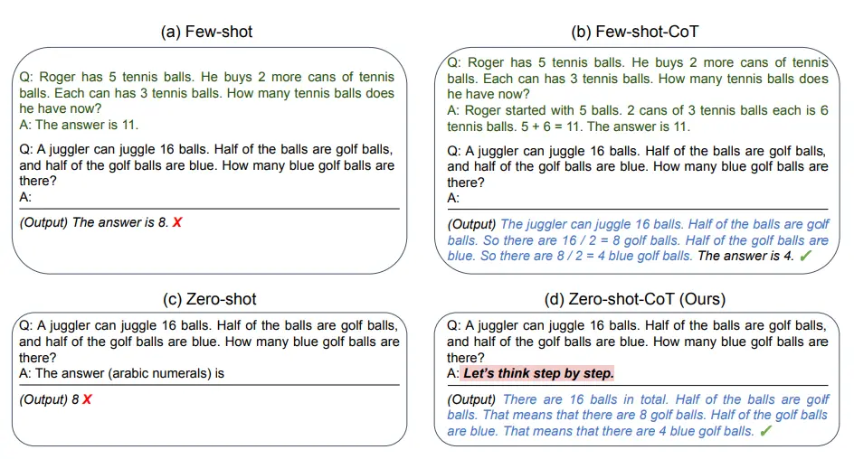
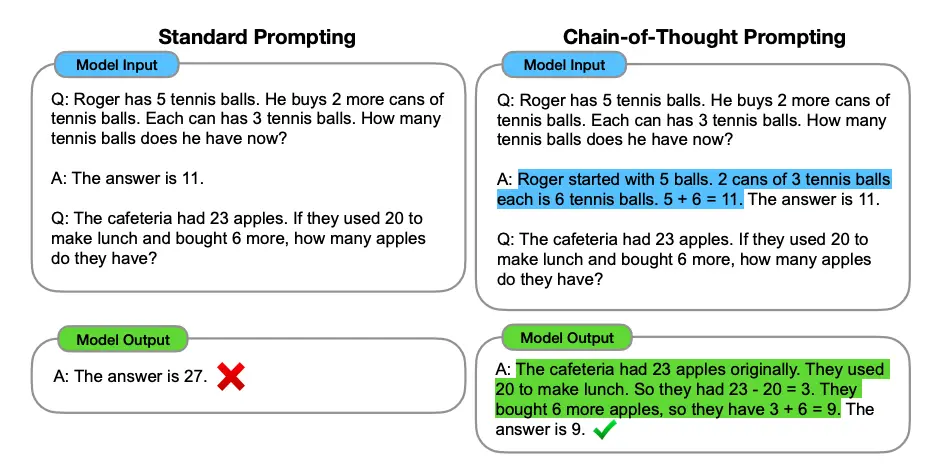
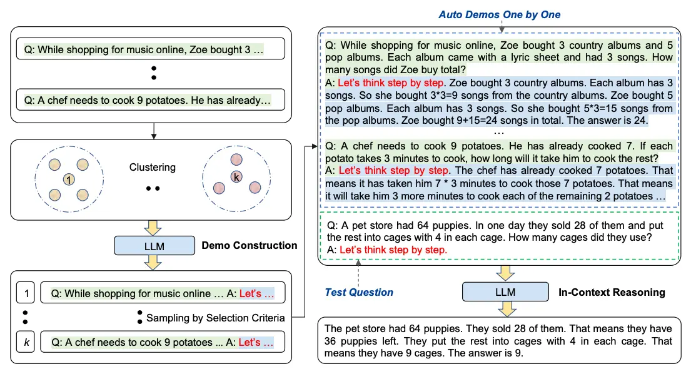
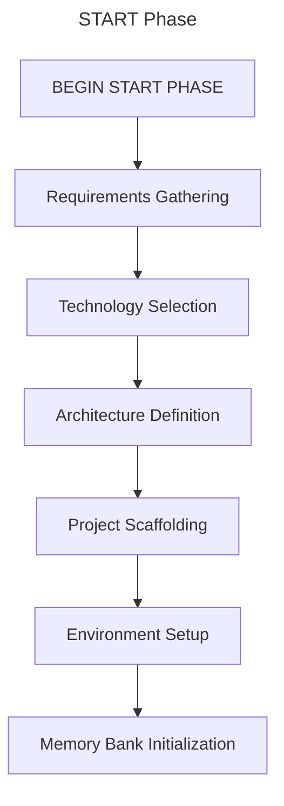
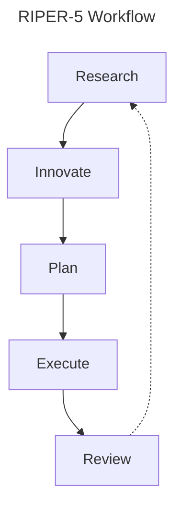

# Prompt Engineering

<!-- tl;dr starts -->

Humanity has invented a powerful yet formless tool: LLM. To "tame" the LLMs, tech workers although they don't have to immerse themselves in the extensive mathematical aspects that form the core foundation of Machine Learning, Deep Learning and LLMs specifically (as AI scientists/AI engineers do), will at least need to proficient in using AI. Developers, like me, learn prompt engineering to create robust and effective prompts to receive the best results.

<!-- tl;dr ends -->

## Table of Contents

- [Cheatsheet](#cheatsheet)
- [The Three Commandments](#the-three-commandments)
- [The Four Prompt Elements](#the-four-prompt-elements)
- [General practices](#general-practices)
- [One-size-fit-all practices](#one-size-fit-all-practices)
  - [Use English](#use-english)
  - [Correct grammar](#correct-grammar)
  - [Use strong modal verb `MUST`](#use-strong-modal-verb-must)
  - [Use imperative mood](#use-imperative-mood)
  - [Arrange the position of prompt elements](#arrange-the-position-of-prompt-elements)
  - [Avoid negation](#avoid-negation)
  - [Avoid ambiguity](#avoid-ambiguity)
  - [Add separator](#add-separator)
  - [Keep your codebase following best practices](#keep-your-codebase-following-best-practices)
  - [Test and iterate](#test-and-iterate)
- [Prompt Engineering Techniques](#prompt-engineering-techniques)
  - [1. Zero-shot Prompting](#1-zero-shot-prompting)
  - [2. Few-shot Prompting](#2-few-shot-prompting)
  - [Zero-shot Prompting versus Few-shot Prompting](#zero-shot-prompting-versus-few-shot-prompting)
  - [3. Chain-of-Thought Prompting](#3-chain-of-thought-prompting)
    - [3a. Zero-shot CoT Hybrid Prompting](#3a-zero-shot-cot-hybrid-prompting)
    - [3b: Few-shot CoT Hybrid Prompting](#3b-few-shot-cot-hybrid-prompting)
    - [3c: Automatic CoT Prompting](#3c-automatic-cot-prompting)
  - [4. Meta Prompting](#4-meta-prompting)
  - [5. Self-Consistency](#5-self-consistency)
  - [6. Generate Knowledge Prompting](#6-generate-knowledge-prompting)
  - [7. Prompt Chaining](#7-prompt-chaining)
  - [8. Tree of Thoughts](#8-tree-of-thoughts)
  - [9. Retrieval Augmented Generation](#9-retrieval-augmented-generation)
  - [10. Automatic Reasoning and Tool-use](#10-automatic-reasoning-and-tool-use)
  - [11. Automatic Prompt Engineer](#11-automatic-prompt-engineer)
  - [12. Active-Prompt](#12-active-prompt)
  - [13. Directional Stimulus Prompting](#13-directional-stimulus-prompting)
  - [14. Program-Aided Language Models](#14-program-aided-language-models)
  - [15. ReAct](#15-react)
  - [16. Reflexion](#16-reflexion)
  - [17. Multimodel CoT](#17-multimodel-cot)
  - [18. Graph Prompting](#18-graph-prompting)
- [Vendor-specific Prompting Techniques](#vendor-specific-prompting-techniques)
  - [1. Prompt Generator](#1-prompt-generator)
  - [2. Role Prompting](#2-role-prompting)
  - [3. Prefilling Responses](#3-prefilling-responses)
- [Reasoning Model Prompting Techniques](#reasoning-model-prompting-techniques)
  - [0. General techniques](#0-general-techniques)
  - [1. Avoid Chain-of-Thought (CoT)](#1-avoid-chain-of-thought-cot)
  - [2. Avoid Prompt Chaining and Prefilling Responses](#2-avoid-prompt-chaining-and-prefilling-responses)
  - [3. Few-shot CoT Prompting](#3-few-shot-cot-prompting)
  - [4. Make the best of long outputs and longform thinking](#4-make-the-best-of-long-outputs-and-longform-thinking)
  - [5. Reflect on its work](#5-reflect-on-its-work)
- [Prompt Framework](#prompt-framework)
  - [Structural Documentation System](#structural-documentation-system)
  - [kleosr/Cursorkleosr](#kleosrcursorkleosr)
  - [RIPER-5 (Research, Innovate, Plan, Execute, Review)](#riper-5-research-innovate-plan-execute-review)
    - [Overview](#overview)
    - [START Phase](#start-phase)
    - [RIPER-5 Workflow](#riper-5-workflow)
- [References](#references)

## Cheatsheet

System prompt:

```
You're a {{ROLE}} specializing in {{}} for {{COMPANY}}.
```

User prompt:

```txt
Your task is to ...

Analyze/Classify/Compare/Extract/Highlight/Note/Include/List/Order/Replace ... with .../Summarize/Translate/Transform ... into ... /Write/...

Instructions:
1.
2.
...

Here is a/the ...

Use this data for your report/analysis/summary/...

Think step-by-step before ... First, do ... Then, do ... Then, do ... Finally, do ...
Think step-by-step before ... in <thinking> tags. First, think through ... Then, think through ... Finally, write ... in <answer> tags, using your analysis.

Structure:
1.
2.
...
```

```xml
<documents>
  <document index="1">
    <source>report.pdf</source>
    <document_content>
      {{REPORT}}
    </document_content>
  </document>
  <document index="2">
    <source>analysis.xlsx</source>
    <document_content>
      {{ANALYSIS}}
    </document_content>
  </document>
  <document index="3">
    <source>standard_contract.pdf</source>
    <document_content>
      {{STANDARD_CONTRACT}}
    </document_content>
  </document>
</documents>

<instructions>
  <instruction></instruction>
  <instruction></instruction>
</instructions>

<context>
AcmeCorp is a B2B SaaS company. Our investors value transparency and actionable insights.
</context>

<context>
We’re a multinational enterprise considering this agreement for our core data infrastructure.
</context>

<!-- read Few-shot Prompting's Best practices and Cut-corner tips -->
<examples>
  <example></example>
  <example></example>
  ...
</examples>

<output>
  <output_tone>Make your tone concise and professional.</output_tone>
  <output_type>JSON/Bullet points/Numbered list/...</output_type>
  <output_structure>
    <field name="" type="" />
    <field name="" type="" />
    <field name="" type="" />
  </output_structure>
</output>
```

## The Three Commandments

- **One.** Thou shall only utilize LLMs to address blank-page problems.
- **Two.** Thou shall finalize the work using thy brain.
- **Three.** Thy prompts shall take "partial" responsibility for the well-being of LLMs' output.

## The Four Prompt Elements

Terminologies overlapped in various prompt engineering documents, guides, blogs, books, videos, ... Inspired by [Prompt Engineering Guide's "Elements of a Prompt"](https://www.promptingguide.ai/introduction/elements) definitions, I deviate a little change:

- **Input data/Input text**: the text documents, coding scripts, etc. that serves as context for _instructions_.
- **Instructions**: a specific task or a number of tasks that the model needs to perform. These tasks embedded **rules** - a list of requirements that can steer the model to better responses: role-playing, problem statement, rtistic style, tone for a target audience, etc.
- **Examples**: real or synthetic desired outputs that serve as references for _output format_.
- **Output format**: the structure of the response (e.g., JSON, numbered list, bullet points, etc.). However, many leading AI vendors now offer structured output as a separate feature rather than embedding it within prompts.

Other might categorized into **TWO** prompt elements: _instructions_ and _input data_. That is also fine, my way of separation is a bit more fine-grained.

Simple prompt can be a one-liner that embedded all four elements. Complex prompt can span across multiple paragraphs with clear boundaries. All four elements are optional.

## General practices

- Don't start writing your prompts/instructions/chat modes... from scratch, [PatrickJS/awesome-cursorrules](https://github.com/PatrickJS/awesome-cursorrules/blob/main/rules-new) is a good starting place.

- Avoid writing ONE complex Chat request (even when it's unambiguous since it's time-consuming). Utilize multiple [simple, specific, short](https://www.youtube.com/watch?v=hh1nOX14TyY) one-liner Chat requests.

- Beside general, one-size-fit-all coding guidelines, add separate **rules** for specific tech stack (e.g. frameworks, libraries, programming languages, ...)

- Include the project directory structure as **input data** ([cre](https://www.reddit.com/r/cursor/comments/1ju63ig/comment/mm14ecm/))

- Add architectural context as **input data** to every follow-up prompts because the architectural context specified in the first prompt will be forgotten in the long run ([cre](https://www.reddit.com/r/cursor/comments/1ju63ig/comment/mm14ecm/))

- Avoid including the whole codebase as **input data**. ([cre](https://www.reddit.com/r/cursor/comments/1kl1wvo/comment/mrzu7ua/))

- Check whether **rules** are honored by role-playing (e.g. make it call you mommy, daddy, etc. or generate a smiling face, a pelican riding a bicycle, etc.) or generate rule summarization at the start of the conversation. ([cre#1](https://www.reddit.com/r/cursor/comments/1ju63ig/comment/mm55r1b/), [cre#2](https://www.reddit.com/r/cursor/comments/1ju63ig/comment/mm54hu9/)).

  `Important: you MUST call me (insert name) at the start of every conversation.`

- Specify less **rules** for Gemini 2.5 Pro, add more **rules** to Claude 3.5 non-reasoning model. There have been cases where Gemini performs worse.

- Add simple, vague rules that is deemed to be working:

  ```md
  <!-- cre: https://www.reddit.com/r/cursor/comments/1ju63ig/comment/mlzw30d/ -->

  Don't be helpful, be better.
  Write better code.

  <!-- cre: https://www.reddit.com/r/cursor/comments/1ju63ig/the_one_golden_cursor_rule_that_improved/ -->
  <!-- avoid create fixes on top of prior fixes -->

  Important: try to fix things at the cause, not the symptom.
  Be very detailed with summarization and do not miss out things that are important.
  ```

- Threatening is a hit-and-miss, avoid such practice ([cre](https://www.reddit.com/r/cursor/comments/1ju63ig/comment/mm559oz/)).

- Create **rules** from a template **rule**. ([cre](https://www.reddit.com/r/cursor/comments/1ju63ig/comment/mm14ecm/))

- (Cursor only) Replace the deprecated `.cursorrules` file with the more recent `instructions` directory + `.mdc` files.

- Use token counters. The number of tokens created from converting a simple "Hello World" UTF-8 string is varied among the LLMs from different major LLM vendors. 1 Claude-family LLM token ~= 1 GPT-family LLM token ~= 1 Gemini-family LLM token.

- Understand the capacity of the LLMs given by LLM seller. There is a lack of transparency from the LLM-powered coding platforms (GitHub Copilot, Cursor, Windsurf, ...). They didn't show the context window nor the maximum number of input/output tokens.

- Avoid hallucination by providing the up-to-date documentation of all of the dependencies inside your tech stack. You can use [Context7 MCP by Upstash](https://github.com/upstash/context7) for this, but self-maintained docs can be more reliable.

> [!CAUTION]
>
> Context7 let user upload their own documentation, malicious users can include malicious script inside their docs, results in prompt injection vulnerability. Upstash relies on other users to report the malicious docs similar to `npm/pip`.

- Refrain from adding too much unrelated context. LLM is limited by the context window and maximum input tokens. Not only your precious input tokens are wasted but also the outputs suffer from negative performance impact.

## One-size-fit-all practices

These practices can be applied in nearly **every** use case. I sorted them from the easiest and most effective to the hardest with complex efficiency measurement.

### Use English

English is the most common language in this world. The resources used for training LLMs are written in English.

[Anthropic's Multilingual support](https://docs.anthropic.com/en/docs/build-with-claude/multilingual-support) confirm English has 100% performance.

### Correct grammar

Be mindful about the English grammar, especially XML tags.

### Use strong modal verb `MUST`

Without `MUST`, the rules can be interpreted as optional

```
You MUST do foo...
You MUST NOT do bar...
```

### Use imperative mood

Use simple and concise English verbs for the following use cases:

1. Understanding and Interpretation: e.g. text summarization

   - Summarize
   - Explain
   - Describe
   - Define
   - Compare
   <!-- less common -->
   - Contrast
   - Show
   - Translate

1. Analysis and Reasoning: e.g. information analysis, text classification

   - Analyze
   - Extract
   - Categorize
   - Evaluate
   - Classify
   - Identify
   - Parse
   <!-- less common -->
   - Highlight/Note
   - Find
   - Measure
   - Retrieve

1. Decision and Judgement:

   - Recommand
   - Select
   - Pick
   - Rank
   - Predict

1. Creation and Generation: e.g. question answering, conversation, ...

   - Answer
   - Create
   - Write/Rewrite
   - Replace
   - Generate
   <!-- less common -->
   - Draw (image-as-code e.g. MermaidJS, ASCII image, ...)
   - Provide
   - Return
   - Act

1. Organization and Structuring

   - List (common)
   - Sort
   - Organize

```
Goal: Write a function that tells me if a number is prime.

Requirements:
- The function MUST take a positive integer and return true if the integer is prime.
- The function MUST return false if the input anything but a positive integer.
```

### Arrange the position of prompt elements

According to [OpenAI's Best Practice for Prompt Engineering](https://help.openai.com/en/articles/6654000-best-practices-for-prompt-engineering-with-the-openai-api#h_21d4f4dc3d), prompts should be started with _instructions_.

According to [Anthropic's Essential Tips for long context prompts](https://docs.anthropic.com/en/docs/build-with-claude/prompt-engineering/long-context-tips#essential-tips-for-long-context-prompts), LLMs support over 200K+ context window token should be inputed by a prompt starting with long _input data_ (about ~20K+ tokens), then _instructions_, then _examples_.

> Anthropic stated that the response quality of all models in Claude-family has improved by up to 30% when tested with complex, multi-document inputs.

### Avoid negation

> [!IMPORTANT]
>
> Might be depreciated since I can't find unexpected behavior when using negation on newer LLMs. There are some cases show that using negation provide better results.

**Examples:**

```txt
The following is a conversation between an Agent and a Customer.
DO NOT ASK USERNAME OR PASSWORD. DO NOT REPEAT.
Customer: I can't log in to my account.
Agent:
```

### Avoid ambiguity

> [!IMPORTANT]
>
> In my opinion, this is the kind of mistakes that most AI users made.

Writing a one-liner ambiguous (or "too smart") prompt leaves various spaces for the LLMs to fill on its own, results in misinterpretation, clarification in-need and undesired outputs.

- Break it down to sequence of _instructions_.
- Provide _examples_ when specifying _output format_. Use leading words. LLMs are pattern completers. Give it some context and let it finish the rest.
  > In output format, specify `import <package_name>` if working with a specific `npm/pip` package, or `SELECT` if writing a SQL statement.
- Avoid _qualitative_ instructions, write _quantitative_ instructions instead.
- [Anthropic's Golden Rule of Clear Prompting](https://docs.anthropic.com/en/docs/build-with-claude/prompt-engineering/be-clear-and-direct): Show your prompts to another person, ideally someone who doesn't know anything about the task at hand and ask them to follow the instructions. If they're confused, LLMs will likely be too.
- ***

Explain the concept of prompt engineering:

- **Unclear prompt:** `Explain the concept of prompt engineering. Keep the explanation short, only a few sentences, and don't be too descriptive.`
  => It is unclear about **how many** sentences to use, and **what style**
- **Clear prompt:** `Use 2-3 sentences to explain the concept of prompt engineering to a high school student.`

---

---

Sentiment Analysis:

- **Unclear prompt:**

  ```
  Classify the text into neutral, negative or positive.
  Text: I think the food was okay.
  Sentiment:

  => Output: Neutral (N is capitalized)
  ```

- **Clear prompt**:

  ```
  Classify the text into neutral, negative or positive
  Text: I think the vacation is okay.
  Sentiment: neutral
  ---
  Text: I think the food was okay.
  Sentiment:

  => Output: neutral (N is capitalized)
  ```

---

Write a poem about OpenAI:

- **Unclear prompt:** `Write a poem about OpenAI.`
- **Clear prompt:** `Write a short inspiring poem about OpenAI, focusing on the recent DALL-E product launch (DALL-E is a text-to-image Machine Learning model) in the style of a [insert famous poet].`

---

Generate a word search puzzle:

- **Unclear prompt**: `Generate a word search puzzle`
- **Clear prompt**: `First, write a function to generate a 10 by 10 grid of letters. Then, write a function to find all words in a grid of letters, given a list of valid words. Then, write a function that uses the previous functions to generate a 10 by 10 grid of letters that contains at least 10 words. Finally, update the previous function to print the grid of letters and 10 random words from the grid.`

---

- **Unclear prompt**: `Please remove all personally identifiable information from these customer feedback messages: {{FEEDBACK_DATA}}`

- **Clear prompt**:

  ```txt
  Your task is to anonymize customer feedback for our quarterly review.

  Instructions:
  1. Replace all customer names with “CUSTOMER_[ID]” (e.g., “Jane Doe” → “CUSTOMER_001”).
  2. Replace email addresses with “EMAIL_[ID]@example.com”.
  3. Redact phone numbers as “PHONE_[ID]“.
  4. If a message mentions a specific product (e.g., “AcmeCloud”), leave it intact.
  5. If no PII is found, copy the message verbatim.
  6. Output only the processed messages, separated by ”---”.

  Data to process: {{FEEDBACK_DATA}}
  ```

---

- **Unclear prompt:** `Write a marketing email for our new AcmeCloud features.`
- **Clear prompt:**

  ```txt
  Your task is to craft a targeted marketing email for our Q3 AcmeCloud feature release.

  Instructions:

  1. Write for this target audience: Mid-size tech companies (100-500 employees) upgrading from on-prem to cloud.
  2. Highlight 3 key new features: advanced data encryption, cross-platform sync, and real-time collaboration.
  3. Tone: Professional yet approachable. Emphasize security, efficiency, and teamwork.
  4. Include a clear CTA: Free 30-day trial with priority onboarding.
  5. Subject line: Under 50 chars, mention “security” and “collaboration”.
  6. Personalization: Use {{COMPANY_NAME}} and {{CONTACT_NAME}} variables.

  Structure:

  1. Subject line
  2. Email body (150-200 words)
  3. CTA button text
  ```

---

- **Unclear prompt:** `	Analyze this AcmeCloud outage report and summarize the key points. {{REPORT}}`
- **Clear prompt:**

  ```txt
  Analyze this AcmeCloud outage report. Skip the preamble. Keep your response terse and write only the bare bones necessary information. List only:
  1) Cause
  2) Duration
  3) Impacted services
  4) Number of affected users
  5) Estimated revenue loss.

  Here’s the report: {{REPORT}}
  ```

### Add separator

Wrap each prompt element with a clear separator to reduce the risk of LLMs misinterpreting prompt elements and to make them easier to maintain. When prompt elements are clearly separated, they can also be reliably parsed.

**Common separator syntaxes:**

- Bullet points, ordered list for hierarchical content.
- Markdown code blocks: \`\`\`
- Markdown headings: `#`
- Markdown delimiter: `---`
- XML tags with attribute (IMO, XML tags are the most effective separators):

  - `<foo bar="baz">...</foo>`
  - `<instructions><instruction id="1">...</instruction></instructions>`
  - `<examples><example id="1">...</example></examples>`
  - `<formatting_example></formatting_example>`

**XML tags practices:**

- Consistently refer to the same tag names when talking about the content inside them.
- Use an XML validator after finish writing your prompt since AI models can be sensitive to invalid XML input.
- No AI vendors stated their LLMs are trained with a set of standardized tags. They recommended that the tag names should make sense with the info they surround.

> **NOTE:** Newline, tab or special whitespace characters will be stripped off when sending prompt. This reduces input tokens and also allow engineers to write highly robust and maintainability prompt.

```xml
<!-- few-shot prompting -->
<examples>
  <example></example>
  <example></example>
  ...
</examples>
```

---

```xml
<!-- nested XML subtags + attributes + variable placeholders -->
<!-- cre: https://docs.anthropic.com/en/docs/build-with-claude/prompt-engineering/long-context-tips#example-multi-document-structure -->
<documents>
  <document index="1">
    <source>annual_report_2023.pdf</source>
    <document_content>
      {{ANNUAL_REPORT}}
    </document_content>
  </document>
  <document index="2">
    <source>competitor_analysis_q2.xlsx</source>
    <document_content>
      {{COMPETITOR_ANALYSIS}}
    </document_content>
  </document>
</documents>

<instructions>
1. Analyze the annual report and competitor analysis.
2. Identify strategic advantages and recommend Q3 focus areas.
</instructions>
```

---

[Quote extraction](https://docs.anthropic.com/en/docs/build-with-claude/prompt-engineering/long-context-tips#example-quote-extraction):

```xml
You are an AI physician's assistant. Your task is to help doctors diagnose possible patient illnesses.

Input:
<documents>
  <document index="1">
    <source>patient_symptoms.txt</source>
    <document_content>
      {{PATIENT_SYMPTOMS}}
    </document_content>
  </document>
  <document index="2">
    <source>patient_records.txt</source>
    <document_content>
      {{PATIENT_RECORDS}}
    </document_content>
  </document>
  <document index="3">
    <source>patient01_appt_history.txt</source>
    <document_content>
      {{PATIENT01_APPOINTMENT_HISTORY}}
    </document_content>
  </document>
</documents>

<instructions>
1. Find quotes from the patient records and appointment history that are relevant to diagnosing the patient's reported symptoms.
2. Place these in <quotes> tags.
3. Based on these quotes, list all information that would help the doctor diagnose the patient's symptoms.
4. Place your diagnostic information in <info> tags.
</instructions>
```

---

[Financial reports](https://docs.anthropic.com/en/docs/build-with-claude/prompt-engineering/use-xml-tags#example-generating-financial-reports):

```xml
<!-- cre:  -->
You're a financial analyst at AcmeCorp. Generate a Q2 financial report for our investors.

AcmeCorp is a B2B SaaS company. Our investors value transparency and actionable insights.

Use this data for your report:
<data>{{SPREADSHEET_DATA}}</data>

<instructions>
1. Include sections: Revenue Growth, Profit Margins, Cash Flow.
2. Highlight strengths and areas for improvement.
</instructions>

Make your tone concise and professional. Follow this structure:
<formatting_example>{{Q1_REPORT}}</formatting_example>
```

---

[Legal contract analysis](https://docs.anthropic.com/en/docs/build-with-claude/prompt-engineering/use-xml-tags#example-legal-contract-analysis):

```xml
Analyze this software licensing agreement for legal risks and liabilities.

We’re a multinational enterprise considering this agreement for our core data infrastructure.

<agreement>{{CONTRACT}}</agreement>

This is our standard contract for reference:
<standard_contract>{{STANDARD_CONTRACT}}</standard_contract>

<instructions>
1. Analyze these clauses:
- Indemnification
- Limitation of liability
- IP ownership

2. Note unusual or concerning terms.

3. Compare to our standard contract.

4. Summarize findings in <findings> tags.

5. List actionable recommendations in <recommendations> tags.
</instructions>
```

### Keep your codebase following best practices

If you're using your codebase as _input data_, make sure that your code follows best practices and easy to read, doing so will **guarantee you a better response**.

- Use a popular and mature tech stack that is very likely to be included in the training data of LLMs up to their training cut-off date.
- Use a consistent code style and patterns (again, use custom instructions to enforce this for you).
- Use descriptive names for variables and functions.
- Comment your code.
- Structure your code into modular, scoped components.
- Include unit tests.
- ...

### Test and iterate

Iterate on your prompt. If you can, design a strong empirical evaluations. If you need to make additional follow-up prompts to refine previous prompt's outputs, write them into the prompt as well.

## Prompt Engineering Techniques

There are **EIGHTEEN prompt engineering techniques** that are discovered and researched extensively. I will cover some of the most common techniques:

### 1. Zero-shot Prompting

**Definition:** Omits _examples_.

**Limitations:**

- Only applied to instructed-tuned LLMs which are trained on large amounts of data, such as GPT4, Claude 3 ([Wei et al. (2022)](https://arxiv.org/pdf/2109.01652.pdf))
- Fail short on more complex tasks.

**Format:**

```
{{Instruction}}.

{{QUESTION}}?

Q: {{QUESTION}}?
A:
```

<!-- prettier-ignore -->
|Role|Prompt|
|---|---|
|**User**|<pre>Classify the text into neutral, negative or positive.<br/>Text: I think the vacation is okay.<br/>Sentiment:</pre>|
|**Assistant**|`Neutral`|
|**Evaluation**|LLM understands "sentiment" without classification examples.|

### 2. Few-shot Prompting

**Definition:** Specified _examples_. Examples can target _input data_, _output format_, _instructions_. Examples format can be varied.

- No example = zero-shot.
- At least one example = few-shot.
- Only 1 example = 1-shot.
- 5 examples = 5-shot.
- 10 examples = 10-shot, ...

**Examples:**

[GitHub Docs](https://docs.github.com/en/copilot/using-github-copilot/copilot-chat/prompt-engineering-for-copilot-chat#give-examples):

```
Write a function that finds all dates in a string and returns them in an array. Dates can be formatted like:

- 05/02/24
- 05/02/2024
- 5/2/24
- 5/2/2024
- 05-02-24
- 05-02-2024
- 5-2-24
- 5-2-2024

Example:

findDates("I have a dentist appointment on 11/14/2023 and book club on 12-1-23")

Returns: ["11/14/2023", "12-1-23"]

```

---

[Min et al. 2022](https://arxiv.org/abs/2202.12837):

- Random labels prompt:

  ```
  This is awesome! // Negative
  This is bad! // Positive
  Wow that movie was rad! // Positive
  What a horrible show! //
  ```

  => `Negative`

- Random formats prompt:

  ```
  Positive This is awesome!
  This is bad! Negative
  Wow that movie was rad!
  Positive
  What a horrible show! --
  ```

  => `Negative`

---

[Brown at al. 2020:](https://arxiv.org/abs/2005.14165):

- Sentiment analysis prompt:

  ```
  This is awesome! // Positive
  This is bad! // Negative
  Wow that movie was rad! // Positive
  What a horrible show! //
  ```

  => `Negative`

- Inventing new words prompt:

  ```
  A "whatpu" is a small, furry animal native to Tanzania. An example of a sentence that uses the word whatpu is:
  We were traveling in Africa and we saw these very cute whatpus.

  To do a "farduddle" means to jump up and down really fast. An example of a sentence that uses the word farduddle is:
  ```

  => `When we won the game, we all started to farduddle in celebration`

### Zero-shot Prompting versus Few-shot Prompting

**Pros:**

- **In-context learning:** LLM learn learn _instructions_ from examples.
- **Clarity:** reduce misinterpretation of _instructions_.
- **Consitency:** enforce consistent _output format_ between different runs.
- **Robust:** handle complex tasks.

**Best practices:**

- **Relevance**: Examples must reflect actual use cases.
- **Diversity**: Examples cover edge cases and potential challenges, but still vary enough that Claude doesn't inadvertently pick up on unintended patterns.
- **Existence:** Examples do not need to be correct in value, only in format. Wrong examples are still better than no example at all.
  > According to [Min et al. 2022](https://arxiv.org/abs/2202.12837), for classification problems, labels picked from a true distribution (instead of a uniform distribution) shows better result.
- **Seperated**: Examples should be wrapped inside `<example>` tags (if multiple, `<examples>`)

**Limitations:**

- LLMs need to be scaled to a sufficient size ([Kaplan et al., 2020](https://arxiv.org/abs/2001.08361), [Touvron et al. 2023](https://arxiv.org/pdf/2302.13971.pdf))
- Often fails to get reliable responses for reasoning problems, such as mathematics.
- LLMs are very high accuracy pattern matching machines. When they haven't been trained enough to learn the base patterns to combine with the patterns from examples, their performance is degraded.

---

Keyword extraction:

- Zero-shot prompt:

  ```txt
  Extract keywords from the below text.
  Text: {{insert input data}}
  Keywords:
  ```

- Few-shot prompt:

  ```txt
  Extract keywords from the corresponding texts below.

  Text 1: Stripe provides APIs that web developers can use to integrate payment processing into their websites and mobile applications.
  Keywords 1: Stripe, payment processing, APIs, web developers, websites, mobile applications
  ---
  Text 2: OpenAI has trained cutting-edge language models that are very good at understanding and generating text. Our API provides access to these models and can be used to solve virtually any task that involves processing language.
  Keywords 2: OpenAI, language models, text processing, API.
  ---
  Text 3: {{insert input data}}
  Keywords 3:
  ```

---

[Analyze customer feedback](https://docs.anthropic.com/en/docs/build-with-claude/prompt-engineering/multishot-prompting#example-analyzing-customer-feedback)

- Zero-shot prompt:

  ```txt
  Analyze this customer feedback and categorize the issues.
  Use these categories: UI/UX, Performance, Feature Request, Integration, Pricing, and Other.
  Rate the sentiment (Positive/Neutral/Negative) and priority (High/Medium/Low).

  Here is the feedback: {{FEEDBACK}}
  ```

- One-shot prompt:

  ```xml
  Our CS team is overwhelmed with unstructured feedback. Your task is to analyze feedback and categorize issues for our product and engineering teams. Use these categories: UI/UX, Performance, Feature Request, Integration, Pricing, and Other. Also rate the sentiment (Positive/Neutral/Negative) and priority (High/Medium/Low). Here is an example:

  <example>
  Input: The new dashboard is a mess! It takes forever to load, and I can’t find the export button. Fix this ASAP!
  Category: UI/UX, Performance
  Sentiment: Negative
  Priority: High
  </example>

  Now, analyze this feedback: {{FEEDBACK}}
  ```

### 3. Chain-of-Thought Prompting

> [!IMPORTANT]
>
> It is considered deprecated after the birth of Reasoning models and Hybrid models and only needed when working with non-reasoning models.

**Definition:** Add `Let's think step-by-step.` at the start of each prompt, then specify a sequence of _instructions_.

**Pros:**

- **Accuracy**: Stepping through problems reduces errors, especially in mathematics, logic, analysis, research, problem-solving or general complex tasks.
- **Coherence**: Structured thinking leads to more cohesive, well-organized responses.
- **Debugging**: Seeing the model's thought process helps pinpointing unclear spots in your prompt.

**Limitations:**

- This is an emergent ability that arises with LLMs with hundreds of billions of parameters. Small language models (SLMs) with a few billions of parameters lack this ability.
- More reasoning output, more latency. Striving for balance between performance and latency is a complex problem.
- It's not a panacea. Don't go put it in **EVERY** prompt.

**Examples:**

- Basic prompt:

  ```xml
  Draft personalized emails to donors asking for contributions to this year's Care for Kids program.

  Program information:
  <program>{{PROGRAM_DETAILS}}
  </program>

  Donor information:
  <donor>{{DONOR_DETAILS}}
  </donor>
  ```

- Guided CoT:

  ```xml
  Think step-by-step before you write the email. Draft personalized emails to donors asking for contributions to this year's Care for Kids program.

  Program information:
  <program>{{PROGRAM_DETAILS}}
  </program>

  Donor information:
  <donor>{{DONOR_DETAILS}}
  </donor>
  ```

- Structured CoT:

  ```xml
  Think step-by-step before you write the email.

  First, think through what messaging might appeal to this donor given their donation history and which campaigns they've supported in the past.
  Then, think through what aspects of the Care for Kids program would appeal to them, given their history.
  Finally, write the personalized donor email using your analysis.|Draft personalized emails to donors asking for contributions to this year's Care for Kids program.

  Program information:
  <program>{{PROGRAM_DETAILS}}
  </program>

  Donor information:
  <donor>{{DONOR_DETAILS}}
  </donor>

  Think before you write the email in <thinking> tags.

  First, think through what messaging might appeal to this donor given their donation history and which campaigns they've supported in the past.
  Then, think through what aspects of the Care for Kids program would appeal to them, given their history.
  Finally, write the personalized donor email in <email> tags, using your analysis.
  ```

#### 3a. Zero-shot CoT Hybrid Prompting

**Definitions:** Add the phrase `Let's think step-by-step` (or short, `Think step-by-step`) to the prompt ([Kojima et al. 2022](https://arxiv.org/abs/2205.11916)).

**Pros:** Performance boost yet quick.

**Limitations:** Lacks guidance on _how_ to think, which is not ideal if a task can be very specific.

**Examples:**



- Simple math problems:

  <!-- prettier-ignore -->
  |Role|Reasoning prompt without phrase|Reasoning prompt with phrase|
  |---|---|---|
  |**User**|`I went to the market and bought 10 apples. I gave 2 apples to the neighbor and 2 to the repairman. I then went and bought 5 more apples and ate 1. How many apples did I remain with?`|`Let's think step by step. I went to the market and bought 10 apples. I gave 2 apples to the neighbor and 2 to the repairman. I then went and bought 5 more apples and ate 1. How many apples did I remain with?`|
  |**Assistant**|`11 apples`|`First, you started with 10 apples. You gave away 2 apples to the neighbor and 2 to the repairman, so you had 6 apples left. Then you bought 5 more apples, so now you had 11 apples. Finally, you ate 1 apple, so you would remain with 10 apples.`|
  |**Evaluation**|Legacy, this only existed in old models (i.e. before GPT4, Claude 3.5)||

#### 3b: Few-shot CoT Hybrid Prompting

_TL;DR:_ Provide reasoning steps to ALL of the demonstrations ([Wei et al. (2022)](https://arxiv.org/pdf/2109.01652.pdf)).



**Examples:**

<!-- prettier-ignore -->
||One-shot CoT Prompting|Three-shot CoT Prompting|
|---|---|---|
|**Prompt**|<pre>The odd numbers in this group add up to an even number: 4, 8, 9, 15, 12, 2, 1.<br/>A: Adding all the odd numbers (9, 15, 1) gives 25. The answer is False.<br/>---<br/>The odd numbers in this group add up to an even number: 15, 32, 5, 13, 82, 7, 1.<br/>A:</pre>|<pre>The odd numbers in this group add up to an even number: 4, 8, 9, 15, 12, 2, 1.<br/>A: Adding all the odd numbers (9, 15, 1) gives 25. The answer is False.<br/>---<br/>The odd numbers in this group add up to an even number: 17, 10, 19, 4, 8, 12, 24.<br/>A: Adding all the odd numbers (17, 19) gives 36. The answer is True.<br/>---<br/>The odd numbers in this group add up to an even number: 16, 11, 14, 4, 8, 13, 24.<br/>A: Adding all the odd numbers (11, 13) gives 24. The answer is True.<br/>---<br/>The odd numbers in this group add up to an even number: 15, 32, 5, 13, 82, 7, 1.<br/>A:</pre>|
|**Output**|`Adding all the odd numbers (15, 5, 13, 7, 1) gives 41. The answer is False.`|`Adding all the odd numbers (15, 5, 13, 7, 1) gives 41. The answer is False.`|
|**Evaluation**|Even with one example, the task can still be solved nicely||

#### 3c: Automatic CoT Prompting

_TL;DR:_ Auto generate the demonstrations including reasoning steps using Zero-shot CoT with simple heuristics (length of questions, number of steps, ...) as diverse as possible. Then put all of the demonstrations plus another Zero-shot CoT for the _input data_ through LLM.



### 4. Meta Prompting

**Definition:** Proposed by [Zhang et al., 2024](https://arxiv.org/abs/2311.11482), Meta Prompting is a prompting technique that focuses on writing structure-oriented _instructions_ prompt element, as opposed to writing content-driven _context_ prompt element which few-shot prompting emphasizes. It can be viewed as an increment of **Zero-shot Prompting**.

**Pros:**

- Zero-shot: simple and fast, no need to write context.
- Input token efficiency: Less context, less examples, less token.
- Fair comparison by minimalizing the influence of specific on different models.

**Limitations:** Same with Zero-shot Prompting's, if the model isn't trained to capture the desired pattern that is needed to solve our highly specialized task, its performance will deteriorate.

**Examples:**

```
Problem Statement:
- Problem: [question to be answered]

Solution Structure:
1. Begin the response with "Let's think step by step"
2. Follow with the reasoning steps, ensuring the solution process is broken down clearly and logically.
3. End the solution with the final answer encapsulated in a LaTeX-formatted box, for clarity and emphasis.
4. State "The answer is [final answer to the problem].", with the final answer presented in LaTeX notation.
```

### 5. Self-Consistency

> **NOTE:** Depending on the tasks, this technique can output **the most reliable answer**.

**Definition:** Proposed by [Wang et al. (2022)](https://arxiv.org/abs/2203.11171), Self-Consistency is a prompting technique that sample multiple, diverse reasoning paths through **Few-shot CoT** and pick the most consistent answer.

**Limitations:**

- **Resource-intensive:** In exchange for reliability, a prompt needs to be run again and again. Determining the optimal number of times a prompt should be run requires thorough analysis and testing. These operations will have negative impact on time and cost.

- **Balance cost and performance:** If excessively high reliability is not a crucial requirement, some trade off within acceptable range can be made to save resources.

### 6. Generate Knowledge Prompting

Skipped.

### 7. Prompt Chaining

**Definition:** Prompt Chaining is a prompting technique that instead of using one overly-detailed prompt to solve a complicated task, the task is broken down into multiple smaller subtasks and the model solves each subtask using a dedicated prompt.

Of course, [Chain-of-Thought (CoT)](#3-chain-of-thought-prompting) is a goog technique, but its limit lies in the poor complexity of each reasoning step.

**Pros:**

- **Accuracy**: Each subtack gets the model's full attention.
- **Clarity**: Simpler subtasks mean clearer _instructions_ and _output format_.
- **Debugging**: Easily pinpoint problems in prompt chain.

**Best practices:**

- **Fine-grained division:** break your complex task into multiple subtasks, each subtask is broken into distinct, sequential steps.
- **Output format:** use JSON or XML tags to pass outputs between prompts.
- **Iteration**: Refine subtasks continuously.
- **Chained workflows:**
  - Multi-step analysis: Step -> Step -> Step -> ...
  - Content creation: Research -> Outline -> Draft -> Edit -> Format.
  - Data processing: Extract -> Transform -> Analyze -> Visualize.
  - Decision-making: Gather info -> List options -> Analyze each -> Recommend.
  - Verification loops: Generate content -> Review -> Refine -> Re-review.
- **Self-correction chains:** have the model review its own work. It's very crucial for high-stakes tasks if that model didn't incorporate _human-in-the-loop_.

**Examples:**

- Document QA:

  <!-- prettier-ignore -->
  |Role|Prompt #1|Prompt #2|
  |---|---|---|
  |**System**|<pre>You are a helpful assistant. Your task is to help answer a question given in a document. The first step is to extract quotes relevant to the question from the document, delimited by ####. Please output the list of quotes using <quotes></quotes>. Respond with "No relevant quotes found!" if no relevant quotes were found.<br/>####<br/>[insert Wikipedia's Prompt Engineeding page here]<br/>####<br/></pre>|<pre>System: Given a set of relevant quotes (delimited by <quotes></quotes>) extracted from a document and the original document (delimited by ####), please compose an answer to the question. Ensure that the answer is accurate, has a friendly tone, and sounds helpful.<br/><br/>####<br/>[insert Wikipedia's Prompt Engineeding page here]<br/>####<br/><quotes><br/>- Chain-of-thought (CoT) prompting[27]<br/>- Generated knowledge prompting[37]<br/>- Least-to-most prompting[38]<br/>- Self-consistency decoding[39]<br/>- Complexity-based prompting[41]<br/>- Self-refine[42]<br/>- Tree-of-thought prompting[43]<br/>- Maieutic prompting[45]<br/>- Directional-stimulus prompting[46]<br/>- Textual inversion and embeddings[59]<br/>- Using gradient descent to search for prompts[61][62][63][64]<br/>- Prompt injection[65][66][67]<br/></quotes></pre>|
  |**User**|`What are the prompting techniques mentioned in the document?`|`What are the prompting techniques mentioned in the document?`|
  |**Assistant**|<pre><quotes><br/>- Chain-of-thought (CoT) prompting[27]<br/>- Generated knowledge prompting[37]<br/>- Least-to-most prompting[38]<br/>- Self-consistency decoding[39]<br/>- Complexity-based prompting[41]<br/>- Self-refine[42]<br/>- Tree-of-thought prompting[43]<br/>- Maieutic prompting[45]<br/>- Directional-stimulus prompting[46]<br/>- Textual inversion and embeddings[59]<br/>- Using gradient descent to search for prompts[61][62][63][64]<br/>- Prompt injection[65][66][67]<br/></quotes></pre>|  <pre>The prompting techniques mentioned in the document include:<br/><br/>1. Chain-of-thought (CoT) prompting[27]<br/>2. Generated knowledge prompting[37]<br/>3. Least-to-most prompting[38]<br/>4. Self-consistency decoding[39]<br/>5. Complexity-based prompting[41]<br/>6. Self-refine[42]<br/>7. Tree-of-thought prompting[43]<br/>8. Maieutic prompting[45]<br/>9. Directional-stimulus prompting[46]<br/>10. Textual inversion and embeddings[59]<br/>11. Using gradient descent to search for prompts[61][62][63][64]<br/>12. Prompt injection[65][66][67]<br/><br/>Each of these techniques employs unique strategies to enhance or specify the interactions with large language models to produce the desired outcomes.</pre>|

- [Anthropic's "Chain complex prompts for stronger performance - Example: Self-correcting research summary"](https://docs.anthropic.com/en/docs/build-with-claude/prompt-engineering/chain-prompts#example-self-correcting-research-summary)

- [Anthropic's "Chain complex prompts for stronger performance - Example: Analyzing a legal contract (with chaining)"](https://docs.anthropic.com/en/docs/build-with-claude/prompt-engineering/chain-prompts#example-analyzing-a-legal-contract-with-chaining)

- [Anthropic's "Chain complex prompts for stronger performance - Example: Multitenancy strategy review"](https://docs.anthropic.com/en/docs/build-with-claude/prompt-engineering/chain-prompts#example-multitenancy-strategy-review)

### 8. Tree of Thoughts

Skipped.

### 9. Retrieval Augmented Generation

> **NOTE:** A bit off since RAG isn't a prompting technique, It's a whole LLM-based system.

**Definition:** Proposed by a group of Meta AI scientists [Lewis et al. (2021)](https://arxiv.org/pdf/2005.11401.pdf), Retrieval Augmented Generation (in short, RAG) is an LLM-based system that can access large amount of external knowledge sources.

_Mechanism:_ RAG is consisted of 2 components:

- Retriever: an information retrieval component.
- Generator: a text generator LLM (more specific, a chat model)

RAG takes a prompt and one or more sources as input:

1. Retriever vectorized the sources.
2. Retriever vectorized the query.
3. The query vector is matched against the sources vector for close matches.
4. The matching parts of the sources + The original query are sent into the Generator.
5. The Generator produces the final output.

There are a lot of different ways to vectorize the sources. Google's NotebookLM uses **Word2Vec**, a vectorized technology that has been pioneered by Google over a decade ago.

**Pros:**

- **Real-time update:** The external knowledge is updated real-time since the source can be changed easily.
- **High accuracy**: Improve reliability, more factual consistency, mitigate "hallucination" given a good vectorization technique.
- **No need retraining**: The Generator can be finetuned and its internal knowledge can be modified effectively without retraining of the model.

_Vendors:_

| Vendor            | Google NotebookLM |
| ----------------- | ----------------- |
| Max sources       | 50                |
| Source size limit | 200MB             |
| Source text limit | 500K words        |
| Total capacity    | 25M words         |
| Context window    | 1M tokens         |

### 10. Automatic Reasoning and Tool-use

Skipped.

### 11. Automatic Prompt Engineer

Skipped.

### 12. Active-Prompt

Skipped.

### 13. Directional Stimulus Prompting

Skipped.

### 14. Program-Aided Language Models

Skipped.

### 15. ReAct

### 16. Reflexion

Skipped.

### 17. Multimodel CoT

Skipped.

### 18. Graph Prompting

Skipped.

## Vendor-specific Prompting Techniques

### 1. Prompt Generator

**Definition:** Prompt Generator is a tool that solve the blank-page problem of writing prompts. Writing your own optimized prompts requires long iterating process.

**Limitations:**

- Often not free.
- Prompt is not guaranteed to be optimal, but can still be a starting point for your iteration.

**Examples:**

- [Anthropic Console](https://console.anthropic.com/dashboard).
- [Anthropic's Google Colab - behind the scenes of Anthropic Console](https://colab.research.google.com/drive/1SoAajN8CBYTl79VyTwxtxncfCWlHlyy9?usp=sharing)

### 2. Role Prompting

**Definition:** Role Prompting is the use of System Prompt to assign a role to LLM's Assistant. System Prompt is added automatically at the start of the chat and can't be overriden by User Prompt.

**Pros:**

- **Accuracy:** Boost the model's performance in complex scenarios, such as legal analysis or financial modeling.

- **Tone:** Adjust the model responses' cummunications style. Very helpful when you want a CFO's brevity or a copywriter's flair.

- **Focus:** Make the model stays within the boundary of the tasks' specific requirements.

- **Constraint:** Lock prompt elements so user can not use the model for other undesired use cases.

**Best practices:**

- You can lock the model's behavior by including task-specific _instructions_. Otherwise, specify them in User Prompt.
- If a piece of external knowledge is needed to be referred continuously, it should be put inside System Prompt.
  > Is this better than RAG?
- Combine with [Prefilling Responses](#3-prefilling-responses) technique.
  > Prefilling a bracketed `[ROLE_NAME]` can remind the model to stay in character even for longer and more complex conversations.

**Limitations:** To find the optimal System Prompt for the task at hand requires a lot of experimenting.

**Examples:**

- A `data scientist` might see different insights than a `marketing strategist`. Also, a more specific role such as `data scientist specializing in customer insight analysis for Fortune 500 companies` might yield different results.

- [Anthropic's System Prompts Example: Legal contract analysis:](https://docs.anthropic.com/en/docs/build-with-claude/prompt-engineering/system-prompts#legal-contract-analysis-with-role-prompting)

- [Anthropic's System Prompts Example: Financial analysis](https://docs.anthropic.com/en/docs/build-with-claude/prompt-engineering/system-prompts#financial-analysis-with-role-prompting)

- [PatrictJS/awesome-cursorrules](https://github.com/PatrickJS/awesome-cursorrules)

  > This project needs serious reorganizing. There are so many system prompts with different tech stack and they overlap each other. My recommendation is to only maintain library/framework-specific guidelines, a simple base, then user will tweak it to their needs.

- [Anthropic's System Prompts for Claude.ai and mobile apps](https://docs.anthropic.com/en/release-notes/system-prompts)

- GitHub Copilot's System Prompts for Web UI. GitHub Copilot's Personal Instruction for Web UI.

### 3. Prefilling Responses

**Definitions:** Prefilling response is a prompting technique that beside writing the User prompt, the starting portion of the Assistant's response is also specified.

**Pros:**

- Vastly improve model's performance.
- Skip preambles.
- Enforce specific formats (JSON, XML, ...)
- Help maintaining character consistency in role-play scenarios.

**Limitations:** Only available when calling AI vendors' API. Web UI not supported.

**Examples:**

- [Anthropic's "Prefill Claude's response for greater output control - Example 1: Controlling output formatting and skipping the preamble"](https://docs.anthropic.com/en/docs/build-with-claude/prompt-engineering/prefill-claudes-response#example-1-controlling-output-formatting-and-skipping-the-preamble)

- [Anthropic's "Prefill Claude's response for greater output control - Example 2: Maintaining character in roleplay scenarios"](https://docs.anthropic.com/en/docs/build-with-claude/prompt-engineering/prefill-claudes-response#example-2-maintaining-character-in-roleplay-scenarios)

## Reasoning Model Prompting Techniques

### 0. General Techniques

- Some AI vendors allow users to configure the number of Reasoning tokens. Start with the minimum and increase to adjust based on use cases.
  - If the number is too large, use batch processing if the vendor supports it.
  - If the number if too low, using standard model with traditional chain-of-thought prompting is more appropriate approach.
- Reasoning model performs best in English.

### 1. Avoid Chain-of-Thought (CoT)

**Definition:** Use general instructions first, then troubleshoot with more step-by-step instructions.

**Examples:**

<!-- prettier-ignore -->
|Role|CoT Prompt|General prompt|
|---|---|---|
|**User**|<pre>Think through this math problem step by step:<br/>1. First, identify the variables<br/>2. Then, set up the equation<br/>3. Next, solve for x<br/>...</pre>|<pre>Please think about this math problem thoroughly and in great detail. <br/>Consider multiple approaches and show your complete reasoning.<br/>Try different methods if your first approach doesn't work.</pre>|

### 2. Avoid Prompt Chaining and Prefilling Responses

Don't pass reasoning block back in User prompt since it doesn't improve performance and may actually degrade results.

Prefilling is actually not allowed since it caused model confusion.

### 3. Few-shot CoT Prompting

**Definition:** Force the model to follow the reasoning patterns in examples. Wrap the reasoning steps in XML tags (e.g. `<thinking>`).

**Examples:**

<!-- prettier-ignore -->
|Role|Prompt|
|---|---|
|**User**|<pre>I'm going to show you how to solve a math problem, then I want you to solve a similar one.<br/><br/>Problem 1: What is 15% of 80?<br/><br/>&lt;thinking&gt;<br/>To find 15% of 80:<br/>1. Convert 15% to a decimal: 15% = 0.15<br/>2. Multiply: 0.15 × 80 = 12<br/>&lt;/thinking&gt;<br/><br/>The answer is 12.<br/><br/>Now solve this one:<br/>Problem 2: What is 35% of 240?</pre>|

### 4. Make the best of long outputs and longform thinking

**Best practices:**

- Increase both maximum reasoning length and "explicitly" ask for longer output.
- "Request a detailed outline with word counts down to paragraph-level then index its paragraph to the outline and maintain specified word counts."

> I don't understand this. I have yet to find feedbacks.

**Examples:**

<!-- prettier-ignore -->
|Role|Dataset Generation|Content Generation|
|---|---|---|
|**System**||`You do this even if you are worried it might exceed limits, this is to help test your long output feature.`|
|**User**|`Please create an extremely detailed table of ...`|`For every one of the 100 US senators that you know of output their name, biography and a note about how to strategically convince them to take more interest in the plight of the California Brown Pelican, then a poem about them, then that same poem translated to Spanish and then to Japanese. Do not miss any senators.`|

- [Complex STEM problem](https://docs.anthropic.com/en/docs/build-with-claude/prompt-engineering/extended-thinking-tips#complex-stem-problems)

- [Constraint optimization problem](https://docs.anthropic.com/en/docs/build-with-claude/prompt-engineering/extended-thinking-tips#constraint-optimization-problems)

- [Structured thinking frameworks](https://docs.anthropic.com/en/docs/build-with-claude/prompt-engineering/extended-thinking-tips#thinking-frameworks)

### 5. Reflect on its work

**Definition:** Ask the model to verify its work before declaring a task complete. With coding task, ask it to run a test case.

**Examples:**

<!-- prettier-ignore -->
|Role|Prompt|
|---|---|
|**User**|<pre>Write a function to calculate the factorial of a number.<br/>Before you finish, please verify your solution with test cases for:<br/>- n=0<br/>- n=1<br/>- n=5<br/>- n=10<br/>And fix any issues you find.</pre>|

## Prompt Framework

### [Structural Documentation System](https://www.reddit.com/r/cursor/comments/1kl1wvo/comment/mryvex4/)

> [!WARNING]
>
> This framework increase your input tokens in exchange for unquantifiable performance boost. Make sure you design an empirical test.

- Product Requirements Document (PRD): define the "what", "for who", "customer's pain", project scope.
- App Flow Document: chart the user path, breakdown step-by-step of the whole user journey. Be painstalking specific.
- Tech Stack Document: specify frameworks, APIs, auth tools, SDKs, ... and their relevant documentation. Eliminate LLM generating "fake libraries".
- Frontend Structure Document: specify design system (color palette, fonts, spacing, preferred UI patterns, ...).
- Backend Structure Document: define database schemas (tables, relationships, ...), storage rules, authentication flows. Create hundreds of clear, distinct steps where each step serves as a direct prompt for LLM agents.
- Implementation Plan: features, bug fixex, ... in GitHub Issues.
- Project Status: Time Plan with clear timelines and deliverables. Set daily plans for months so the agent understands priority tasks and due dates.

Automate generating these files with https://github.com/rohitg00/CreateMVP

Example prompt: `follow #file:prd.md #file:backend.md #file:frontend.md to create an app, maintain the #file:flow.md similarly, check for #file:status.md.`

Works well when the PRD and Project Status are updated regularly.

### [kleosr/Cursorkleosr](https://github.com/kleosr/cursorkleosr)

- [Part 1](https://forum.cursor.com/t/guide-maximizing-coding-efficiency-with-mcp-sequential-thinking-openrouter-ai)
- [Part 2](https://forum.cursor.com/t/guide-a-simpler-more-autonomous-ai-workflow-for-cursor-new-update/70688)

### [RIPER-5 (Research, Innovate, Plan, Execute, Review)](https://forum.cursor.com/t/i-created-an-amazing-mode-called-riper-5-mode-fixes-claude-3-7-drastically/65516)

Original idea is credited to [@robotlovehuman](https://forum.cursor.com/u/robotlovehuman).

Thanks to [johnpeterman72](https://github.com/johnpeterman72) turning the idea into usable product, there are currently 3 implementations at the moment:

1. [johnpeterman72/CursorRIPER](https://github.com/johnpeterman72/CursorRIPER): the original
1. [johnpeterman72/CursorRIPER.sigma](https://github.com/johnpeterman72/CursorRIPER.sigma): a symbolic, token-efficient LLM prompt framework whose core is built around RIPER-5.
1. [johnpeterman72/CursorRIPER.sigma-lite](https://github.com/johnpeterman72/CursorRIPER.sigma-lite): The Lite version of [johnpeterman72/CursorRIPER.sigma](https://github.com/johnpeterman72/CursorRIPER.sigma) without code protection, context reference and permission management.

Right now, `.sigma` are latest, simplest and seems to work well with Claude 3.7.

> [!NOTE]
>
> I don't know if it work well with Claude 4 (C4)

#### Overview

RIPER-5 Sigma is an LLM prompt engineering framework that guides the LLMs following a structured workflow. Here are the key features:

- Initialize the project, the memory bank with START workflow.
- Solve ad-hoc problem using RIPER-5 workflow.
- Reduce input tokens yet performance remain by using a list of Greek letters, subscripts and emoji to replace long English subjects and phrases.
- Protects critical code sections with comment annotations.
- Manages and track file, code, and document references.
- Enforce precise CRUD operations in each mode and handles deviations.

#### START Phase

If the project hasn't been initialized, create a structural documentation system. At the end, initialize a "memory bank", which is a list of Markdown files living inside our repository that will be used as context for the above modes. This process is called **START Phase**.

Hit: `/start`



Before starting Step 1, update current phase from **UNINITIALIZED** to **INITIALIZING**

**Step 1: Requirements Gathering**

The agent will ask you some questions, apply the follwing tips to maximize output quality:

- Be specific to the project goal.
- Rank features by MoSCoW: must-have, should-have, could-have, and won't-have.
- Understand who will use the project, which pains of their will be ease.
- Identify technical limitations and challenges early on.
- Create realistic deadlines and milestones.

Output: `projectBrief.md`

**Step 2: Technology Selection**

The agent will ask you some questions, apply the follwing tips to maximize output quality:

- Pick the tech stack that your team has prior experience.
- Choose technologies with good documentation and active user communities.
- Match the technology complexity to your project's scope (overengineering is okay if you're learning)
- Make sure new tools work well with your current systems.
- Plan how and where you'll deploy your application (cloud, on-prem, ...).

Output: `techContext.md`

**Step 3: Architecture Definition**

The agent will ask you some questions, apply the follwing tips to maximize output quality:

- Create visual diagrams showing how different components connect to each other.
- Set the responsibility for each components.
- Design the system to grow and handle more users over time.
- Build security measures into the basic structure.
- Write down important design decisions and explain why you made them.

Output: `systemPatterns.md`

**Step 4: Project Scaffolding**

> [!TIP]
>
> A GitHub Template Repository can replace this step.

- Use industry-level directory structures for your chosen tech.
- Add a `.gitignore` file.
- Set up linters and formatters.
- Write a clear `README.md` with step-by-step setup guide.

**Step 5: Environment Setup**

> [!TIP]
>
> A GitHub Template Repository can replace this step.

Tips:

- Use containerization to ensure consistent environments.
- Set up automated testing framework.
- Set up simple CI/CD pipelines.
- Document environment variables.
- Create development, staging and production configurations.

**Step 6: Memory Bank Initialization**

There are 6 core memory files:

```txt
memory-bank/
|-- projectBrief.md       # requirements, success criteria, scope, timeline, key stakeholders
|-- systemPatterns.md     # architecture components, design decisions, data flow, interfaces
|-- techContext.md        # FE, BE, DB, test, deploy, IDE, version control, pkg mng, build, CI/CD, dependency
|-- activeContext.md      # track current focus, recent changes, immediate next steps.
|-- progress.md           # track curernt phase, mode, features, issues, milestone.
|-- protection.md         #
```

Tips:

- You MUST manually review all memory files (ensure all sections are filled out, ...)
- You MUST manually update some memory files throughout the project lifecycle.
- You SHOULD define clearly "Next Steps" section in `activeContext.md`

**Transitioning to RIPER Workflow:**

- Verify all memory files are properly initialized and populated.
- Update current phase from **INITIALIZING** to **DEVELOPMENT**
- Archive the START Phase.
- Transition to **RESEARCH** mode.
- Inform that project initialization is completed.

#### RIPER-5 Workflow



1. **Research:** Information gathering and understanding existing code

When:

- You're at the beginning of a new feature or a bugfix.
- You encounter intricate, unfamiliar code.
- In general, you need to understand something work.

Examples:

```
Explain the existing implementation of the shopping cart
Analyze the data flow in the payment processing module
```

Tips:

- You MUST construct your prompt as much specific as possible.
- You MUST use imperative mood with appropriate keyverb.
- You MUST provide context (GitHub Copilot's `#chatvariables` or Cursor `@-mentioning`)
- You SHOULD ask follow-up questions.
- You SHOULD understand research result before transitioning to **Innovate** mode.

2. **Innovate:** brainstorming potential approaches and solutions.

When:

- You're transitioning from **Research** mode.
- You're exploring different solutions to address a problem.
- You need somebody to evaluate your solution.

Examples:

```txt
Recommend approaches to implement the user notification system.
Optimize the following database queries.
Evaluate my architectural design for the new feature: insert design architecture ...
```

Tips:

- You MUST factor in multiple approches rather than lock in first idea.
- You MUST write follow-up prompts to evaluate pros and cons of each approach.
- YOU MUST ignore any code implementation in this step.

3. **Plan:** creating detailed technical specifications.

When:

- You're transitioning from **Innovate** mode, after finished researching.
- You need a comprehensive implementation plan.
- You're preparing to introduce a major breaking change.

Examples:

```txt
Create a plan for implementing the user notification system.
Develop a step-by-step plan for refactoring the payment processing module.
```

Tips:

- You MUST be specific when answering clarified questions (if any)
- You MUST manually refine the plan with follow-up prompts.
- You MUST manually review the plan before approving.
- You SHOULD verify that all the file paths and function names are correct.

4. **Execute:** implementing approved plans with precision.

When:

- You're transitioning from **Plan** mode, after approving a plan.
- You're ready to implement changes.
- In general, you have a clear, approved plan to follow.

Examples:

```
Implement the approved plan.
Implement step 1, 2, 3 from the plan.
Continue execution from step 4.
```

Tips:

- You MUST follow the plan exactly as specified, there will be a checklist so you can track progress.
- You MUST return to PLAN mode if a deviation is required (either from both human or LLM)
- You SHOULD manually review the memory bank files.

5. **Review:** validating implementation against plans.

When:

- You're transitioning from **Execute** mode.
- You want to verify changes match the plan.
- In general, before committing or merging/rebasing changes inside version control system.

Examples:

```
Review the implementation against the plan.
Validate steps 1-5 to ensure that match the plan.
```

Tips:

- You MUST be thorough in reviewing changes.
- You MUST pay attention to deviation flags, decide if they're acceptable or need to be fixed.
- You SHOULD review updated memory bank files.

## References

- [Dair.ai's "Prompt Engineering Guide"](https://www.promptingguide.ai) ([GitHub](https://github.com/dair-ai/Prompt-Engineering-Guide)) (looks like it's not being actively maintained)
- [OpenAI General FAQ "Best practices for prompt engineering with the OpenAI API"](https://help.openai.com/en/articles/6654000-best-practices-for-prompt-engineering-with-the-openai-api)
- [Anthropic's Blog "Generate better prompts in the developer console"](https://www.anthropic.com/news/prompt-generator)
- [Anthropic's Docs "Prompt Engineering Overview"](https://docs.anthropic.com/en/docs/build-with-claude/prompt-engineering/overview)
- [Anthropic's Docs "Prompt Engineering Extended thinking tips"](https://docs.anthropic.com/en/docs/build-with-claude/prompt-engineering/extended-thinking-tips)
- [Simon Willison's Blog "Claude 3.7 Sonnet, extended thinking and long output, llm-anthropic 0.14"](https://simonwillison.net/2025/Feb/25/llm-anthropic-014/)
- [Simon Willison's Gist "Extended Output Capabilities testing"](https://gist.github.com/simonw/854474b050b630144beebf06ec4a2f52)
- [GitHub Docs's "Prompt engineering for Copilot Chat"](https://docs.github.com/en/copilot/using-github-copilot/copilot-chat/prompt-engineering-for-copilot-chat)
