# Mermaid Architecture Diagram

<!-- tl;dr starts -->

Architecture diagram is used to show the relationship between services and resources commonly found within the Cloud or CI/CD.

<!-- tl;dr ends -->

Main components:

- `groups <group_id>(<icon_name>)[<title>] in <parent_id>`
- `service <service_id>(<icon_name>)[<title>] in parent_id`
- `<service_id><{group}>:<T|B|L|R> <arrow_or_normal> <T|B|L|R>:<service_id><{group}>`

**services (nodes)** + **edges**. Related services are grouped.

```mermaid
architecture-beta
  group api(cloud)[API]
  service db(database)[Database] in api
  service disk1(disk)[Storage] in api
  service disk2(disk)[Storage] in api
  service server(server)[Server] in api

  db:L -- R:server %% the edge coming out of the left of db and the right of server
  disk1:T -- B:server
  disk2:T -- B:db

  group client(internet)[Client]
  service client1(logos:react)[Client 1] in client
  client1:R --> L:server
```

```mermaid
architecture-beta
  service left_disk(disk)[Disk]
  service top_disk(disk)[Disk]
  service bottom_disk(disk)[Disk]
  service top_gateway(internet)[Gateway]
  service bottom_gateway(interncet)[Gateway]
  junction junctionCenter
  junction junctionRight

  left_disk:R -- L:junctionCenter
  top_disk:B -- T:junctionCenter
  bottom_disk:T -- B:junctionCenter
  junctionCenter:R -- L:junctionRight
  top_gateway:B -- T:junctionRight
  bottom_gateway:T -- B:junctionRight
```

```mermaid
architecture-beta
  group api(logos:aws-lambda)[API]

  service db1(logos:aws-aurora)[Aurora] in api
  service db2(logos:aws-dynamodb)[DynamoDB] in api
  service storage1(logos:aws-s3)[S3] in api
  service storage2(logos:aws-glacier)[Glacier] in api
  service server(logos:aws-ec2)[Server] in api

  db1:L -- R:server
  db2:R -- L:server
  storage1:T -- B:server
  storage2:T -- B:db1
```

