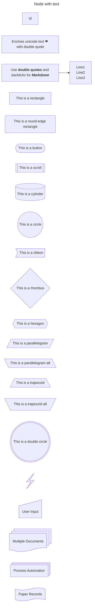
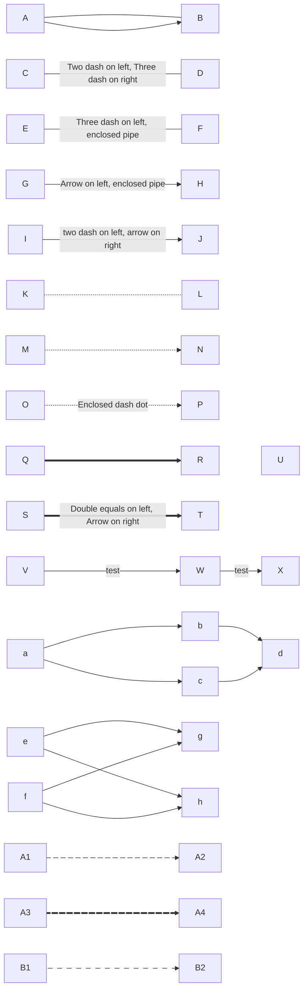
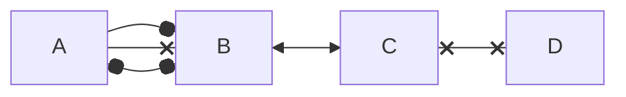
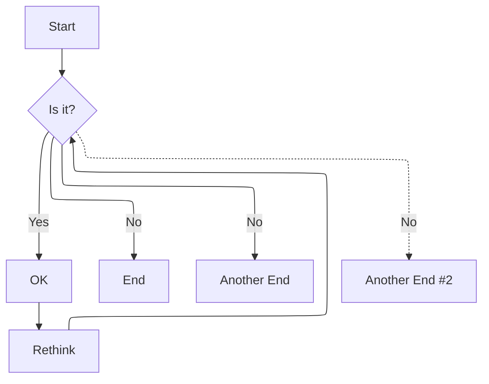
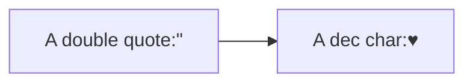
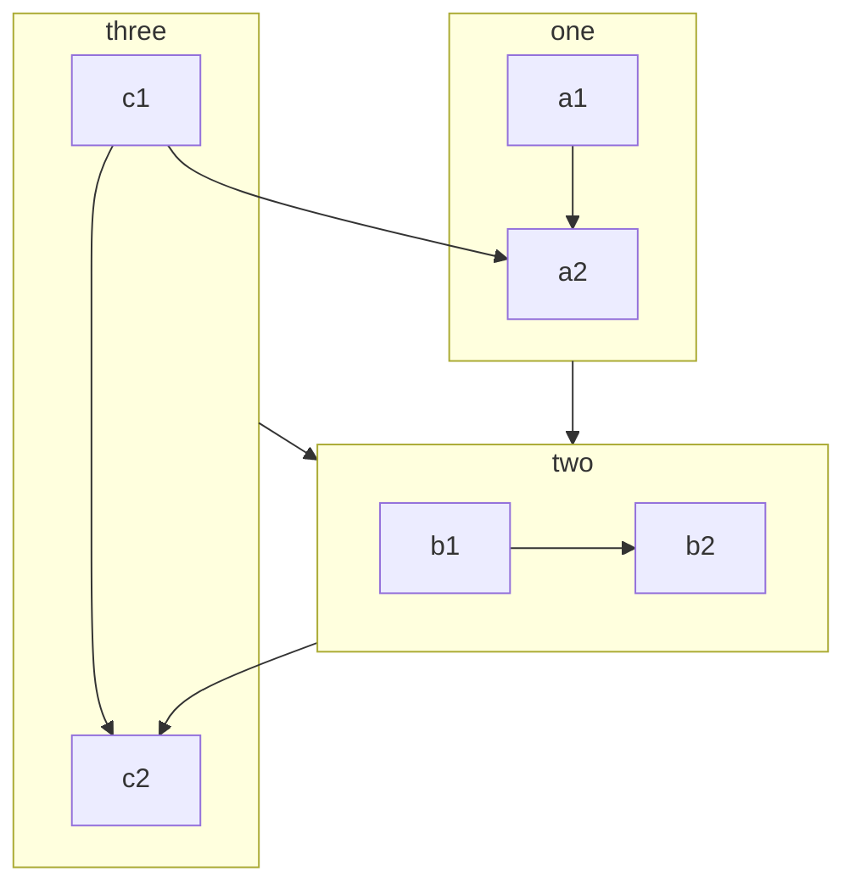
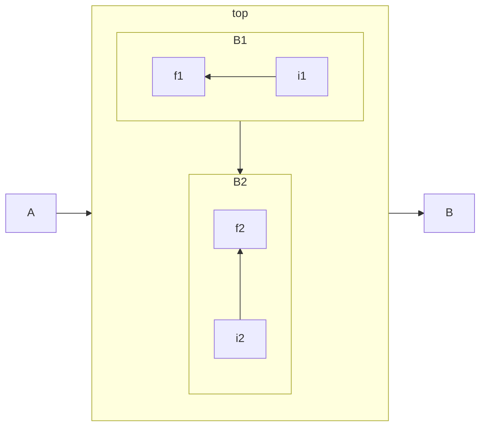
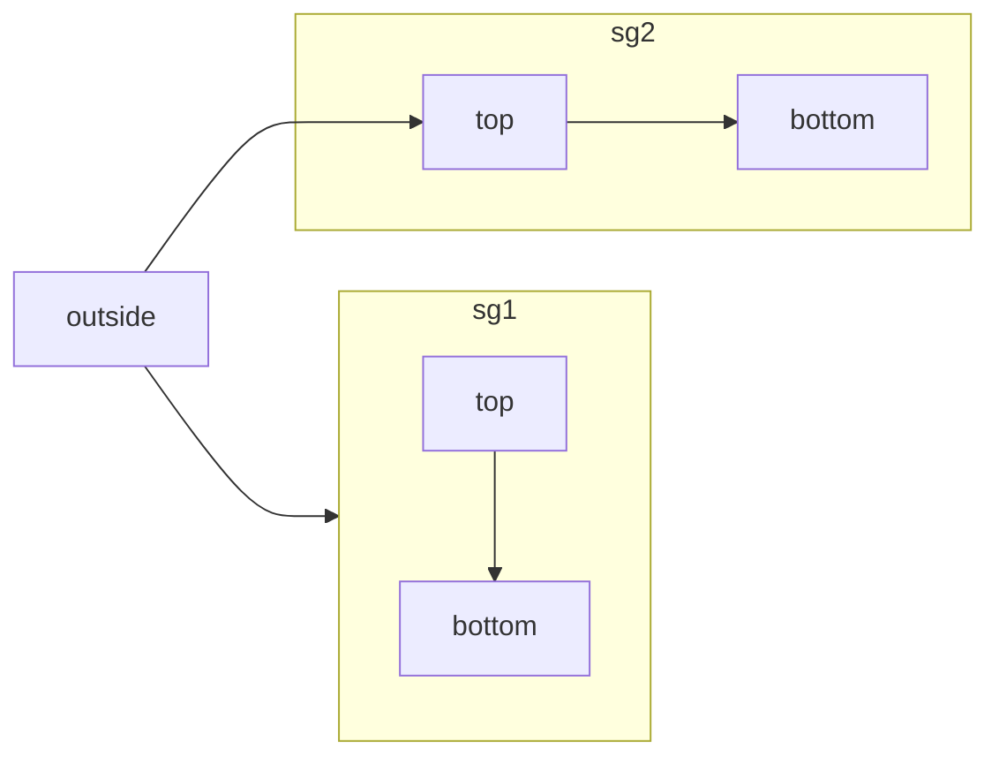
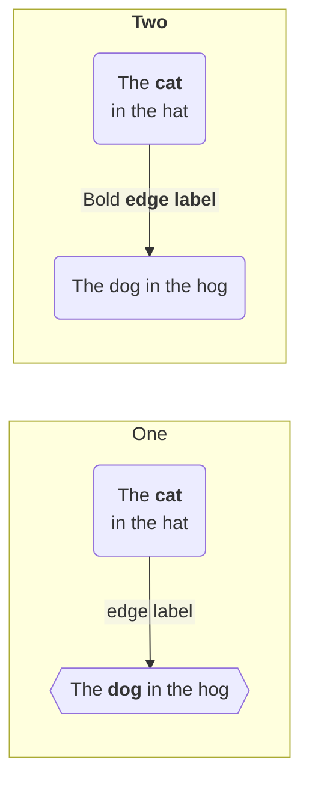
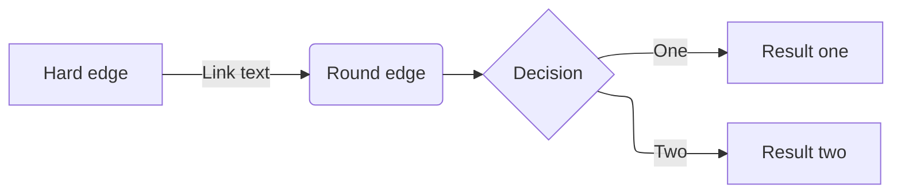

# Mermaid Flowchart

<!-- tl;dr starts -->

Flowchart is the most commonly used type of diagram in Mermaid.

<!-- tl;dr ends -->

**Main components: nodes + edges**

> [!WARNING]
>
> 1. Rule of thumb: always add a space before or captalize the first letter.
>
>    A---oB create circle edge
>    A --- oB correct
>
>    A---xB create cross edge
>    A --- xB correct
>
> 2. Do not use the word "end" while naming nodes. Use "End" or "END".



















```
%% Styling should be done via AI
%% 1. style links with `linkStyle`.
%% 2. style line curves.
%% 3. style a node.
%% 4. Use class to define styling.
%% 5. Use fontawesome to embed font (CSS must be included)
%% 6. Use custom fontawesome icons (not free)
```


