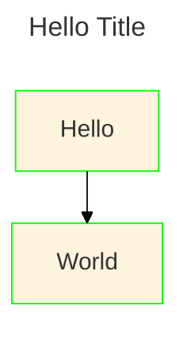

# Mermaid Cheatsheet

<!-- tl;dr starts -->

A diagram should be "writable" and version controlled. Mermaid's a diagram-as-code solution that's highly embraced by the community.

<!-- tl;dr ends -->

Its main use case is to help documentation catch up with development. If a diagram takes too much time to create, it can be neglected and therefore get outdated quickly.

## Features

- **Playground:** It has a [live editor](https://mermaid.live/) running entirely via JS in browser so non-programmers can play with it.
  > Unlike D2, you will need WebAssembly enabled.
- **Integration:** [various applications](https://mermaid.js.org/ecosystem/integrations-community.html) has supported Mermaid, either via 3rd-party plugins or native support from the application itself.
- **Portability:** it has [a minified JS build that's served via CDN](https://www.jsdelivr.com/package/npm/mermaid). Any website can run Mermaid.

## Frontmatter config

